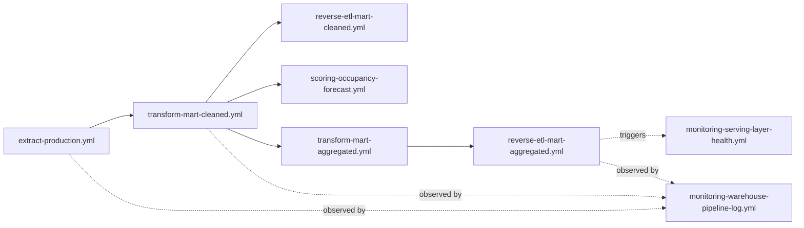

# Katalog Workflow GitHub Actions

Workflow di folder ini membentuk orkestrasi serverless untuk monitoring, extraction, transformasi, reverse ETL, scoring mock, dan observability. Konvensi penamaan dan dependency normatif dijelaskan di [docs/05-orchestrator/konvensi-job-dependency.md](../../docs/05-orchestrator/konvensi-job-dependency.md).

## Prinsip workflow

1. Satu workflow mewakili satu tanggung jawab operasional yang jelas.
2. Dependency antar workflow menggunakan `workflow_run`; workflow yang mendengar dependency memeriksa status sukses sebelum melanjutkan, kecuali collector yang memang perlu mencatat kegagalan.
3. Secret ditulis sementara ke environment runner dan tidak disimpan sebagai file repository.
4. Monitoring mengamati pipeline tanpa mengubah logic pipeline yang diamati.

## Jalur data utama

`transform-mart-cleaned.yml` saat ini berjalan dengan buffer waktu setelah extraction, bukan `workflow_run` gate. Gap dependency tersebut didokumentasikan sebagai keputusan terbuka dan dipantau secara defensif oleh monitoring.

## Workflow pipeline

| Workflow | Trigger utama | Menjalankan | Catatan |
| --- | --- | --- | --- |
| [extract-production.yml](extract-production.yml) | cron + manual dispatch | `scripts/extract/extract.py` | memuat 23 tabel ke `raw_production` dan memperbarui expiration Sandbox |
| [transform-mart-cleaned.yml](transform-mart-cleaned.yml) | cron + manual dispatch | dbt staging dan `mart_cleaned/promote.py` | menjalankan quality gate sebelum promotion |
| [reverse-etl-mart-cleaned.yml](reverse-etl-mart-cleaned.yml) | `workflow_run` transform cleaned | `scripts/reverse_etl/` | full refresh, parity gate, dan swap serving |
| [scoring-occupancy-forecast.yml](scoring-occupancy-forecast.yml) | `workflow_run` transform cleaned | `scripts/ml_scoring/mock_score.py` | stand-in provisional untuk scoring eksternal |
| [transform-mart-aggregated.yml](transform-mart-aggregated.yml) | `workflow_run` transform cleaned | `mart_aggregated/promote.py` dan sensor ML | promotion core dipisahkan dari feedback loop ML best-effort |
| [reverse-etl-mart-aggregated.yml](reverse-etl-mart-aggregated.yml) | `workflow_run` transform aggregated | `scripts/reverse_etl_mart_aggregated/` | sync 76 tabel, reindex, dan analyze pasca-swap |

## Workflow monitoring

| Workflow | Trigger utama | Tanggung jawab |
| --- | --- | --- |
| [monitoring.yml](monitoring.yml) | cron + manual dispatch | monitoring Fase 1 untuk production data |
| [monitoring-warehouse-pipeline-log.yml](monitoring-warehouse-pipeline-log.yml) | `workflow_run` pada enam workflow pipeline | mencatat status dan durasi run, termasuk kegagalan upstream |
| [monitoring-warehouse-dq-anomaly.yml](monitoring-warehouse-dq-anomaly.yml) | schedule + dispatch | DQ gate result, volume anomaly, ML health, dan dependency gap |
| [monitoring-serving-layer-health.yml](monitoring-serving-layer-health.yml) | `workflow_run` reverse ETL aggregated | storage, vacuum, orphan table, dan swap-duration health |

## Workflow demo orchestrator

`orchestrator-demo-extract.yml`, `orchestrator-demo-transform.yml`, dan `orchestrator-demo-monitoring.yml` adalah artefak Milestone 2.0 yang membuktikan pola dependency GitHub Actions. Mereka bukan jalur data produksi utama; gunakan workflow pipeline di atas untuk memahami proses aktif.

## Cara menelusuri sebuah run

1. Mulai dari workflow yang menjadi sumber event.
2. Periksa dependency `workflow_run` dan `if` condition pada workflow downstream.
3. Gunakan [monitoring-warehouse-pipeline-log.yml](monitoring-warehouse-pipeline-log.yml) untuk riwayat lintas workflow.
4. Periksa [Milestone 6.7 report](../../milestones/6.7-dashboard-alerting-terpadu/report.md) untuk cara alert dan root-cause grouping dikonsolidasikan.

## Referensi lanjutan

- [Konvensi job dan dependency](../../docs/05-orchestrator/konvensi-job-dependency.md)
- [Katalog script](../../scripts/README.md)
- [Rekam milestone](../../milestones/README.md)
- [Pemetaan titik observasi pipeline](../../docs/10-monitoring-warehouse-serving/pemetaan-titik-pengamatan-pipeline.md)
