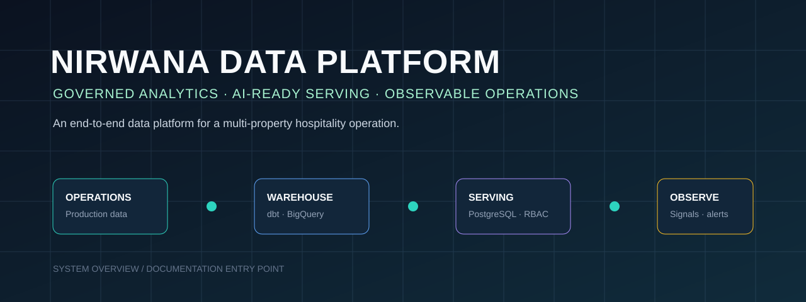
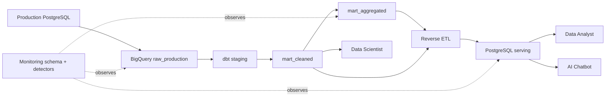

# Nirwana Data Platform

<p align="center">
  
</p>

> An end-to-end data platform for governed analytics, AI-ready serving, and observable operations in a multi-property hospitality environment.

This repository documents the design, implementation, verification, and operational trade-offs behind Nirwana Data Platform. It follows the path from operational PostgreSQL data, through a BigQuery warehouse and dbt marts, to PostgreSQL serving layers for Data Analysts and an AI Chatbot.

The data domain represents a fictional five-property hospitality group. Its synthetic data deliberately includes realistic quality conditions—such as meaningful missing values, formatting variation, and selected duplicates—so the platform can demonstrate how data quality controls preserve business context rather than simply remove imperfect records.

## Start here

Choose the path that matches what you want to understand:

| Read this | To understand |
| --- | --- |
| [System Guides](docs/guides/README.md) | the guided narrative from problem context to operational trade-offs |
| [Technical Reference](docs/README.md) | detailed architecture, milestone records, scripts, workflow, and verification sources |
| [System Architecture](docs/guides/02-system-architecture.md) | data flow, component boundaries, and the difference between target and as-built architecture |
| [Build Journey](docs/guides/03-building-the-platform.md) | how the platform evolved from production monitoring to end-to-end observability |
| [Trust and Access Controls](docs/guides/04-data-quality-and-trust.md) | quality gates, parity checks, scoped credentials, and verification evidence |
| [Operations and Observability](docs/guides/06-observability-and-operations.md) | pipeline signals, anomaly detection, and root-cause grouping |

## System at a glance



## Design principles

1. **Separate data by consumption purpose.** `mart_cleaned` preserves granular, cleaned data; `mart_aggregated` stores approved business metrics at an intentional grain.
2. **Preserve business meaning during cleaning.** A null, duplicate, or inconsistent value is not removed unless its meaning is understood.
3. **Publish through gates.** dbt test, validation, row-count parity, then table swap; a failed candidate never replaces the live table.
4. **Apply least privilege in layers.** Credentials, schemas, views, API whitelists, and request authorization each constrain a different boundary.
5. **Make operations inspectable.** Pipeline run logs, DQ results, anomalies, reverse-ETL health, and Chatbot performance are consolidated into one observability backbone.

## Implementation footprint

| Area | Implemented capability |
| --- | --- |
| Data foundation | incremental extraction of 23 source tables into BigQuery |
| Transform | dbt staging, 23 `mart_cleaned` tables, and 76 `mart_aggregated` models (27 dimensions and 49 facts) |
| Serving | full-history reverse ETL to PostgreSQL with row-count parity and RENAME-based swap |
| Analyst access | domain views, 50 evidence-based indexes, API query patterns, and 7 read-only roles |
| Chatbot boundary | 67 views, 10 domain-scoped readers, query audit, and a 200-cell RBAC verification matrix |
| Operations | GitHub Actions orchestration, monitoring collectors/detectors, Grafana provisioning, and root-cause alert grouping |

## Documentation map

```text
README.md                         Project entry point
docs/guides/                      Guided system narrative
docs/README.md                    Technical-reference index
docs/01-architecture/             Architecture, metadata, and schema rationale
docs/02-requirements/             Consumer and RBAC requirements
docs/03-implementation-plans/     Milestone contracts and scope
docs/04-10-*/                     Monitoring, credentials, mart, and serving references
milestones/                       Decisions, event logs, reports, and known gaps
warehouse/                        dbt project, models, macros, seeds, and tests
scripts/                          Operational implementation by responsibility
.github/workflows/                Scheduled and dependency-driven workflows
```

For a detailed reading path, see [System Guides](docs/guides/README.md). For the full architecture, start with [Rancangan Arsitektur Data Platform ELT](docs/01-architecture/rancangan-arsitektur-data-platform-elt.md).

## Working with the repository

This repository contains production-oriented scripts and infrastructure configuration. Before running any component:

- use [.env.example](.env.example) as the environment-variable reference; never commit a populated `.env` file;
- read [warehouse/README.md](warehouse/README.md) before running dbt models, especially the section on values intentionally not cleaned;
- read [Keputusan Tertunda](docs/keputusan-tertunda.md) before treating a known limitation as an accidental omission;
- follow the existing workflow and credential conventions rather than creating broad access paths.

## Current boundaries and next decisions

The as-built system contains intentional, documented constraints: BigQuery Sandbox affects materialization and table lifetime; the ML feedback loop uses a provisional mock scorer; external alert delivery remains deferred; and some serving-view automation requires a follow-up decision. These are described with context and proposed revisit conditions in [Trade-off dan Keputusan Lanjutan](docs/guides/07-tradeoffs-and-next-decisions.md).

## Primary references

- [System Guides](docs/guides/README.md)
- [Architecture](docs/01-architecture/rancangan-arsitektur-data-platform-elt.md)
- [Deferred Decisions](docs/keputusan-tertunda.md)
- [Milestone Reports](milestones/)
