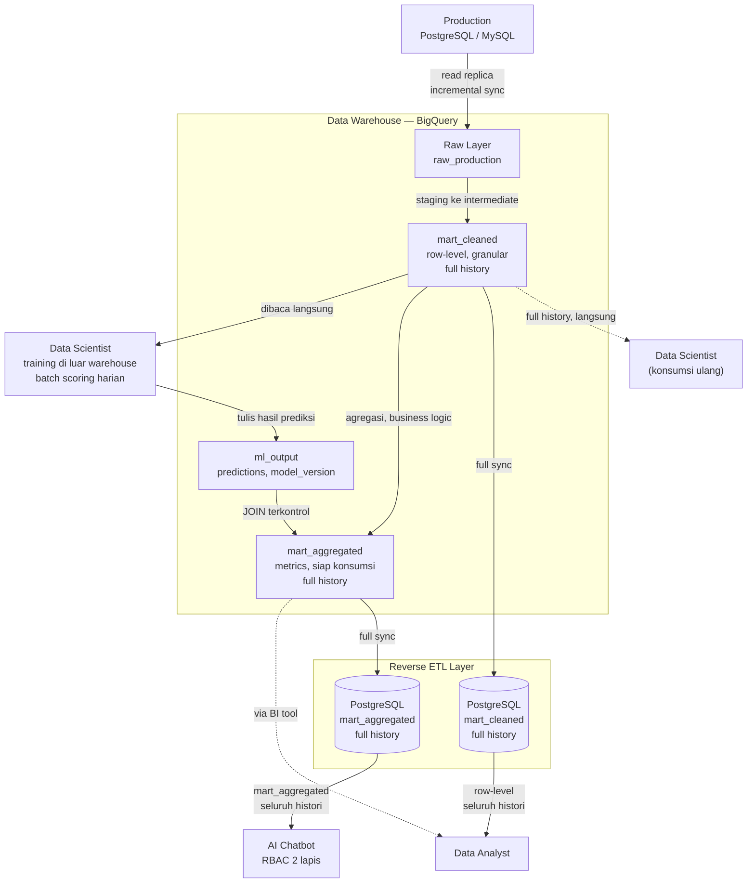
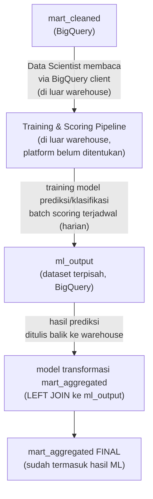

# Rancangan Arsitektur Data Platform ELT

**Production Database → Data Warehouse → Data Marts → Serving Layer**
Mengakomodasi konsumsi oleh Data Analyst, Data Scientist, dan AI Chatbot Agentic

| | |
|---|---|
| **Sumber data** | PostgreSQL / MySQL (Production) |
| **Data Warehouse** | Google BigQuery |
| **Serving Layer** | PostgreSQL (Reverse ETL) |
| **Pola Pipeline** | ELT (Extract – Load – Transform), transformasi dijalankan di dalam warehouse |
| **Status Dokumen** | Draft — sebagian keputusan menunggu validasi (lihat Bagian 10) |

---

## Daftar Isi

1. [Ringkasan Eksekutif](#1-ringkasan-eksekutif)
2. [Tujuan dan Cakupan Sistem](#2-tujuan-dan-cakupan-sistem)
3. [Arsitektur Keseluruhan (End-to-End)](#3-arsitektur-keseluruhan-end-to-end)
4. [Layer Extract & Load (Production → Raw Warehouse)](#4-layer-extract--load-production--raw-warehouse)
5. [Layer Transform (di dalam BigQuery)](#5-layer-transform-di-dalam-bigquery)
6. [Feedback Loop: Data Scientist → ML Output → Mart Aggregated](#6-feedback-loop-data-scientist--ml-output--mart-aggregated)
7. [Layer Reverse ETL (BigQuery → PostgreSQL)](#7-layer-reverse-etl-bigquery--postgresql)
8. [Peta Akses Konsumen dan Keamanan (RBAC)](#8-peta-akses-konsumen-dan-keamanan-rbac)
9. [Orkestrasi dan Monitoring](#9-orkestrasi-dan-monitoring)
   - 9.1 [Orkestrasi End-to-End](#91-orkestrasi-end-to-end)
   - 9.2 [Lima Pilar Monitoring](#92-lima-pilar-monitoring)
   - 9.3 [Performance Optimization](#93-performance-optimization)
   - 9.4 [Deteksi Perubahan pada Data](#94-deteksi-perubahan-pada-data)
   - 9.5 [Monitoring Spesifik Reverse ETL](#95-monitoring-spesifik-reverse-etl)
   - 9.6 [Monitoring Query AI Chatbot](#96-monitoring-query-ai-chatbot)
   - 9.7 [Monitoring Model/ML](#97-monitoring-modelml)
10. [Area yang Masih Memerlukan Validasi](#10-area-yang-masih-memerlukan-validasi)
11. [Checklist Implementasi](#11-checklist-implementasi)
12. [Opsi Tooling (Ilustratif)](#12-opsi-tooling-ilustratif)

---

## 1. Ringkasan Eksekutif

Dokumen ini menjabarkan rancangan arsitektur data platform untuk kebutuhan ELT (Extract, Load, Transform) dari database production ke data warehouse, dilanjutkan dengan distribusi data marts ke serving layer, guna melayani tiga jenis konsumen dengan karakteristik kebutuhan yang berbeda: Data Analyst, Data Scientist, dan AI Chatbot berbasis agen (agentic AI).

Sistem ini dirancang bukan sebagai pipeline linear sederhana, melainkan memiliki dua karakteristik khusus yang memengaruhi banyak keputusan desain di dalamnya:

- **Feedback loop** — hasil kerja Data Scientist (model prediksi dan klasifikasi) menjadi input balik ke dalam data mart yang dikonsumsi oleh AI Chatbot, sehingga alur data membentuk siklus, bukan garis lurus satu arah.
- **Serving layer terpisah** — data marts pada akhirnya tidak diakses langsung dari data warehouse oleh sebagian konsumen, melainkan didorong (reverse ETL) ke database PostgreSQL terpisah demi memenuhi kebutuhan latensi rendah, terutama untuk AI Chatbot yang beroperasi secara interaktif/percakapan.

### Ringkasan Keputusan Arsitektur Utama

- Extraction dari production menggunakan strategi incremental sync, dari read replica — bukan primary — untuk menjaga kesehatan database transaksional.
- Transformasi dilakukan sepenuhnya di dalam BigQuery, menghasilkan dua tipe data mart dengan tujuan berbeda: `mart_cleaned` (granular, row-level) dan `mart_aggregated` (metrics, hasil agregasi bisnis).
- Data Scientist mengonsumsi `mart_cleaned` langsung dari BigQuery; hasil model (prediksi/klasifikasi) ditulis ke tabel `ml_output` yang kemudian di-join secara terkontrol ke `mart_aggregated`.
- `mart_aggregated` dan `mart_cleaned` di-reverse-ETL secara penuh (seluruh histori, tanpa pembatasan rentang waktu) ke PostgreSQL sebagai serving layer, agar dapat diakses dengan latensi rendah — Data Analyst membutuhkan detail row-level penuh untuk analisis kuartalan/semesteran/tahunan, dan AI Chatbot membutuhkan agregat dari seluruh histori tanpa batas waktu.
- AI Chatbot hanya memiliki akses ke `mart_aggregated` di PostgreSQL, dengan dua lapis kontrol akses: RBAC berbasis intent di application layer, dan isolasi kredensial read-only di level database sebagai lapis pertahanan kedua.

> **Catatan:** Beberapa parameter teknis — khususnya volume data aktual, platform training model, dan kebutuhan freshness data — masih memerlukan validasi lebih lanjut sebelum implementasi final dapat dikunci sepenuhnya. Area ini didokumentasikan secara eksplisit pada [Bagian 10](#10-area-yang-masih-memerlukan-validasi) agar tidak menjadi asumsi tersembunyi.

---

## 2. Tujuan dan Cakupan Sistem

### 2.1 Tujuan

- Menyediakan satu sumber kebenaran (*single source of truth*) hasil replikasi data production yang konsisten dan teruji kualitasnya di data warehouse.
- Menyediakan data mart yang sesuai kebutuhan masing-masing konsumen: granular untuk pemodelan, teragregasi untuk konsumsi cepat dan aman.
- Mengintegrasikan hasil kerja Data Scientist (model prediksi/klasifikasi) kembali ke dalam alur data secara terstruktur dan dapat ditelusuri (*traceable*).
- Menyediakan serving layer dengan latensi rendah untuk konsumsi interaktif, khususnya oleh AI Chatbot.
- Menjamin isolasi akses yang ketat antar konsumen sesuai kebutuhan dan tingkat sensitivitas data.

### 2.2 Konsumen Sistem

| Konsumen | Kebutuhan Utama | Sumber Data Akhir |
|---|---|---|
| **Data Analyst** | Analisis cepat/interaktif dan analisis historis mendalam | PostgreSQL (recent) + BigQuery (full history, via BI tool) |
| **Data Scientist** | Data granular row-level untuk feature engineering dan training model | BigQuery `mart_cleaned` (full history) |
| **AI Chatbot (Agentic)** | Query cepat, aman, dan sudah teragregasi untuk menjawab percakapan | PostgreSQL `mart_aggregated` (termasuk hasil ML) |

> **Prinsip desain:** Setiap konsumen mengakses data melalui jalur yang paling sesuai dengan pola query dan tingkat kepercayaan (*trust level*) mereka — bukan seluruh konsumen memakai jalur yang sama.

---

## 3. Arsitektur Keseluruhan (End-to-End)

Diagram berikut menggambarkan alur data dari production database hingga ke seluruh konsumen akhir, termasuk feedback loop dari Data Scientist dan reverse ETL layer ke PostgreSQL.



---

## 4. Layer Extract & Load (Production → Raw Warehouse)

### 4.1 Prinsip Desain

Layer ini murni memindahkan data dari production ke warehouse tanpa transformasi bisnis apa pun — skema di sisi raw dibuat identik (1:1) dengan sumbernya. Transformasi baru terjadi pada tahap berikutnya di dalam warehouse, sesuai prinsip ELT.

### 4.2 Extraction dari Production

- Sumber: PostgreSQL dan/atau MySQL production database.
- Ekstraksi dilakukan dari **read replica**, bukan dari primary database, untuk mencegah beban sinkronisasi mengganggu traffic transaksional aplikasi.
- Kapabilitas tool ekstraksi yang dibutuhkan: mendukung koneksi native ke PostgreSQL dan MySQL, mendukung strategi incremental sync maupun Change Data Capture (CDC), sehingga dapat ditingkatkan ke CDC di kemudian hari tanpa perlu mengganti tool. Lihat [Bagian 12](#12-opsi-tooling-ilustratif) untuk contoh kategori tool yang memenuhi kapabilitas ini.
- Strategi sinkronisasi awal: **incremental sync** berbasis kolom `updated_at` atau CDC log — bukan full table scan setiap kali sync, untuk menjaga performa production database.

#### 4.2.1 Konfigurasi Teknis di Sisi Production

- Jika menggunakan CDC: aktifkan `wal_level=logical` (PostgreSQL) atau binlog format `ROW` (MySQL).
- Buat user replikasi/ekstraksi dengan privilese terbatas, hanya pada tabel yang di-*whitelist* — sinkronisasi tidak dilakukan secara membabi buta ke seluruh tabel, terutama tabel yang memuat data PII (*Personally Identifiable Information*).

### 4.3 Landing Zone di BigQuery

- Dataset khusus: `raw_production`, menyimpan data apa adanya dari sumber.
- Partitioning berdasarkan kolom waktu ingest (`_synced_at`) untuk efisiensi biaya query di kemudian hari.
- Kolom metadata tambahan pada setiap tabel: `_synced_at` (waktu sinkronisasi) dan `_source_table` (nama tabel asal), untuk keperluan traceability.

> **Catatan:** Skema production dapat berubah sewaktu-waktu (*schema drift*). Perlu strategi penanganan — baik melalui fitur deteksi otomatis dari tool ekstraksi yang dipilih maupun proses alerting manual — agar perubahan kolom baru di production tidak menyebabkan kegagalan diam-diam (*silent failure*) di downstream.

---

## 5. Layer Transform (di dalam BigQuery)

### 5.1 Struktur Layer Transformasi

Transformasi disusun berjenjang menjadi tiga layer konseptual di dalam BigQuery, masing-masing dengan tanggung jawab yang jelas dan tidak tumpang tindih:

```
Layer 1: Staging
   - Representasi 1:1 dengan raw, cleaning ringan: type cast, rename, dedup
   - Contoh cakupan: staging untuk tabel orders, customers, dst.

Layer 2: Intermediate
   - Join antar tabel staging, business logic sementara
   - Contoh cakupan: enrichment data orders dengan atribut customer

Layer 3: Marts
   - cleaned/   -> mart_cleaned (full history, row-level)
   - aggregated/ -> mart_aggregated (termasuk join ke ml_output)
```

Penerapan struktur berjenjang ini dapat dilakukan dengan berbagai tool transformasi berbasis SQL yang mendukung layering model, testing, dan dependency management — lihat [Bagian 12](#12-opsi-tooling-ilustratif) untuk contoh kategori tool yang umum dipakai untuk kebutuhan ini.

### 5.2 Dua Tipe Data Mart — Keputusan Desain Inti

Pemisahan dua tipe mart ini merupakan keputusan arsitektural paling mendasar dalam sistem ini, karena menentukan siapa boleh mengonsumsi data seperti apa.

| Aspek | `mart_cleaned` | `mart_aggregated` |
|---|---|---|
| **Granularitas** | Row-level, sedetail data sumber | Teragregasi (harian/kategori/dsb) |
| **Transformasi** | Cleaning saja: dedup, null handling, type cast | Business logic penuh: agregasi, metrics, join lintas domain |
| **Konsumen utama** | Data Scientist | AI Chatbot, Data Analyst |
| **Alasan desain** | Model ML butuh detail/sinyal yang sering hilang akibat agregasi dini | Chatbot tidak perlu — dan sebaiknya tidak — menghitung ulang logic bisnis sendiri via prompt |

#### 5.2.1 Cakupan `mart_aggregated` Dibatasi Secara Sengaja

Secara kombinatorik, jumlah agregasi dan operasi antar kolom yang *mungkin* dibentuk dari data yang tersedia bisa sangat besar — kombinasi antara kolom, fungsi agregasi, dan dimensi pengelompokan akan bertambah dengan cepat seiring bertambahnya jumlah kolom sumber. `mart_aggregated` tidak dirancang untuk memuat seluruh kemungkinan kombinasi tersebut, melainkan hanya subset yang dipilih secara sengaja.

Tujuan pembatasan ini adalah kemudahan: Data Analyst, Data Scientist, dan AI Chatbot seharusnya bisa langsung mengambil hasil perhitungan yang sudah tersedia di `mart_aggregated` untuk kebutuhan yang umum dan berulang, tanpa harus selalu menghitung ulang dari data mentah setiap kali. Semakin lengkap dan relevan cakupan agregasi yang tersedia, semakin sedikit pekerjaan berulang yang perlu dilakukan ketiga konsumen tersebut.

Cakupan konkret — agregasi dan operasi apa saja yang akan dibangun, dan berapa batas jumlahnya — **belum ditentukan di dokumen ini**, karena penentuannya bergantung pada pemetaan kebutuhan nyata dari ketiga konsumen yang belum dilakukan secara menyeluruh. Dokumen ini secara sengaja tidak menetapkan daftar operasi tersebut, agar rancangan arsitektur tetap fleksibel dan tidak mengunci detail teknis yang seharusnya lahir dari proses requirement gathering, bukan dari tahap perancangan arsitektur. Lihat [Bagian 10](#10-area-yang-masih-memerlukan-validasi) untuk status area ini sebagai kerja lanjutan.

### 5.3 Data Quality Gate

- Pengujian data wajib di setiap layer: validasi nilai tidak boleh kosong (`not_null`), validasi keunikan (`unique`), validasi relasi antar tabel (`relationships`), validasi nilai yang diperbolehkan (`accepted_values`).
- Custom test untuk business rule spesifik, misalnya `revenue >= 0` atau validasi format email.
- Pengujian berfungsi sebagai gerbang kualitas — data yang tidak lolos pengujian tidak diteruskan ke mart, apalagi ke consumer manapun.

---

## 6. Feedback Loop: Data Scientist → ML Output → Mart Aggregated

Ini adalah karakteristik khusus sistem ini yang membedakannya dari pipeline ELT konvensional: hasil pekerjaan salah satu konsumen (Data Scientist) menjadi input balik ke dalam mart yang dikonsumsi konsumen lain (AI Chatbot).

### 6.1 Alur Data



### 6.2 Mengapa `ml_output` Dipisah, Bukan Ditulis Langsung ke Mart

Prinsip yang dipegang: proses eksternal tidak boleh menulis langsung ke tabel mart final. Alasannya:

1. **Traceability** — harus bisa ditelusuri kapan model versi tertentu menghasilkan prediksi tertentu.
2. **Rollback** — jika model baru bermasalah, dapat di-rollback tanpa merusak seluruh `mart_aggregated`.
3. **Kontrol** — layer transformasi memperlakukan `ml_output` sebagai *source* yang di-join secara terkontrol, bukan black-box write dari sistem eksternal.

### 6.3 Skema Tabel `ml_output`

```sql
CREATE TABLE ml_output.predictions (
  prediction_id STRING,
  entity_id STRING,              -- FK ke entity di mart_cleaned
  model_name STRING,              -- misal 'churn_classifier'
  model_version STRING,           -- WAJIB, untuk traceability
  prediction_type STRING,         -- 'classification' / 'regression' / 'score'
  predicted_value STRING,         -- bisa berupa JSON jika multi-output
  confidence_score FLOAT64,
  scored_at TIMESTAMP,
  feature_snapshot_at TIMESTAMP   -- versi data mart_cleaned yang dipakai saat scoring
)
PARTITION BY DATE(scored_at)
```

> **Wajib diisi:** Kolom `model_version` dan `feature_snapshot_at` bersifat wajib. Jika chatbot menyajikan jawaban berdasarkan prediksi dari model versi lama atau snapshot data yang sudah usang, ini adalah masalah kepercayaan (*trust*) yang serius dan harus dapat ditelusuri baliknya.

### 6.4 Orkestrasi Loop

Karena scoring terjadi di luar warehouse, urutan eksekusi berikut bersifat kritis dan diatur dalam satu orchestrator yang sama dengan pipeline ELT utama:

1. `mart_cleaned` selesai di-refresh (proses transformasi berjalan).
2. Trigger scoring job eksternal (melalui pemanggilan API atau mekanisme trigger orchestrator).
3. Sensor menunggu hingga `ml_output` selesai ditulis.
4. Proses transformasi untuk `mart_aggregated` dijalankan (melakukan join ke `ml_output`).
5. Pengujian data dijalankan untuk validasi `mart_aggregated` final.

### 6.5 Batch Scoring

Berdasarkan kebutuhan yang telah dikonfirmasi, proses scoring dilakukan secara **batch terjadwal (harian)**, bukan on-demand/real-time. Ini menyederhanakan orkestrasi karena tidak memerlukan mekanisme trigger real-time dari sisi chatbot ke pipeline scoring.

---

## 7. Layer Reverse ETL (BigQuery → PostgreSQL)

### 7.1 Mengapa Layer Ini Diperlukan

BigQuery adalah sistem OLAP (columnar) yang unggul untuk pemindaian data besar dan agregasi berat, namun memiliki overhead startup per query (umumnya 1–2 detik) yang kurang ideal untuk pola akses interaktif. PostgreSQL adalah sistem OLTP (row-based) yang unggul untuk point-lookup cepat dan menangani banyak koneksi bersamaan dengan latensi rendah.

Pola akses AI Chatbot — banyak query kecil, sering, dan membutuhkan respons cepat untuk mendukung percakapan — secara karakteristik jauh lebih sesuai dengan OLTP. Praktik memindahkan data dari warehouse kembali ke database operasional/serving ini dikenal secara luas di industri dengan istilah **Reverse ETL**.

### 7.2 Strategi Reverse ETL: Full Sync untuk Kedua Mart

Kedua mart — `mart_aggregated` maupun `mart_cleaned` — di-reverse-ETL secara penuh ke PostgreSQL, mencakup seluruh histori tanpa pembatasan rentang waktu. Ini merupakan revisi dari pendekatan windowed (hanya mengirim sebagian rentang waktu terkini) yang sempat dipertimbangkan di awal rancangan, karena kebutuhan aktual dari kedua sisi konsumen ternyata tidak mengizinkan pembatasan tersebut:

- **AI Chatbot** perlu dapat menjawab pertanyaan yang mencakup seluruh rentang waktu sejak sistem berjalan, bukan hanya periode terkini — sehingga `mart_aggregated` di PostgreSQL harus mencakup agregat dari seluruh histori.
- **Data Analyst** memiliki tugas analisis kuartalan, semesteran, dan tahunan yang membutuhkan detail row-level penuh — bukan cukup data yang sudah teragregasi — sehingga `mart_cleaned` di PostgreSQL juga tidak dapat dibatasi ke rentang waktu tertentu.

#### 7.2.1 `mart_aggregated` → Full Sync

- Karena sudah teragregasi, volume data secara alami cenderung jauh lebih terkendali dibanding `mart_cleaned`, meskipun mencakup seluruh histori.
- Strategi sinkronisasi: **full refresh dengan swap table** — data dimuat ke tabel staging terlebih dahulu, baru kemudian ditukar (rename) dengan tabel produksi, sehingga tidak ada downtime baca selama proses pemuatan berlangsung.

```sql
CREATE TABLE mart_aggregated_staging (LIKE mart_aggregated INCLUDING ALL);
-- proses load data ke staging
BEGIN;
ALTER TABLE mart_aggregated RENAME TO mart_aggregated_old;
ALTER TABLE mart_aggregated_staging RENAME TO mart_aggregated;
COMMIT;
DROP TABLE mart_aggregated_old;
```

#### 7.2.2 `mart_cleaned` → Full Sync

Karena `mart_cleaned` bersifat row-level dan mencakup seluruh histori, mart ini secara alami memiliki volume lebih besar dibanding `mart_aggregated`. Untuk skala proyek ini, volume yang diperkirakan masih berada dalam rentang yang wajar ditangani PostgreSQL, sehingga strategi sinkronisasi yang sama dengan `mart_aggregated` — **full refresh dengan swap table** — dipakai sebagai pendekatan utama, tanpa perlu kompleksitas tambahan seperti incremental sync atau native table partitioning sejak awal.

Strategi ini tetap dapat ditingkatkan ke incremental sync di kemudian hari apabila volume data bertumbuh signifikan melampaui perkiraan awal — tapi ini bukan kebutuhan yang diantisipasi sejak sekarang, dan tidak perlu dibangun di muka.

### 7.3 Perbandingan Strategi Reverse ETL

| Aspek | `mart_aggregated` | `mart_cleaned` |
|---|---|---|
| **Cakupan data** | Seluruh histori (full sync) | Seluruh histori (full sync) |
| **Volume relatif** | Lebih terkendali (sudah teragregasi) | Lebih besar (row-level), namun masih dalam skala wajar untuk proyek ini |
| **Strategi sync** | Full refresh + swap table | Full refresh + swap table |
| **Konsumen di Postgres** | AI Chatbot, Data Analyst | Data Analyst |

### 7.4 Data Scientist Tetap di BigQuery

Data Scientist tidak mengakses PostgreSQL sama sekali untuk kebutuhan training. Training model umumnya membutuhkan pemindaian seluruh data historis, yang justru merupakan kekuatan natural BigQuery. Memindahkan kebutuhan ini ke PostgreSQL akan bertentangan dengan karakteristik masing-masing sistem dan tidak memberikan manfaat.

---

## 8. Peta Akses Konsumen dan Keamanan (RBAC)

### 8.1 Peta Akses Final

| Konsumen | Sumber Data | Alasan |
|---|---|---|
| **Data Scientist** | BigQuery `mart_cleaned` (full history) | Butuh data granular dan kapasitas pemindaian data besar untuk training model |
| **Data Analyst** | PostgreSQL `mart_cleaned` dan `mart_aggregated` (keduanya full history, cepat) + BigQuery langsung (via BI tool, untuk kebutuhan analitis lanjutan yang tidak tersedia di serving layer) | Butuh detail row-level penuh untuk analisis kuartalan/semesteran/tahunan, dengan performa akses yang cepat |
| **AI Chatbot** | PostgreSQL `mart_aggregated` **SAJA** | Latensi rendah untuk percakapan; terisolasi total dari data granular/raw demi keamanan |

### 8.2 RBAC Dua Lapis untuk AI Chatbot

Sistem AI Chatbot memiliki mekanisme RBAC tersendiri di application layer: frontend mengirimkan identitas pengguna yang melakukan prompting, dan chatbot melakukan validasi apakah maksud (*intent*) dari prompt tersebut sesuai dengan peran (*role*) pengguna sebelum query dieksekusi. Permintaan yang tidak sesuai akan ditolak pada tahap ini.

Mekanisme ini efektif sebagai lapis pertama, namun tidak dirancang untuk menjadi satu-satunya lapisan keamanan. Prinsip **defense in depth** diterapkan dengan menambahkan lapis kedua yang bersifat teknis di level database:

| Lapis | Lokasi | Fungsi |
|---|---|---|
| **Lapis 1** | Application layer (chatbot) | Validasi intent/prompt terhadap role pengguna sebelum query dieksekusi |
| **Lapis 2** | Database/infrastructure layer | Service account chatbot secara teknis hanya memiliki privilese `SELECT` ke `mart_aggregated` di PostgreSQL — tidak ada jalur apa pun menuju `mart_cleaned`, `raw_production`, atau production database asli |

> **Mengapa dua lapis:** Jika lapis pertama gagal — misalnya karena bug pada logika validasi atau upaya prompt injection — lapis kedua tetap berfungsi sebagai pengaman akhir yang murni bersifat teknis dan tidak bergantung pada benar-tidaknya application logic.

Karena AI Chatbot terhubung ke PostgreSQL — bukan BigQuery — isolasi ini menjadi semakin kuat: berbeda sistem, berbeda kredensial, berbeda jalur jaringan sepenuhnya. Secara arsitektural, chatbot tidak akan pernah dapat "nyasar" ke BigQuery karena memang tidak pernah terhubung ke sana sama sekali.

### 8.3 Prinsip Keamanan Tambahan

- Setiap dataset di BigQuery (`raw_production`, `mart_cleaned`, `mart_aggregated`, `ml_output`) memiliki service account dengan IAM yang di-*scope* secara terpisah — minimal 4 service account berbeda: satu untuk proses transformasi (baca-tulis di seluruh dataset transformasi), satu untuk penulisan hasil model ML (`ds-write`), satu untuk chatbot (`chatbot-readonly`, jika masih dibutuhkan sebagai fallback), dan satu untuk Data Analyst (`analyst-readonly`).
- Tidak ada satu pun credential yang memiliki akses lintas dataset secara default; akses lintas dataset harus eksplisit diberikan sesuai kebutuhan.
- Data sensitif (PII) yang mungkin ada di `raw_production` tidak diteruskan ke `mart_aggregated` tanpa proses masking/anonymization yang eksplisit didefinisikan di layer transform.

---

## 9. Orkestrasi dan Monitoring

### 9.1 Orkestrasi End-to-End

Satu orchestrator mengatur seluruh urutan eksekusi dari ujung ke ujung, dengan dependency eksplisit antar tahap — tidak ada layer yang berjalan sebelum layer sebelumnya selesai dan lolos pengujian.

1. Sinkronisasi ekstraksi (production → `raw_production`)
2. Proses transformasi: staging → intermediate → `mart_cleaned`
3. Pengujian data: validasi `mart_cleaned`
4. Trigger scoring job eksternal (pipeline Data Scientist)
5. Sensor: menunggu `ml_output` selesai ditulis
6. Proses transformasi: `mart_aggregated` (join ke `ml_output`)
7. Pengujian data: validasi `mart_aggregated`
8. Reverse ETL job: `mart_aggregated` → PostgreSQL (full refresh + swap)
9. Reverse ETL job: `mart_cleaned` → PostgreSQL (full refresh + swap, atau incremental sync tergantung hasil audit volume)
10. Post-sync validation (row count parity check)

### 9.2 Lima Pilar Monitoring

| Pilar | Fokus | Contoh Metrik/Alert |
|---|---|---|
| **Pipeline Health** | Apakah job berjalan atau gagal | Task success/failure alert, SLA duration, dependency visibility |
| **Data Freshness** | Apakah data terbaru sampai tepat waktu | Freshness check pada source ekstraksi, freshness `ml_output`, freshness sync PostgreSQL |
| **Data Quality** | Apakah data benar, bukan sekadar ada | Pengujian data terjadwal, anomaly detection (distribusi/volume tidak wajar) |
| **Volume & Anomali** | Apakah jumlah baris wajar | Row count harian dibandingkan baseline historis |
| **Cost & Performance** | Apakah query/pipeline efisien | Bytes scanned BigQuery, slot usage, storage growth, budget alert |

### 9.3 Performance Optimization

Optimasi performa dibahas terpisah untuk BigQuery dan PostgreSQL karena keduanya punya mekanisme optimasi yang sama sekali berbeda — BigQuery dioptimasi dari sisi *berapa banyak data yang perlu dipindai*, sementara PostgreSQL dioptimasi dari sisi *seberapa cepat satu baris bisa ditemukan dan seberapa banyak koneksi bisa dilayani bersamaan*.

#### 9.3.1 Optimasi BigQuery

**Partitioning dan Clustering**

- Semua tabel besar (raw, staging, marts) di-partition berdasarkan kolom tanggal yang relevan (`_synced_at`, `created_at`, `scored_at`) — ini sudah menjadi bagian dari desain dasar layer raw dan perlu diteruskan konsisten ke seluruh layer turunannya, bukan hanya di raw.
- Tambahan clustering key pada kolom yang sering dipakai sebagai filter di `WHERE` atau join, misalnya `customer_id`, `region`, atau `category_id` pada `mart_aggregated`. Clustering mempersempit data yang benar-benar dipindai di dalam satu partition, sehingga biaya dan waktu query turun signifikan untuk query yang sudah ter-filter oleh partition.

```sql
-- ilustrasi definisi tabel dengan partition + cluster di BigQuery
CREATE TABLE mart_aggregated
PARTITION BY DATE(order_date)
CLUSTER BY region, customer_id
AS SELECT ...
```

**Strategi Materialisasi**

Pemilihan strategi materialisasi tiap layer transformasi berdampak langsung pada biaya dan waktu refresh. Berikut panduan konseptual yang dipakai di project ini:

| Layer | Strategi Materialisasi | Alasan |
|---|---|---|
| `staging` | View / hasil query yang dihitung ulang setiap dipanggil | Ringan, tidak menyimpan data ganda, cukup untuk transformasi ringan yang murah dihitung ulang |
| `intermediate` | View / tidak disimpan sebagai tabel fisik | Hanya dipakai sebagai batu loncatan, tidak perlu disimpan sebagai tabel fisik |
| `mart_cleaned` | Tabel dengan refresh incremental | Volume besar, refresh penuh terlalu mahal; hanya proses baris baru/berubah |
| `mart_aggregated` | Tabel dengan full refresh, atau incremental tergantung volume hasil audit | Perlu snapshot penuh yang konsisten tiap refresh; incremental dipertimbangkan bila volume ternyata besar |

- Untuk refresh incremental, gunakan strategi overwrite per partition alih-alih merge berbasis pencocokan baris bila memungkinkan — pada BigQuery, overwrite per partition umumnya lebih murah dibanding merge yang butuh full table scan untuk pencocokan baris.

**Query & Cost Control**

- Terapkan batas maksimum bytes yang boleh dibaca (`maximum_bytes_billed`) di level project/job untuk mencegah query yang secara tidak sengaja memindai seluruh tabel besar.
- Gunakan mekanisme dry run (estimasi biaya tanpa eksekusi penuh) sebagai bagian dari proses rilis, sebelum model baru di-deploy, untuk mengetahui estimasi biaya sebelum job production berjalan.
- Hindari `SELECT *` di seluruh model transformasi — BigQuery adalah columnar storage, sehingga memilih kolom secara eksplisit langsung mengurangi bytes yang dipindai.
- Evaluasi slot reservation (flat-rate pricing) dibanding on-demand jika volume query sudah cukup tinggi dan predictable — ini keputusan finansial yang perlu ditinjau ulang setelah beberapa bulan berjalan dengan on-demand sebagai baseline.

#### 9.3.2 Optimasi PostgreSQL (Serving Layer)

**Index Strategy**

Karena PostgreSQL di sistem ini murni berperan sebagai serving layer (bukan tempat transaksi), index dirancang seagresif mungkin mengikuti pola baca, tanpa perlu mempertimbangkan trade-off terhadap write-heavy workload seperti pada database OLTP pada umumnya.

| Tabel | Kolom yang di-index | Alasan |
|---|---|---|
| `mart_aggregated` | Kolom tanggal (`date`), kolom dimensi yang sering jadi filter chatbot (`region`, `category`) | Query chatbot didominasi filter tanggal + satu-dua dimensi |
| `mart_cleaned` | Primary key entity (`customer_id`, `order_id`), kolom tanggal | Data Analyst melakukan lookup per entity maupun filter rentang tanggal — mulai dari investigasi harian hingga rentang kuartalan/tahunan untuk kebutuhan pelaporan berkala |

- Gunakan **composite index** untuk kombinasi filter yang sering dipakai bersamaan (misalnya `(region, date)`), bukan hanya index tunggal per kolom — composite index jauh lebih efektif ketika query menyaring lebih dari satu dimensi sekaligus.
- Index dibuat ulang (`REINDEX`) secara berkala pasca `full refresh + swap` bila diperlukan, karena tabel baru hasil swap tidak otomatis mewarisi statistik index dari tabel lama.

**Connection Pooling**

- AI Chatbot berpotensi menghasilkan banyak query pendek secara bersamaan dari berbagai sesi percakapan. PostgreSQL secara default tidak efisien menangani lonjakan koneksi singkat dalam jumlah besar, karena tiap koneksi baru punya overhead pembuatan proses tersendiri.
- Perlu **connection pooler** di depan PostgreSQL, dengan mode transaction pooling — koneksi dipakai bergantian per transaksi, bukan dipegang penuh oleh satu sesi chatbot. Lihat [Bagian 12](#12-opsi-tooling-ilustratif) untuk contoh tool connection pooler yang umum dipakai untuk PostgreSQL.
- Tentukan batas maksimum koneksi pool berdasarkan hasil load testing awal, bukan asumsi angka baku, karena ini bergantung pada pola trafik aktual chatbot yang belum diketahui.

**Query Performance**

- Gunakan `EXPLAIN ANALYZE` secara rutin terhadap pola query representatif dari chatbot (bukan hanya saat troubleshooting) untuk mendeteksi query plan yang tidak memakai index sebagaimana mestinya.
- Pantau `pg_stat_statements` untuk mengidentifikasi query yang paling sering dijalankan dan paling lambat — ini jadi kandidat utama untuk optimasi index lanjutan.
- Jadwalkan `VACUUM` dan `ANALYZE` secara berkala, terutama setelah proses `full refresh + swap` yang menghasilkan banyak perubahan data sekaligus.

**Caching Layer (Opsional, Dipertimbangkan Bila Diperlukan)**

- Jika audit pola query chatbot menunjukkan banyak pertanyaan berulang dengan jawaban yang sama dalam rentang waktu pendek (misalnya "total penjualan bulan ini" ditanya berkali-kali oleh pengguna berbeda), pertimbangkan caching layer ringan di depan PostgreSQL untuk query yang sifatnya agregat dan tidak berubah dalam hitungan menit. Lihat [Bagian 12](#12-opsi-tooling-ilustratif) untuk contoh tool in-memory cache yang umum dipakai untuk kebutuhan ini.
- Ini bukan kebutuhan yang pasti diperlukan sejak awal — keputusan ini sebaiknya diambil berdasarkan data pola akses aktual, bukan diasumsikan di muka.

### 9.4 Deteksi Perubahan pada Data

Deteksi perubahan data dibagi menjadi tiga jenis yang berbeda sifat dan mekanismenya: perubahan struktur (schema drift), perubahan pola statistik data yang berdampak pada model ML (data drift), dan perubahan nilai atau volume yang tidak wajar (value/volume anomaly). Ketiganya memerlukan pendekatan deteksi yang berbeda dan tidak bisa saling menggantikan.

#### 9.4.1 Schema Drift (Perubahan Struktur Tabel)

Schema drift terjadi ketika struktur tabel di production berubah — kolom baru ditambahkan, kolom dihapus, atau tipe data suatu kolom berubah — tanpa pemberitahuan eksplisit ke tim data.

- **Deteksi di titik ekstraksi**: kapabilitas deteksi schema change dari tool ekstraksi yang dipilih dikonfigurasi agar perubahan skema memicu notifikasi (bukan otomatis diteruskan tanpa review), terutama untuk kolom baru yang berpotensi memuat data sensitif.
- **Deteksi di titik transform**: mekanisme freshness check pada source dan penguncian ekspektasi skema (schema contract) dipakai untuk mengunci ekspektasi skema pada level staging — jika kolom yang diharapkan hilang atau tipe datanya berubah, proses transformasi akan gagal secara eksplisit alih-alih meneruskan data yang salah bentuk ke downstream.
- **Kebijakan penanganan**: kolom baru dari production tidak otomatis diteruskan ke `mart_cleaned` atau `mart_aggregated` — perlu keputusan sadar apakah kolom tersebut relevan untuk mart dan apakah mengandung PII yang perlu penanganan khusus sebelum diteruskan.

```yaml
# ilustrasi konsep penguncian ekspektasi skema pada layer staging
model: stg_orders
schema_contract:
  enforced: true
columns:
  - name: order_id
    data_type: string
    constraints:
      - not_null
  - name: order_status
    data_type: string
```

#### 9.4.2 Data Drift untuk Kebutuhan ML

Data drift adalah perubahan pola statistik pada data yang dipakai model prediksi/klasifikasi, di mana distribusi data terkini mulai berbeda signifikan dari distribusi data saat model dilatih — ini relevan khusus untuk sistem ini karena ada feedback loop Data Scientist yang hasilnya dikonsumsi langsung oleh AI Chatbot.

- **Feature drift**: pantau distribusi statistik (mean, median, standar deviasi, atau proporsi kategori) dari fitur-fitur utama yang dipakai model, dibandingkan antara data training awal dan data `mart_cleaned` terkini yang dipakai untuk scoring harian. Perubahan signifikan mengindikasikan model mungkin perlu dilatih ulang meskipun belum ada error teknis apa pun.
- **Prediction drift**: pantau distribusi hasil prediksi di `ml_output` dari waktu ke waktu (misalnya proporsi kelas hasil klasifikasi) — pergeseran mendadak pada distribusi output, meskipun input tidak terlihat berubah drastis, adalah sinyal bahwa perlu investigasi lebih lanjut terhadap model maupun data.
- **Mekanisme**: perbandingan distribusi ini dapat dilakukan dengan metrik statistik sederhana (population stability index, atau perbandingan kuantil) yang dihitung sebagai bagian dari pipeline scoring harian, disimpan sebagai tabel metrik terpisah (`ml_monitoring.feature_drift`), dan dipantau trennya melalui dashboard yang sama dengan monitoring lainnya.
- **Tanggung jawab**: karena training model berada di luar warehouse dan dikelola tim Data Scientist, mekanisme deteksi data drift idealnya dibangun sebagai bagian dari pipeline scoring itu sendiri (bukan sebagai proses terpisah di sisi data engineering), namun hasilnya tetap perlu diekspos ke dataset yang dapat dipantau bersama sistem monitoring lainnya, konsisten dengan prinsip traceability yang sudah diterapkan pada skema `ml_output` (lihat [Bagian 6.3](#63-skema-tabel-ml_output)).

> **Catatan:** Ambang batas (threshold) yang dianggap "signifikan" untuk feature drift maupun prediction drift perlu ditentukan bersama tim Data Scientist berdasarkan karakteristik masing-masing model — ini tidak bisa distandardisasi secara seragam di seluruh model tanpa pemahaman domain, dan ditandai sebagai bagian dari [Bagian 10](#10-area-yang-masih-memerlukan-validasi).

#### 9.4.3 Value dan Volume Anomaly

Ini mencakup perubahan pada nilai data atau jumlah baris yang secara statistik tidak wajar dibanding pola historis, terlepas dari apakah skema berubah atau tidak.

- **Volume anomaly**: bandingkan jumlah baris hasil sync/refresh harian terhadap baseline historis (misalnya rata-rata 7 atau 30 hari terakhir) di setiap tahap pipeline — raw, staging, mart. Lonjakan atau penurunan drastis pada satu tahap tapi tidak di tahap lain membantu mengisolasi di mana masalah terjadi.
- **Value anomaly**: pantau distribusi nilai pada kolom-kolom kunci bisnis (misalnya `revenue`, `quantity`) — nilai negatif yang tidak seharusnya ada, lonjakan outlier ekstrem, atau proporsi `NULL` yang tiba-tiba meningkat drastis pada kolom yang biasanya lengkap.
- **Kapabilitas tool yang dibutuhkan**: idealnya tool anomaly detection yang dipilih dapat secara otomatis membangun baseline dari histori run sebelumnya dan memicu alert ketika penyimpangan terdeteksi, tanpa perlu menuliskan threshold secara manual per kolom. Lihat [Bagian 12](#12-opsi-tooling-ilustratif) untuk contoh kategori tool yang memenuhi kapabilitas ini, termasuk opsi untuk kebutuhan lebih kompleks seperti deteksi anomali lintas tabel.
- **Baseline dan sensitivitas**: baseline anomaly detection dihitung secara rolling (bukan statis), agar mengikuti perubahan pola bisnis yang wajar (misalnya lonjakan volume transaksi musiman) tanpa terus-menerus memicu false alert.

### 9.5 Monitoring Spesifik Reverse ETL

- Row count parity check antara BigQuery dan PostgreSQL setelah setiap sinkronisasi selesai.
- PostgreSQL-specific health: connection pool usage, query latency (p50/p95/p99), storage growth, table bloat/status vacuum.

### 9.6 Monitoring Query AI Chatbot

- Audit log setiap query yang dijalankan chatbot: prompt asli pengguna, SQL yang dieksekusi, jumlah baris hasil, waktu eksekusi, dan biaya (jika relevan).
- Pelacakan query yang gagal/ditolak — persentase tinggi menjadi indikator kualitas semantic layer/deskripsi metadata yang perlu diperbaiki.
- Latency end-to-end dari prompt pengguna hingga jawaban chatbot tersaji.

### 9.7 Monitoring Model/ML

- Model staleness — seberapa lama sejak `model_version` terakhir dilatih ulang (*retrain*).
- Validasi jumlah baris di `ml_output` dibandingkan jumlah entity di `mart_cleaned`, untuk mendeteksi entity yang gagal ter-score.
- Feature drift dan prediction drift dipantau berkelanjutan sebagai bagian dari pipeline scoring — lihat detail mekanisme pada [Bagian 9.4.2](#942-data-drift-untuk-kebutuhan-ml).

---

## 10. Area yang Masih Memerlukan Validasi

Bagian ini secara sengaja memisahkan keputusan desain yang sudah solid dari asumsi kerja yang masih memerlukan konfirmasi lebih lanjut, agar tidak menjadi asumsi tersembunyi yang berisiko saat implementasi.

| No. | Area | Status | Dampak Jika Belum Divalidasi |
|---|---|---|---|
| 1 | Platform training model Data Scientist | Belum ditentukan (dipastikan di luar warehouse) | Menentukan bentuk mekanisme trigger/integrasi ke orchestrator pada tahap orkestrasi feedback loop |
| 2 | Kebutuhan freshness data secara keseluruhan | Masih perlu digali dengan stakeholder | Jika ternyata dibutuhkan lebih real-time dari batch harian, strategi extraction dan reverse ETL perlu direvisi ke arah CDC/streaming |
| 3 | Ambang batas (threshold) feature drift dan prediction drift per model | Belum ditentukan, perlu didiskusikan bersama Data Scientist | Tanpa threshold yang disepakati, deteksi data drift tidak dapat dijalankan secara otomatis dan hanya bersifat observasional |
| 4 | Pola akses aktual chatbot ke PostgreSQL (frekuensi, tingkat pengulangan query) | Belum ada data, sistem belum berjalan | Menentukan apakah caching layer tambahan benar-benar diperlukan, serta angka connection pool yang tepat |
| 5 | Pemilihan tool konkret untuk tiap kapabilitas (ekstraksi, transformasi, orkestrasi, anomaly detection, connection pooler, caching) | Belum dibahas oleh tim; hanya BigQuery dan PostgreSQL yang sudah pasti | Memengaruhi detail implementasi teknis (sintaks konfigurasi, cara deploy, biaya lisensi/infrastruktur), meski tidak mengubah arsitektur besar yang sudah dirancang di dokumen ini |
| 6 | Cakupan dan batas jumlah agregasi/operasi antar kolom yang disediakan `mart_aggregated` (lihat [Bagian 5.2.1](#521-cakupan-mart_aggregated-dibatasi-secara-sengaja)) | Belum dipetakan; kebutuhan konkret dari ketiga konsumen belum dikumpulkan secara menyeluruh | Tanpa pemetaan kebutuhan, sulit menentukan agregasi/operasi mana yang benar-benar perlu dibangun di `mart_aggregated`, berisiko membangun terlalu sedikit (konsumen tetap harus hitung ulang dari data mentah) atau terlalu banyak (mart sulit dikelola) |

### 10.1 Langkah yang Direkomendasikan

1. Menetapkan platform training model bersama tim Data Scientist untuk menjawab area validasi nomor 1.
2. Menggali kebutuhan freshness bersama stakeholder bisnis — khususnya untuk use case AI Chatbot dan dashboard BI — untuk menjawab area validasi nomor 2.
3. Mendiskusikan bersama tim Data Scientist ambang batas drift yang wajar untuk masing-masing model, berdasarkan karakteristik dan tingkat sensitivitas masing-masing use case, untuk menjawab area validasi nomor 3.
4. Melakukan load testing awal dan/atau memantau pola akses riil pasca-peluncuran untuk menjawab area validasi nomor 4, sebelum memutuskan investasi pada caching layer tambahan.
5. Melakukan diskusi terpisah bersama tim (setelah arsitektur di dokumen ini disepakati) untuk memilih tool konkret per kapabilitas — lihat [Bagian 12](#12-opsi-tooling-ilustratif) sebagai titik awal diskusi, bukan sebagai keputusan yang sudah diambil.
6. Memetakan kebutuhan konkret dari Data Analyst, Data Scientist, dan AI Chatbot untuk menentukan cakupan agregasi/operasi antar kolom yang perlu dibangun di `mart_aggregated`, untuk menjawab area validasi nomor 6.

> **Rekomendasi:** Implementasi dapat dimulai dari komponen yang sudah solid desainnya (prinsip extraction, struktur layer transformasi, skema `ml_output`) sambil menjalankan validasi di atas secara paralel, agar tidak ada waktu yang terbuang menunggu seluruh parameter final ditetapkan lebih dulu.

---

## 11. Checklist Implementasi

### 11.1 Extract & Load

- [ ] Read replica untuk extraction sudah tersedia dan terisolasi dari primary
- [ ] Tool ekstraksi terpasang dengan konektor ke PostgreSQL/MySQL → BigQuery
- [ ] User replikasi dengan privilese terbatas dan whitelist tabel sudah dikonfigurasi
- [ ] Dataset `raw_production` dengan partitioning dan metadata column sudah dibuat

### 11.2 Transform

- [ ] Struktur layer transformasi (staging/intermediate/marts) sudah dibuat
- [ ] Pengujian data dasar (`not_null`, `unique`, `relationships`) terpasang di setiap layer
- [ ] Model `mart_cleaned` dan `mart_aggregated` terpisah secara eksplisit
- [ ] Kebutuhan agregasi/operasi antar kolom dari ketiga konsumen sudah dipetakan, sebagai dasar penentuan cakupan `mart_aggregated`

### 11.3 Feedback Loop ML

- [ ] Skema tabel `ml_output` sudah disepakati bersama tim Data Scientist
- [ ] Model transformasi join `mart_aggregated` ↔ `ml_output` sudah dirancang
- [ ] Mekanisme trigger dan sensor di orchestrator untuk scoring job eksternal sudah tersedia

### 11.4 Reverse ETL

- [ ] Job reverse ETL `mart_aggregated` (full refresh + swap) sudah dibangun
- [ ] Job reverse ETL `mart_cleaned` (full refresh + swap) sudah dibangun
- [ ] Skema PostgreSQL dengan index strategy sesuai pola query sudah disiapkan

### 11.5 Keamanan & Akses

- [ ] Service account terpisah per dataset/tujuan (transformasi, penulisan ML, chatbot, analyst) sudah dikonfigurasi
- [ ] Kredensial chatbot dipastikan hanya memiliki akses `SELECT` ke `mart_aggregated` di PostgreSQL
- [ ] Validasi RBAC lapis aplikasi (chatbot) tetap berjalan sebagai lapis pertama

### 11.6 Monitoring

- [ ] Alerting pipeline health ke kanal komunikasi tim (chat/on-call) sudah aktif
- [ ] Freshness check dikonfigurasi untuk source `raw_production` dan `ml_output`
- [ ] Row count parity check antara BigQuery dan PostgreSQL berjalan otomatis setelah setiap sync
- [ ] Audit log query AI Chatbot sudah tersimpan dan dapat ditelusuri

### 11.7 Performance Optimization

- [ ] Partitioning dan clustering key sudah diterapkan pada tabel-tabel besar di BigQuery (`mart_cleaned`, `mart_aggregated`)
- [ ] Strategi materialisasi tiap layer transformasi sudah ditentukan secara sadar (view/tabel/incremental), bukan default bawaan
- [ ] Batas maksimum bytes yang dibaca (`maximum_bytes_billed`) dan estimasi biaya (dry run) sudah menjadi bagian dari proses rilis
- [ ] Index dan composite index di PostgreSQL sudah dirancang berdasarkan pola query chatbot dan Data Analyst
- [ ] Connection pooler sudah terpasang di depan PostgreSQL
- [ ] `pg_stat_statements` aktif dan dipantau untuk mengidentifikasi query lambat

### 11.8 Deteksi Perubahan Data

- [ ] Penguncian ekspektasi skema (schema contract) sudah diterapkan pada model staging
- [ ] Notifikasi schema change dari tool ekstraksi sudah dikonfigurasi dan diarahkan ke tim yang tepat
- [ ] Mekanisme feature drift dan prediction drift sudah dirancang bersama tim Data Scientist sebagai bagian dari pipeline scoring
- [ ] Tabel metrik drift (`ml_monitoring.feature_drift` atau setara) sudah didefinisikan dan terhubung ke dashboard monitoring
- [ ] Tool anomaly detection sudah terpasang dan terintegrasi dengan layer transformasi

### 11.9 Pemilihan Tooling

- [ ] Diskusi pemilihan tool konkret untuk tiap kapabilitas (ekstraksi, transformasi, orkestrasi, anomaly detection, connection pooler, caching) sudah dilakukan bersama tim — lihat [Bagian 12](#12-opsi-tooling-ilustratif)
- [ ] Estimasi biaya operasional (infrastruktur, lisensi, jam maintenance) dari tool terpilih sudah dihitung dan disetujui

---

## 12. Opsi Tooling (Ilustratif)

> **Penting — sifat bagian ini berbeda dari bagian lain:** Seluruh badan dokumen ini (Bagian 1–11) sengaja ditulis tanpa mengunci pilihan tool konkret, karena pembahasan tooling belum dimulai bersama tim. Satu-satunya komponen yang sudah pasti adalah **Google BigQuery** sebagai data warehouse dan **PostgreSQL** sebagai serving layer. Bagian ini berisi contoh kategori tool yang lazim dipakai di industri untuk tiap kapabilitas yang dibahas di Bagian 1–9 — semata sebagai titik awal diskusi, bukan rekomendasi final maupun keputusan yang sudah diambil. Nama tool yang disebut bisa saja tidak dipakai sama sekali setelah diskusi tim; kapabilitas dan prinsip di badan dokumen tetap berlaku terlepas dari tool apa yang akhirnya dipilih.

| Kapabilitas (dibahas di) | Contoh Kategori Tool | Beberapa Contoh Produk di Pasar |
|---|---|---|
| Ekstraksi data dari production dengan dukungan incremental sync/CDC ([Bagian 4.2](#42-extraction-dari-production)) | Tool ELT/ekstraksi data | Airbyte, Fivetran, Stitch |
| Transformasi berlapis di dalam warehouse dengan pengujian data ([Bagian 5](#5-layer-transform-di-dalam-bigquery)) | Tool transformasi berbasis SQL | dbt, Dataform, SQLMesh |
| Orkestrasi pipeline end-to-end dengan dependency management ([Bagian 9.1](#91-orkestrasi-end-to-end)) | Tool orchestrator/workflow scheduler | Apache Airflow, Dagster, Prefect |
| Connection pooler di depan PostgreSQL ([Bagian 9.3.2](#932-optimasi-postgresql-serving-layer)) | Connection pooler PostgreSQL | PgBouncer, Pgpool-II |
| Caching layer opsional di depan PostgreSQL ([Bagian 9.3.2](#932-optimasi-postgresql-serving-layer)) | In-memory data store | Redis, Memcached |
| Anomaly detection dan data quality monitoring ([Bagian 9.4.3](#943-value-dan-volume-anomaly)) | Tool data observability | Elementary, Monte Carlo, Great Expectations |
| Alerting pipeline health ke tim ([Bagian 9.2](#92-lima-pilar-monitoring)) | Kanal notifikasi/on-call | Slack, PagerDuty, Opsgenie |
| Platform training dan batch scoring model ML ([Bagian 6](#6-feedback-loop-data-scientist--ml-output--mart-aggregated)) | Platform ML (di luar warehouse) | Python custom pipeline, Vertex AI, SageMaker |

### 12.1 Cara Menggunakan Tabel Ini

Tabel di atas bukan daftar yang harus dipilih salah satu — melainkan gambaran kategori agar diskusi pemilihan tool bersama tim punya kerangka yang jelas. Setiap kapabilitas di kolom pertama merujuk balik ke bagian badan dokumen yang menjelaskan *kenapa* kapabilitas itu dibutuhkan secara arsitektural, terlepas dari tool apa yang nanti dipilih untuk memenuhinya. Kriteria pemilihan tool aktual (biaya, kompleksitas operasional, kecocokan dengan keahlian tim yang ada, dan seterusnya) adalah pembahasan terpisah yang direkomendasikan dilakukan setelah arsitektur di dokumen ini disepakati — lihat [Bagian 10.1](#101-langkah-yang-direkomendasikan) poin 6.

---

*Dokumen ini merupakan rancangan arsitektur yang bersifat hidup (living document) dan akan diperbarui seiring hasil validasi pada Bagian 10 diperoleh, serta seiring implementasi berjalan dan ditemukan penyesuaian yang diperlukan.*
