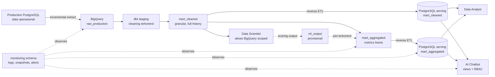
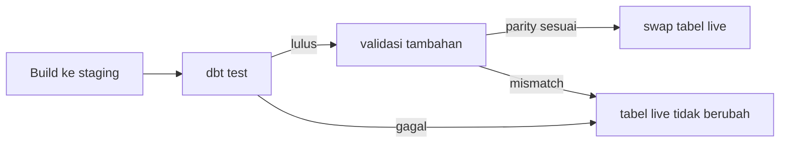

# 02 — Arsitektur Sistem

## Ringkasan

Nirwana Data Platform memisahkan pekerjaan analitis berat, penyajian interaktif, dan kontrol akses ke dalam komponen yang berbeda. BigQuery menjadi tempat warehouse dan transformasi; PostgreSQL menjadi serving layer untuk konsumsi berlatensi rendah; sementara schema `monitoring` menyatukan sinyal operasional dari seluruh alur.

## Tanggung jawab setiap layer

| Layer | Tanggung jawab | Tidak bertanggung jawab untuk |
| --- | --- | --- |
| Production | mencatat operasi bisnis | menyediakan model analitis siap pakai |
| `raw_production` | mempertahankan salinan data yang dapat ditelusuri | cleaning atau business logic |
| Staging | type cast, rename, normalisasi yang dapat dijelaskan | feature engineering atau keputusan bisnis baru |
| `mart_cleaned` | data granular yang sudah dibersihkan secara terkontrol | agregasi lintas domain untuk semua consumer |
| `mart_aggregated` | metrics dan grain bisnis yang disetujui | endpoint bebas untuk semua kemungkinan query |
| PostgreSQL serving | query interaktif dan view konsumsi | transformasi warehouse berat |
| `monitoring` | observability, audit, dan alert | menghitung ulang logic bisnis di dashboard |

Pemisahan tanggung jawab ini mencegah satu komponen menjadi tempat semua logic. Contohnya, dashboard membaca hasil detector yang telah dicatat ke `monitoring`; Grafana tidak menghitung ulang anomaly detection sendiri.

## Jalur publikasi data

Data tidak langsung berpindah dari tabel build ke tabel yang dikonsumsi. Kedua jalur mart menggunakan pola gate sebelum publikasi:

Untuk `mart_cleaned` dan `mart_aggregated`, promotion memisahkan build, test, dan swap. Untuk reverse ETL, row-count parity diperiksa sebelum RENAME swap sehingga serving table lama tetap dapat dibaca bila salinan baru tidak lengkap.

## Arsitektur target dan as-built

Dokumen arsitektur induk menjelaskan arah sistem secara menyeluruh. Implementasi aktual memuat beberapa penyesuaian yang penting untuk dipahami sebelum menilai atau memperluas sistem.

| Area | Arah rancangan | Implementasi saat ini | Dampak |
| --- | --- | --- | --- |
| Sumber extract | read replica untuk melindungi primary | koneksi langsung ke primary PostgreSQL | layak untuk data sintetis/statis saat ini; perlu ditinjau untuk traffic produksi |
| Transformasi granular | layering konseptual dapat memuat intermediate | `raw` → staging → `mart_cleaned`; intermediate tidak dibuat karena mart 1:1 dengan sumber | menghindari layer tanpa tanggung jawab nyata |
| Materialisasi BigQuery | incremental dan partition-aware bila tersedia | full refresh berbasis DDL karena BigQuery Sandbox memblokir DML | ada batas expiration 60 hari dan kebutuhan renew berkala |
| Feedback loop ML | scorer eksternal dengan kontrak output yang stabil | mock scorer dan `ml_output` provisional | tidak diperlakukan sebagai model produksi; fact ML belum disajikan ke serving |
| Orkestrasi | dependency dan sensor end-to-end | GitHub Actions dengan `workflow_run` serta polling sensor manual | sederhana dan hemat biaya, tetapi bukan pengganti orchestrator khusus |

Kata **as-built** dalam panduan ini selalu merujuk pada kolom implementasi saat ini, bukan hanya rancangan ideal.

## Batas consumer

### Data Scientist

Data Scientist membaca `mart_cleaned` langsung dari BigQuery dengan kredensial scoped. Pilihan ini mempertahankan kemampuan scan data historis besar dan tidak menambahkan API yang hanya menjadi perantara tanpa nilai.

### Data Analyst

Data Analyst memakai kombinasi view PostgreSQL, akses row-level yang dibatasi, API internal, serta kredensial BigQuery untuk kebutuhan BI. View menyimpan business rule agar pengguna tidak perlu mengulang filter penting pada setiap query.

### AI Chatbot

Chatbot tidak menerima akses ke tabel dasar secara bebas. Ia mengakses `chatbot_views` melalui kredensial read-only per domain, sementara request authorization memeriksa `role_permissions` sebelum query data dijalankan. Pemisahan ini menjadi bagian dari dua lapis kontrol: application-layer intent validation berada di luar repository ini, sedangkan isolasi database dan query interface dibangun di sini.

## Referensi lanjutan

- [Arsitektur ELT induk](../01-architecture/rancangan-arsitektur-data-platform-elt.md)
- [Konvensi dependency GitHub Actions](../05-orchestrator/konvensi-job-dependency.md)
- [Skema dan metadata `mart_aggregated`](../07-mart-aggregated/DataSchema-mart-aggregated.md)
- [Pemetaan akses Data Analyst](../08-serving-data-analyst/pemetaan-pola-akses-analyst.md)
- [Pemetaan akses teknis AI Chatbot](../09-serving-ai-chatbot/pemetaan-akses-teknis-chatbot.md)
- [Keputusan tertunda project-wide](../keputusan-tertunda.md)
