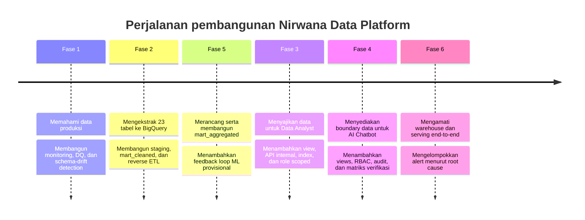

# 03 — Perjalanan Pembangunan

## Ringkasan

Platform ini dibangun sebagai rangkaian kemampuan yang saling mengunci, bukan sebagai satu migrasi besar. Urutan pembangunannya mengikuti satu prinsip: sebelum menambah jalur konsumsi baru, pastikan data, kontrol, dan sinyal operasionalnya dapat diverifikasi.

Nomor fase/milestone mengikuti sejarah project, sehingga Fase 5 muncul sebelum Fase 3 dan 4 pada urutan implementasi aktual. Ini bukan kesalahan penamaan: `mart_aggregated` lebih dulu dibangun sebagai aset bersama sebelum consumer layer diperluas.

## Fase 1 — Memahami dan mengamati data produksi

Pekerjaan dimulai dari inventaris data dan prioritas monitoring, bukan dari pemindahan data. Tahap ini membangun snapshot volume dan freshness, data-quality rule dengan Great Expectations, deteksi value anomaly berbasis IQR, serta snapshot-diff untuk schema drift. Hasil detector dicatat ke schema `monitoring`, lalu dijadwalkan melalui GitHub Actions dan disajikan di Grafana.

Keputusan pentingnya: dashboard dan alert hanya mengonsumsi hasil yang telah diputuskan detector. Mereka tidak menyembunyikan atau menduplikasi logic deteksi di layer visualisasi.

**Bukti utama:** baseline 23 tabel, workflow monitoring terjadwal, serta laporan milestone 1.1–1.5.

## Fase 2 — Membuat jalur data granular yang dapat dipercaya

Fase ini membawa 23 tabel dari PostgreSQL ke BigQuery `raw_production` melalui extraction incremental berbasis cursor. dbt kemudian membentuk staging views dan `mart_cleaned`. Cleaning yang dilakukan dibatasi pada transformasi yang dapat dijelaskan; missing value dan dirty data yang bermakna dipertahankan.

Promotion `mart_cleaned` membangun tabel staging, menjalankan dbt tests, dan hanya melakukan swap jika gate lulus. Setelah itu, reverse ETL menyinkronkan histori penuh ke PostgreSQL serving dengan pemeriksaan row-count parity sebelum swap.

Fase ini juga membangun kredensial Data Scientist scoped ke `mart_cleaned`, tanpa membangun REST API yang tidak dibutuhkan untuk pola analisis skala besar.

**Bukti utama:** `scripts/extract/`, `warehouse/models/staging/`, `warehouse/models/mart_cleaned/`, `scripts/mart_cleaned/promote.py`, dan `scripts/reverse_etl/`.

## Fase 5 — Menjadikan kebutuhan bisnis sebagai mart bersama

`mart_aggregated` dibangun setelah kebutuhan consumer dikonsolidasikan agar metrics yang sama tidak didefinisikan secara terpisah oleh setiap consumer. Model star schema ini berisi 27 dimension table dan 49 fact table. Setiap perubahan cakupan mart harus masuk melalui mekanisme pengajuan perubahan, bukan edit ad-hoc dari consumer layer.

Fase ini juga membuktikan bentuk awal feedback loop ML: mock scorer menulis ke `ml_output`, kemudian transformasi menggabungkannya secara terkontrol. Statusnya sengaja provisional—mekanisme ini menunjukkan batas kontrak dan orkestrasi yang dibutuhkan, bukan mengklaim model ML produksi sudah tersedia.

**Bukti utama:** metadata dan ERD `mart_aggregated`, dbt tests, promotion gate, serta laporan Milestone 5.1–5.6.

## Fase 3 — Menyajikan data untuk Data Analyst

Serving Data Analyst dimulai dari pemetaan persona ke tabel, filter wajib, dan business rule yang konkret. Dari sana, project membangun view per domain di PostgreSQL, index berdasarkan `EXPLAIN ANALYZE`, API internal dengan whitelist query, serta tujuh role read-only.

Satu batas yang tetap terbuka dicatat secara eksplisit: kredensial BigQuery dan akses programatik telah diverifikasi, tetapi koneksi GUI ke BI tool belum dieksekusi sehingga Milestone 3.6 berstatus partially completed.

**Bukti utama:** `docs/08-serving-data-analyst/`, `scripts/data_analyst_views/`, `scripts/data_analyst_credentials/`, dan laporan Milestone 3.1–3.6.

## Fase 4 — Membuat boundary data untuk AI Chatbot

AI Chatbot memerlukan jalur data yang cepat tetapi tidak boleh mengubah boundary akses. Implementasi dimulai dari pemetaan 20 persona ke 10 domain data, lalu membangun 67 `chatbot_views`, 10 credential domain-scoped, query API internal, dan audit log setiap request.

Keputusan paling penting di fase ini adalah memisahkan authorization dari query execution. API terlebih dahulu memeriksa izin terhadap `role_permissions`, lalu menggunakan kredensial database per domain untuk query. Uji matriks 20 persona × 10 domain menghasilkan 200/200 kecocokan terhadap ground truth; pemeriksaan property override dan superset role juga diverifikasi terpisah.

**Bukti utama:** `docs/09-serving-ai-chatbot/`, `scripts/chatbot_views/`, `scripts/chatbot_credentials/`, `scripts/chatbot_api/`, dan `scripts/chatbot_rbac_test/`.

## Fase 6 — Mengoperasikan rantai warehouse hingga serving

Setelah jalur data dan consumer tersedia, observability diperluas dari sisi production menuju warehouse dan serving. Sistem memetakan 10 titik observasi pipeline, merekam run GitHub Actions, menyimpan hasil dbt test, memantau anomali volume, health `ml_output`, performa chatbot, storage serving, dan kesehatan swap reverse ETL.

Tahap konsolidasi tidak hanya membuat dashboard. Dependency graph dipakai untuk mengelompokkan alert downstream ke root cause sehingga satu kegagalan upstream tidak tampil sebagai banjir alert yang tampak tidak berhubungan.

**Bukti utama:** `scripts/monitoring_warehouse/`, `scripts/serving_layer_monitor/`, `scripts/grafana/`, dokumentasi pemetaan titik pipeline, dan laporan Milestone 6.1–6.7.

## Pelajaran dari urutan ini

1. **Monitoring lebih bernilai bila dibangun bersama pemahaman atas sumber data.**
2. **Gate publikasi harus menjadi pola lintas layer, bukan fitur satu pipeline.**
3. **Consumer layer sebaiknya dibangun di atas batas data yang sudah jelas.**
4. **Observability akhir perlu memanfaatkan dependency, bukan hanya menghitung jumlah alert.**
5. **Status provisional dan gap implementasi harus tetap terlihat agar pembaca tidak salah memperluas sistem.**

## Referensi lanjutan

- [Rencana Fase 1](../03-implementation-plans/01-monitoring-data-production-fase1.md)
- [Rencana Fase 2 / Data Scientist](../03-implementation-plans/02-serving-data-scientist.md)
- [Rencana mart aggregated](../03-implementation-plans/03-mart-aggregated-owner.md)
- [Rencana serving Data Analyst](../03-implementation-plans/04-serving-data-analyst.md)
- [Rencana serving AI Chatbot](../03-implementation-plans/05-serving-ai-chatbot.md)
- [Rencana monitoring warehouse dan serving](../03-implementation-plans/06-monitoring-warehouse-serving-fase2.md)
- [Laporan Milestone 6.7](../../milestones/6.7-dashboard-alerting-terpadu/report.md)
