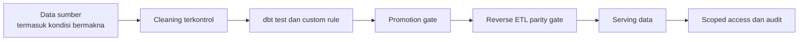
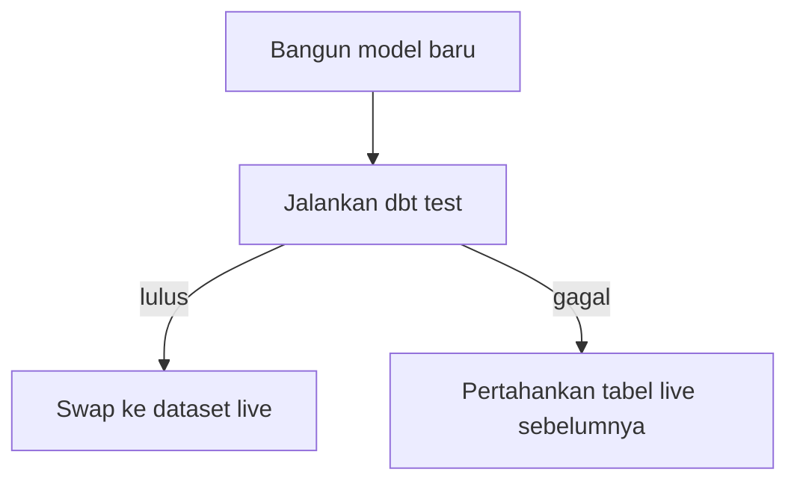

# 04 — Kualitas Data dan Kepercayaan

## Ringkasan

Kepercayaan pada platform ini dibangun dari beberapa gate kecil yang saling melengkapi. Tidak ada satu test atau satu dashboard yang dianggap cukup. Data perlu mempertahankan konteks bisnisnya, lolos validasi sebelum dipublikasikan, tetap konsisten setelah dipindahkan, dan hanya dapat dibaca oleh identitas yang tepat.

## 1. Kualitas dimulai dari pemahaman, bukan dari penghapusan nilai

Platform membedakan tiga keadaan yang sering disamakan:

| Keadaan | Contoh | Perlakuan |
| --- | --- | --- |
| Data perlu dinormalisasi | format telepon atau kapitalisasi yang tidak konsisten | normalisasi di staging bila rule-nya jelas |
| Missing value bermakna | `guest_id` kosong untuk walk-in anonim | dipertahankan dan didokumentasikan |
| Dirty data yang sengaja tersedia | duplikat dan typo tertentu pada data tamu | dipertahankan untuk kebutuhan analisis dan pengujian DQ |

Pemisahan ini penting karena transformasi yang terlalu agresif dapat menghapus sinyal operasional atau mengubah pertanyaan yang dapat dijawab Data Scientist. `mart_cleaned` berarti data yang dibersihkan secara terkontrol, bukan data yang dipaksa tampak sempurna.

## 2. Test berada dekat dengan model yang diuji

dbt schema tests memeriksa kontrak struktural seperti `not_null`, `unique`, relationship, dan accepted values. Custom singular tests memeriksa rule bisnis yang tidak cukup dijelaskan oleh constraint generik, misalnya nilai revenue tidak negatif atau perhitungan GOP tidak terhitung dua kali.

| Area | Contoh kontrol | Lokasi utama |
| --- | --- | --- |
| Staging | validasi source dan test model per tabel | `warehouse/models/staging/` |
| `mart_cleaned` | tests untuk hasil cleaning dan rule yang relevan | `warehouse/models/mart_cleaned/` |
| `mart_aggregated` | grain, relationship dimension/fact, dan rule metrik | `warehouse/models/mart_aggregated/` |
| Rule lintas model | SQL assertions yang tidak cocok ditulis sebagai schema test | `warehouse/tests/` |

Test tidak hanya tersimpan sebagai definisi. Hasilnya dicatat ke `monitoring.dbt_test_result` agar kondisi quality gate dapat dipantau tanpa membuka artefak ephemeral GitHub Actions.

## 3. Promotion adalah boundary publikasi

Pola promotion pada kedua mart adalah build → test → swap. Tabel baru dibangun di lokasi staging, diuji, lalu hanya menggantikan tabel live setelah gate lulus.

Pola ini sengaja dibuktikan lewat fault injection. Ketika baris buruk disuntikkan, gate gagal dan swap dibatalkan; bukti ini lebih kuat daripada hanya menyimpulkan test akan bekerja dari pembacaan source code.

## 4. Reverse ETL memiliki gate tambahan

Data yang sudah benar di BigQuery tetap dapat bermasalah saat disalin ke PostgreSQL. Karena itu, reverse ETL menggunakan full refresh ke tabel staging dan membandingkan jumlah baris BigQuery dengan staging PostgreSQL sebelum RENAME swap.

Pemeriksaan parity dilakukan sebelum tabel live berganti. Jika jumlahnya tidak cocok, pembaca tetap memakai tabel live sebelumnya. Uji pembaca konkuren juga digunakan untuk membuktikan bahwa swap tidak menimbulkan downtime baca yang direncanakan.

## 5. Akses adalah bagian dari kualitas jawaban

Jawaban yang memakai data benar tetapi dibuka kepada pihak yang salah tetap tidak dapat dipercaya. Karena itu, project memisahkan reader dan writer menurut dataset, schema, atau domain; membatasi API ke view/whitelist yang diketahui; serta memberi hak minimum yang diperlukan.

Untuk Chatbot, kepercayaan diperkuat dengan dua batas berbeda:

1. request harus lolos authorization berbasis `role_permissions` pada aplikasi;
2. query menggunakan kredensial database read-only yang hanya dapat membaca `chatbot_views` pada domain yang diizinkan.

Jika satu boundary salah dikonfigurasi, boundary lain tetap membatasi cakupan dampaknya. Detail jalur consumer ada di [Serving dan Kontrol Akses](05-serving-and-access-control.md).

## 6. Verifikasi sebagai artefak operasional

Project menyimpan atau mendokumentasikan bukti berikut:

- hasil dbt test dan fault-injection untuk quality gate;
- parity log untuk setiap sinkronisasi reverse ETL;
- test no-downtime swap dengan pembaca konkuren;
- verifier isolasi kredensial BigQuery dan PostgreSQL;
- matriks akses Chatbot 20 persona × 10 domain;
- audit log request Chatbot, termasuk penolakan.

Tujuannya bukan mengejar jumlah test, melainkan memastikan setiap boundary kritis mempunyai cara verifikasi yang sejalan dengan risiko boundary tersebut.

## Referensi lanjutan

- [Catatan data yang sengaja tidak dibersihkan](../../warehouse/README.md)
- [Test dbt staging](../../warehouse/models/staging/_staging_tests.yml)
- [Test `mart_cleaned`](../../warehouse/models/mart_cleaned/_mart_cleaned_tests.yml)
- [Test `mart_aggregated`](../../warehouse/models/mart_aggregated/_mart_aggregated_dimensions_tests.yml)
- [SQL assertions tambahan](../../warehouse/tests/)
- [Kebijakan kredensial scoped](../06-akses-kredensial/kebijakan-akses-kredensial-scoped.md)
- [Laporan promotion `mart_cleaned`](../../milestones/2.3-layer-intermediate-mart-cleaned/report.md)
- [Laporan promotion `mart_aggregated`](../../milestones/5.3-implementasi-transformasi-mart-aggregated/report.md)
- [Laporan verifikasi RBAC Chatbot](../../milestones/4.6-uji-ketahanan-rbac-lintas-persona/report.md)
