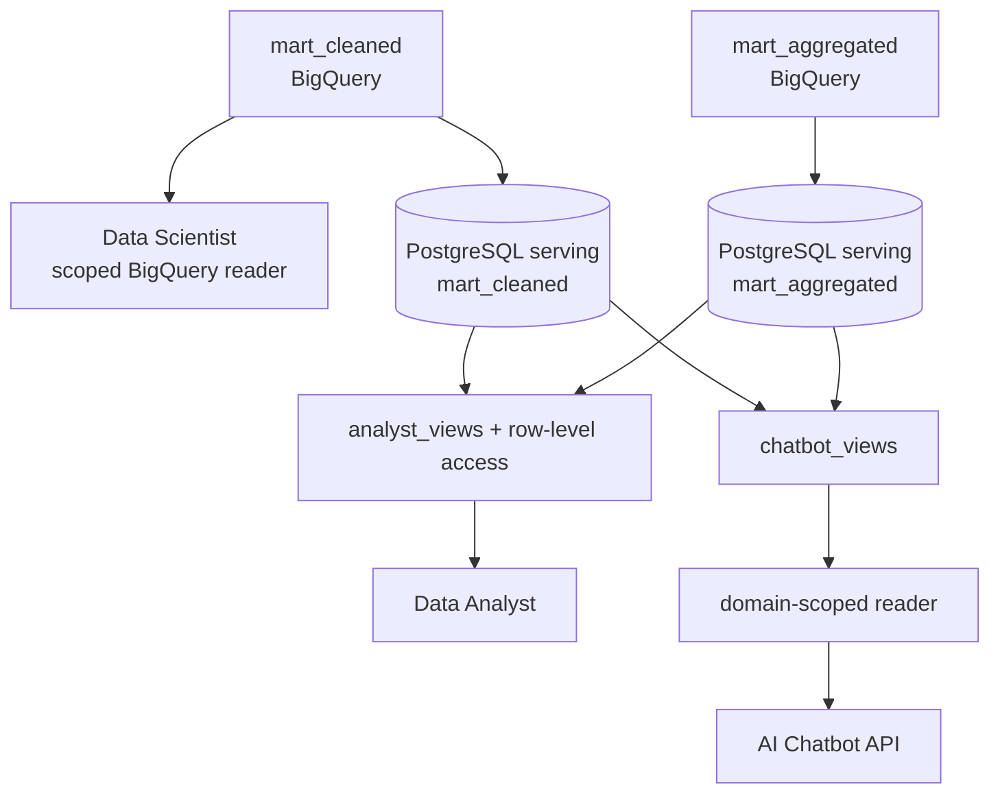
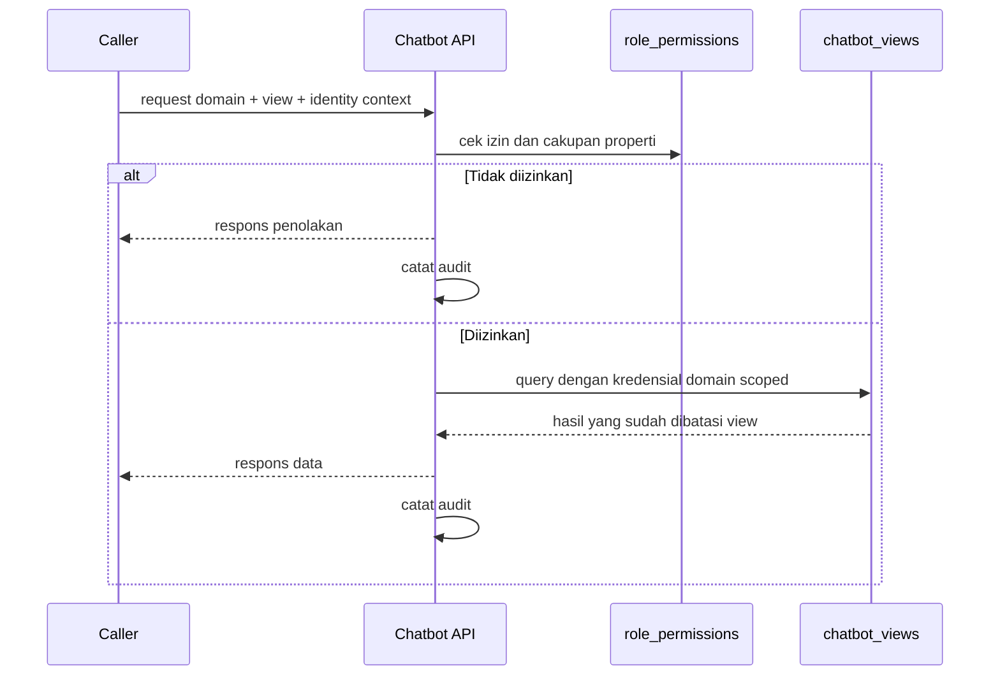

# 05 — Serving dan Kontrol Akses

## Ringkasan

Serving layer tidak diperlakukan sebagai satu endpoint data untuk semua pihak. Setiap consumer memiliki pola query, tingkat sensitivitas, dan kebutuhan latensi yang berbeda. Karena itu, platform memilih jalur akses yang berbeda daripada memperluas satu kredensial atau satu API untuk semua kebutuhan.

## Data Scientist: langsung ke warehouse

Data Scientist membaca `mart_cleaned` langsung dari BigQuery menggunakan service account `data-scientist-reader` yang scoped ke dataset terkait. Jalur ini dipilih karena pekerjaan analitis dan feature engineering membutuhkan data granular serta scan historis besar—karakter yang lebih sesuai dengan warehouse daripada API transaksional.

Platform tidak melakukan feature engineering untuk menggantikan kerja MLOps. Ia menyediakan basis data yang konsisten, dokumentasi kondisi data, dan boundary akses; tim ML menentukan transformasi feature serta modelnya sendiri.

## Data Analyst: semantic layer yang dapat digunakan kembali

Data Analyst menggunakan PostgreSQL serving dan BigQuery sesuai jenis pekerjaan. Di PostgreSQL, schema `analyst_views` menyediakan satu view per fact/dimension relevan agar nama dimension, filter bisnis, dan grain yang benar tidak perlu dirangkai ulang pada setiap query.

| Kebutuhan | Jalur utama | Kontrol |
| --- | --- | --- |
| Analisis metrik siap pakai | `analyst_views` di atas `mart_aggregated` | business rule tertanam pada view |
| Analisis row-level | `mart_cleaned` PostgreSQL | role dan tabel dibatasi menurut domain |
| Query melalui aplikasi internal | FastAPI dengan parameterized whitelist | tidak menerima nama tabel/query bebas |
| Analisis historis besar | BigQuery melalui credential `analyst-readonly` | scope dataset read-only |

Tujuh role PostgreSQL mencerminkan enam domain analyst dan satu role Property/GM yang dibangun melalui inheritance. Index dipilih dari bukti query plan, bukan dipasang secara merata ke seluruh tabel.

## AI Chatbot: data dibatasi sebelum query dibuat

Chatbot membutuhkan dua control plane yang berbeda.

Pertama, API memeriksa izin request terhadap `role_permissions`. Untuk akses `own_property`, API menentukan `property_id` berdasarkan `employee_id` di sisi server; klaim property dari caller tidak dipercaya sebagai sumber otorisasi.

Kedua, setelah request lolos, query dieksekusi dengan salah satu dari sepuluh reader database yang hanya memiliki `SELECT` ke `chatbot_views` domain tertentu. Reader tidak diberi akses langsung ke `mart_cleaned` atau `mart_aggregated`. View memisahkan kolom PII tamu dari atribut profil agar kebutuhan kontak tidak otomatis membuka data analitis, dan sebaliknya.

Setiap request sukses maupun ditolak dicatat ke `monitoring.chatbot_query_log` oleh writer khusus yang hanya memiliki hak INSERT. Penulisan audit berjalan sebagai background task agar tidak memperpanjang latency respons utama.

## Reverse ETL: serving data tetap sinkron dan tersedia

Baik `mart_cleaned` maupun `mart_aggregated` disalin penuh ke PostgreSQL serving. Proses tidak menulis baris demi baris ke tabel live. Ia memuat tabel staging, membandingkan row count, melakukan RENAME swap, lalu memastikan index/analyze pasca-swap tersedia.

Pola ini memberi tiga karakteristik:

1. pembaca melihat tabel konsisten, bukan tabel yang sedang diisi sebagian;
2. mismatch jumlah baris menghentikan publikasi;
3. swap dapat diuji terhadap pembaca konkuren untuk memeriksa downtime.

## Boundary yang tetap di luar repository

Repository ini membangun boundary data dan isolasi database Chatbot. Validasi intent dari aplikasi agent serta pembuktian bahwa klaim `role_title` benar-benar terikat ke identitas pengguna berada di luar cakupan repository. Batas ini sengaja disebutkan agar pembaca tidak menyimpulkan bahwa database RBAC menggantikan seluruh sistem autentikasi aplikasi.

## Referensi lanjutan

- [Kebutuhan dan akses Data Scientist](../02-requirements/pemetaan-kebutuhan-konsumen-data-mart.md)
- [Pola akses dan view Data Analyst](../08-serving-data-analyst/pemetaan-pola-akses-analyst.md)
- [API Data Analyst](../08-serving-data-analyst/api-analyst.md)
- [Kredensial Data Analyst](../08-serving-data-analyst/kredensial-analyst.md)
- [Pemetaan teknis Chatbot](../09-serving-ai-chatbot/pemetaan-akses-teknis-chatbot.md)
- [Rancangan pengujian RBAC Chatbot](../09-serving-ai-chatbot/rancangan-pengujian-rbac-chatbot.md)
- [Audit log Chatbot](../09-serving-ai-chatbot/audit-log-chatbot.md)
- [Kontrak reverse ETL `mart_cleaned`](../../scripts/reverse_etl/schema.sql)
- [Kontrak reverse ETL `mart_aggregated`](../../scripts/reverse_etl_mart_aggregated/schema.sql)
