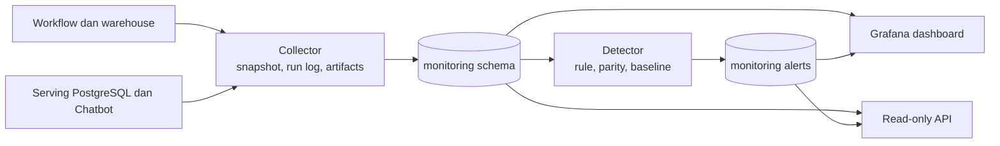
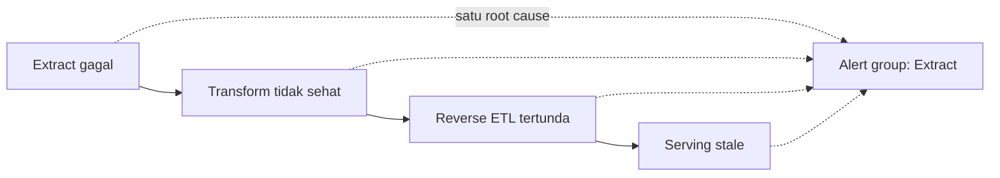

# 06 — Observability dan Operasi

## Ringkasan

Observability pada Nirwana Data Platform tidak dibangun sebagai dashboard tunggal yang mengumpulkan angka. Ia adalah jalur data tersendiri: collector mengambil keadaan sistem, detector menilai keadaan tersebut terhadap rule atau baseline, hasilnya disimpan terpusat, lalu dashboard dan API hanya menyajikannya.

Pemisahan ini membuat sumber keputusan dapat ditelusuri. Sebuah panel tidak perlu menebak apakah volume data anomali; ia membaca alert dan snapshot yang sudah dihasilkan detector.

## Satu schema monitoring untuk lintas layer

Schema `monitoring` pada PostgreSQL menjadi backbone observability. Ia menyimpan log pipeline, snapshot volume/freshness, hasil dbt test, log reverse ETL, audit query Chatbot, dan alert. Sistem yang diamati dapat berada di BigQuery, PostgreSQL serving, atau GitHub Actions, tetapi artefak observability dikonsolidasikan agar investigasi tidak berpindah antar banyak penyimpanan.

| Sinyal | Contoh pertanyaan operasional |
| --- | --- |
| Pipeline run log | tahap mana terakhir berjalan, berapa lama, dan apa hasilnya? |
| dbt test result | quality gate mana gagal dan pada run mana? |
| Warehouse volume snapshot | apakah volume tabel menyimpang dari baseline historis? |
| Reverse ETL sync log | apakah row count warehouse dan serving sama sebelum swap? |
| ML health snapshot | apakah `ml_output` masih baru, lengkap, dan memiliki versi yang dapat dilacak? |
| Chatbot query log | bagaimana latency, jumlah penolakan, dan outcome request? |
| Serving storage snapshot | apakah storage, vacuum, atau tabel orphan memerlukan perhatian? |

## Tiga jenis pertanyaan operasional

### Apa yang terjadi?

Collector pipeline mengambil status, waktu mulai, waktu selesai, dan durasi workflow GitHub Actions. Ini memberi timeline eksekusi tanpa harus membuka log Actions satu per satu.

### Apakah hasilnya wajar dan benar?

Detector memadukan hasil dbt test, volume anomaly, row-count parity, freshness `ml_output`, serta keadaan swap. Baseline rolling dipakai ketika nilai yang dinilai bersifat relatif terhadap histori; rule eksplisit dipakai ketika kegagalan bersifat deterministik, seperti parity mismatch.

### Apa dampak dan akar masalahnya?

Peta dependency pipeline menerjemahkan hubungan antar tahap menjadi graph yang dapat dibaca query. Ketika beberapa alert aktif, view root-cause menelusuri event downstream menuju titik upstream yang aktif. Tujuannya bukan menghapus alert, tetapi menyajikan hubungan sebab-akibat agar satu kegagalan tidak tampak seperti banyak insiden terpisah.

## Monitoring yang sesuai dengan risiko komponen

| Komponen | Bentuk observability | Mengapa bentuk ini dipilih |
| --- | --- | --- |
| Production data | volume, freshness, DQ, schema drift | perubahan sumber dapat menjalar ke semua layer berikutnya |
| dbt transform | hasil test dan status pipeline | quality gate adalah boundary sebelum publikasi mart |
| Warehouse | volume anomaly dan health `ml_output` | masalah dapat bersifat benar secara teknis tetapi tidak wajar secara operasional |
| Reverse ETL | row parity, durasi swap, orphan table | serving harus konsisten dan tetap tersedia selama refresh |
| Chatbot | p50/p95/p99 request latency, denial trend, query plan, connection pool | pola akses interaktif memerlukan sinyal performa berbeda dari batch pipeline |

## Verifikasi melalui simulasi terkontrol

Beberapa collector dan detector memiliki `simulate_test.py` untuk membuktikan kondisi gagal tanpa merusak data operasional. Skenario mencakup anomali volume, parity mismatch, output ML tidak lengkap, lonjakan connection pool, kesehatan swap, dan root-cause grouping multi-titik.

Simulasi bukan pengganti observasi produksi. Ia membuktikan detector dapat mengenali failure mode yang diketahui; data produksi kemudian menunjukkan apakah instrumentasi benar-benar menerima sinyal yang diperlukan.

## Batas operasional yang diketahui

- Notifikasi ke kanal eksternal masih ditunda; alert saat ini terlihat melalui Grafana dan grouping internal.
- Root-cause correlation menggunakan dependency dan hari kalender. Dua kejadian independen pada hari yang sama dapat terkelompok jika jalurnya beririsan.
- Data drift ML yang sebenarnya belum disediakan. Sistem hanya memiliki canary availability, bukan klaim bahwa drift model sudah sehat.
- Monitoring dapat mendeteksi tabel orphan setelah swap, tetapi pencegahan dan reapply view otomatis belum selesai.

Bagian ini penting karena observability yang baik menjelaskan batas kepercayaannya sendiri.

## Referensi lanjutan

- [Pemetaan titik pengamatan pipeline](../10-monitoring-warehouse-serving/pemetaan-titik-pengamatan-pipeline.md)
- [Dokumen monitoring warehouse dan serving](../03-implementation-plans/06-monitoring-warehouse-serving-fase2.md)
- [Implementasi monitoring warehouse](../../scripts/monitoring_warehouse/)
- [Implementasi monitoring serving layer](../../scripts/serving_layer_monitor/)
- [Provisioning Grafana](../../scripts/grafana/)
- [Laporan dashboard dan alerting terpadu](../../milestones/6.7-dashboard-alerting-terpadu/report.md)
