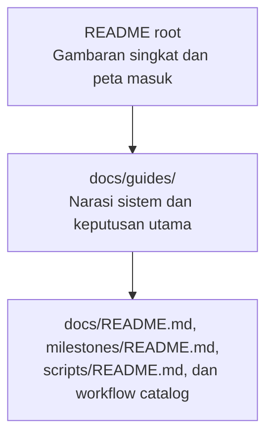

# Panduan Sistem Nirwana Data Platform

Dokumentasi ini adalah jalur baca terkurasi untuk memahami Nirwana Data Platform dari konteks masalah sampai bukti implementasi. Ia tidak menggantikan dokumen arsitektur, laporan milestone, maupun source code. Ketiganya tetap menjadi sumber kebenaran untuk detail teknis dan status aktual.

## Mulai dari kebutuhan pembaca

| Jika ingin memahami… | Mulai dari |
| --- | --- |
| alasan sistem ini dibangun | [01 — Konteks dan Masalah](01-context-and-problem.md) |
| alur data dan batas antar komponen | [02 — Arsitektur Sistem](02-system-architecture.md) |
| urutan pembangunan sistem | [03 — Perjalanan Pembangunan](03-building-the-platform.md) |
| cara menjaga kualitas data dan akses | [04 — Kualitas Data dan Kepercayaan](04-data-quality-and-trust.md) |
| cara data disajikan ke setiap konsumen | [05 — Serving dan Kontrol Akses](05-serving-and-access-control.md) |
| cara sistem dioperasikan dan diamati | [06 — Observability dan Operasi](06-observability-and-operations.md) |
| batasan yang diketahui dan langkah berikutnya | [07 — Trade-off dan Keputusan Lanjutan](07-tradeoffs-and-next-decisions.md) |
| dokumen teknis, script, workflow, atau bukti milestone tertentu | [Referensi Teknis Level 3](../README.md) |

## Tiga tingkat dokumentasi

Level ini berada di tengah: cukup ringkas untuk dibaca berurutan, tetapi setiap klaim penting mengarah ke artefak yang dapat diperiksa.

## Cara menggunakan panduan ini

- Baca secara berurutan jika baru mengenal sistem.
- Gunakan bagian **Referensi lanjutan** pada tiap bab untuk menelusuri keputusan, laporan, atau implementasi yang mendasarinya.
- Perlakukan kata **as-built** sebagai implementasi yang benar-benar ada; dokumen arsitektur awal dapat memuat rancangan target yang kemudian berubah karena constraint implementasi.
- Perlakukan status **provisional**, **partially completed**, dan **open** sebagai informasi penting, bukan detail yang disembunyikan.

## Batas dokumentasi ini

Panduan ini tidak menyalin data dictionary, konfigurasi kredensial, kontrak API, maupun log peristiwa milestone. Pengulangan seperti itu akan membuat dua sumber kebenaran. Sebagai gantinya, setiap bab menjelaskan *mengapa* suatu keputusan ada, *bagaimana* bagian-bagiannya terhubung, dan *di mana* detailnya dapat diverifikasi.

## Dokumen induk dan status

- [Rancangan Arsitektur Data Platform ELT](../01-architecture/rancangan-arsitektur-data-platform-elt.md) menjelaskan target arsitektur menyeluruh.
- [Keputusan Tertunda](../keputusan-tertunda.md) mencatat batasan dan keputusan yang sengaja belum diambil.
- `milestones/<id>/report.md` adalah rujukan pertama untuk hasil aktual dan gap pada milestone tertentu.

## Konvensi bahasa

Istilah teknis yang sudah lazim—seperti *warehouse*, *serving layer*, *quality gate*, dan *reverse ETL*—dipertahankan agar selaras dengan implementasi. Penjelasannya diberikan dalam Bahasa Indonesia dan setiap istilah dipakai secara konsisten.
