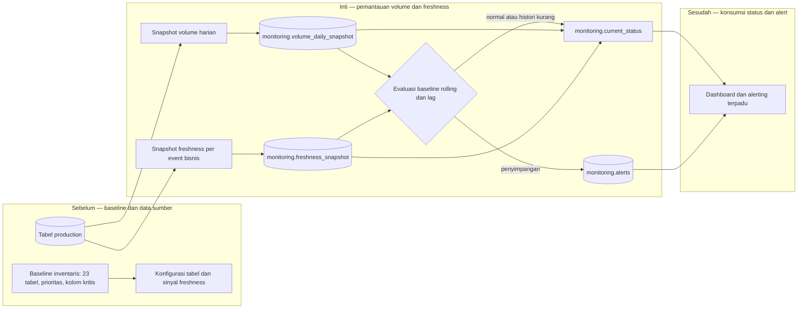

# Report — Milestone 1.2: Monitoring Volume dan Freshness Data Masuk

Milestone ini berjenis **berbasis kode/sistem**. Hasilnya adalah mekanisme snapshot, baseline rolling, dan alert di schema `monitoring`.

## Bagian 1 — Ringkasan Hasil

**Status akhir:** Selesai sesuai rencana.

Milestone 1.2 membangun pemantauan volume dan freshness untuk 23 tabel production. `snapshot_volume.py` menyimpan hitungan baris harian; `snapshot_freshness.py` menentukan kejadian bisnis terbaru untuk tabel yang memiliki sinyal waktu; `detect_alerts.py` mengevaluasi keduanya dan menyimpan penyimpangan ke `monitoring.alerts`. View `monitoring.current_status` menyatukan status terkini sehingga tujuh tabel prioritas Tinggi dapat dibaca tanpa menyusun query manual.

Baseline volume menggunakan riwayat hari-dalam-minggu yang sama, bukan angka tetap, agar pola akhir pekan dan musiman tidak menjadi false alert. Uji coba terisolasi membuktikan lima skenario: dua kondisi normal tidak memicu alert, sedangkan lonjakan, penurunan, dan keterlambatan data memicu alert. Penjadwalan otomatis sengaja belum diaktifkan; mekanisme berjalan on-demand sampai keputusan `pg_cron` dituntaskan.

## Bagian 2 — Kriteria Keberhasilan vs Bukti Nyata

| Kriteria (dari dokumen sumber) | Bukti Aktual | Terpenuhi? |
|---|---|---|
| Untuk tabel prioritas tinggi, tim bisa menjawab “berapa baris masuk hari ini vs biasanya” dan “kapan data terakhir update” tanpa query manual. | `monitoring.current_status` menampilkan volume terkini, baseline/persentase ketika histori cukup, sinyal event terbaru, dan lag. Satu query ke view ini telah dijalankan untuk tujuh tabel prioritas Tinggi; `role_permissions` tampil volume-only sesuai karakter master statisnya. | Ya |
| Simulasi penurunan/lonjakan volume buatan berhasil memicu alert sesuai ekspektasi. | `scripts/monitoring/simulate_test.py` menulis snapshot `_simulation` terisolasi. Hasilnya 5/5 skenario benar: volume normal dan freshness normal tidak alert; volume spike, volume drop, dan freshness delayed menghasilkan alert critical. | Ya |

## Bagian 3 — Cara Kerja dan Arsitektur

### Cara Kerja

Daftar 23 tabel, prioritas, kolom freshness, dan kelas kadensi berasal dari baseline M1.1 dan disimpan di `tables_config.py`. Pada setiap run, snapshot volume menghitung `COUNT(*)` lalu menyimpannya per tanggal. Evaluator membandingkan hitungan itu dengan histori maksimal delapan minggu pada hari-dalam-minggu yang sama, memakai band `mean ± 2×stddev`; kurang dari tiga titik histori tidak menghasilkan alert karena baseline belum bermakna.

Freshness memakai `MAX()` dari kolom peristiwa bisnis terdekat, bukan kolom audit baru agar tidak mengubah schema production. Nilai `hire_date` yang formatnya campuran, period bulanan, dan period semesteran diparse di Python. Tabel tanpa sinyal yang jujur—misalnya master statis atau `event_bookings`—dipantau volume-only. Evaluator menerapkan ambang sesuai kadensi lalu menyimpan hasil yang menyimpang sebagai alert.

### Diagram Arsitektur

### Integrasi dengan Komponen Lain

M1.1 memasok prioritas dan pemetaan karakteristik tabel. Schema `monitoring`, snapshot, alert, dan `current_status` menjadi fondasi data untuk kualitas data M1.3, schema drift M1.4, serta dashboard M1.5. Konsumen berikutnya membaca status/alert yang telah dihitung ini, bukan menghitung ulang baseline mereka sendiri.

## Bagian 4 — Perubahan dari Plan

Ada satu koreksi implementasi: `housekeeping_log.cleaning_start_time` semula dipertimbangkan sebagai sinyal freshness, tetapi verifikasi `information_schema` menunjukkan tipenya `time without time zone`; sinyal diganti menjadi kolom `date`. Ini menjaga definisi freshness tetap valid. Tidak ada penyimpangan lain dari keputusan teknis.

## Bagian 5 — Keterbatasan dan Item Provisional

- Dataset produksi adalah snapshot sintetis yang berhenti pada 1 Juli 2026. Terhadap waktu server, 12 tabel harian terlapor critical karena memang stale; ini temuan kondisi dataset, bukan cacat detektor.
- Baseline rolling baru memiliki satu snapshot awal, sehingga persentase dari baseline belum dapat dihitung sampai sedikitnya tiga titik pada hari yang sama terkumpul.
- `event_bookings` tidak memiliki waktu pembuatan booking yang valid; tabel itu volume-only. `employees.hire_date` hanya proxy dan tidak menangkap update ke karyawan lama.
- Scheduler otomatis belum aktif; run harian masih manual/on-demand sampai keputusan `pg_cron` dibuka kembali.

## Bagian 6 — Follow-up

- Jalankan `snapshot_volume.py`, `snapshot_freshness.py`, lalu `detect_alerts.py` secara berkala agar histori baseline terbentuk.
- Putuskan dan aktifkan mekanisme penjadwalan yang tercatat di `docs/keputusan-tertunda.md`.
- M1.3 memakai pola schema `monitoring` dan alert ini untuk hasil kualitas data; M1.4 menambahkan antrian schema drift secara terpisah.
- M1.5 mengonsumsi `monitoring.current_status` dan `monitoring.alerts` untuk tampilan terpadu.
