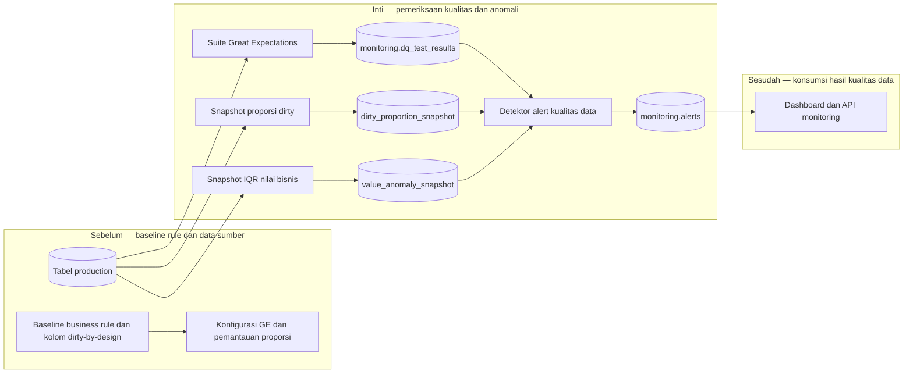

# Report — Milestone 1.3: Monitoring Kualitas Data dan Anomali Nilai

Milestone ini berjenis **berbasis kode/sistem**. Hasilnya adalah suite kualitas data, pemantauan proporsi dirty data, dan deteksi perubahan proporsi outlier nilai.

## Bagian 1 — Ringkasan Hasil

**Status akhir:** Selesai dengan penyesuaian dari plan.

Milestone 1.3 membangun pemeriksaan kualitas data bagi seluruh 23 tabel dengan Great Expectations (GE), serta dua pemantauan yang tidak dapat diperlakukan sebagai rule tetap: proporsi kolom dirty-by-design dan proporsi outlier nilai bisnis. Hasil pemeriksaan disimpan ke tabel monitoring dan diringkas sebagai alert bersama hasil M1.2.

Pada data nyata, 173 dari 174 expectation akhir lolos. Satu kegagalan yang tersisa—`bookings.total_amount` tidak sama dengan `room_rate × nights` pada 165 dari 217.654 baris—dipertahankan sebagai temuan kualitas data nyata, bukan dibuat agar test hijau. Simulasi tujuh skenario membuktikan semua anomali yang disengaja tertangkap dan kondisi normal tidak memicu false alert.

## Bagian 2 — Kriteria Keberhasilan vs Bukti Nyata

| Kriteria (dari dokumen sumber) | Bukti Aktual | Terpenuhi? |
|---|---|---|
| Pengujian kualitas data berjalan terjadwal dan hasilnya bisa ditelusuri (lolos/gagal per tabel per waktu). | `build_and_run.py` menyimpan hasil per suite/tabel/run ke `monitoring.dq_test_results`; run nyata mencakup 23/23 tabel. Mekanisme dapat dijalankan ulang dan hasil historis dapat ditelusuri, namun penjadwalan otomatis belum aktif. | Sebagian, lihat Bagian 5 |
| Anomali nilai buatan, di luar pola dirty data yang sudah dikenal, berhasil terdeteksi. | `simulate_test.py` membuktikan `dq_failure_case`, `dirty_drift_case` (z=256), dan `value_spike_case` (z=158) menimbulkan alert critical. | Ya |
| Proporsi dirty data yang sudah diketahui tidak memicu false alert pada kondisi normal. | Tujuh simulasi seluruhnya pass; data production juga menunjukkan delapan kolom dirty-by-design berada di band bootstrap dan tidak menghasilkan alert false-positive. | Ya |

## Bagian 3 — Cara Kerja dan Arsitektur

### Cara Kerja

`rules_config.py` menerjemahkan katalog M1.1 menjadi expectation GE dan basic checks untuk 23 tabel. `build_and_run.py` membangun suite, menjalankannya terhadap batch Postgres, lalu merekam hasilnya. Hasil gagal dibaca `dq_alerts.py` dan ditulis sebagai alert. Kredensial datasource tidak ditaruh mentah dalam konfigurasi GE; konfigurasi memakai placeholder `SUPABASE_DB_URL` di lokasi uncommitted.

Kolom yang kosong/kotor secara sah tetap diawasi dengan snapshot proporsi harian, bukan rule `not_null`. Setelah bootstrap, proporsi dibandingkan dengan band rolling. Untuk enam kolom nilai bisnis, snapshot menyimpan kuartil dan IQR; yang dipantau adalah perubahan proporsi outlier terhadap historinya, bukan setiap nilai tinggi secara absolut. Ini menghindari salah menandai distribusi gaji atau tarif kamar yang memang skewed.

### Diagram Arsitektur

### Integrasi dengan Komponen Lain

M1.1 memasok business rule dan pengecualian dirty-by-design; M1.2 memasok pola snapshot dan tabel alert. M1.5 menampilkan empat dataset hasil M1.3, sedangkan API publik dan website membacanya melalui lapisan consumer berikutnya. Scheduler M1.5 kelak harus menjalankan runner GE, snapshot dirty, snapshot IQR, lalu `dq_alerts.py` dalam urutan itu.

## Bagian 4 — Perubahan dari Plan

Rule urutan `staff_shifts.clock_out > clock_in` dihapus setelah data live membuktikan kolom hanya bertipe `time` dan shift yang melewati tengah malam sah. Ini merupakan penyesuaian dari rencana awal memakai seluruh 27 rule katalog, bukan pengurangan diam-diam. Dua rule lain disempurnakan setelah validasi data nyata: alias SQL GE diperbaiki, dan asumsi `financial_summary` tentang `NULL` versus nilai sentinel `0` serta `Corporate Overhead` dikoreksi. Tidak ada penyimpangan arsitektural dari pilihan GE, tolerance band, cakupan 23 tabel, atau IQR.

## Bagian 5 — Keterbatasan dan Item Provisional

- Penjadwalan otomatis belum aktif; karena itu kriteria “terjadwal” hanya tercapai setelah scheduler M1.5/keputusan `pg_cron` dioperasikan.
- Temuan nyata `total_amount_matches_rate_x_nights` masih terbuka dan perlu investigasi pemilik data, bukan disenyapkan sebagai false alarm.
- `staff_shifts` tidak bisa divalidasi urutan clock-in/out tanpa perubahan schema yang membawa tanggal atau durasi.
- Empat tabel prioritas Rendah hanya memiliki basic checks karena katalog rule M1.1 lebih tipis.
- `event_bookings` tetap volume-only dari M1.2 karena tidak memiliki sinyal freshness yang valid.

## Bagian 6 — Follow-up

- Jalankan empat runner dalam urutan yang telah ditetapkan; aktifkan scheduler otomatis saat keputusan tertunda diselesaikan.
- Tinjau dan perbaiki 165 baris `bookings` yang menyimpang jika kualitas source data perlu dinaikkan.
- M1.4 perlu memverifikasi tipe aktual dari `information_schema`, karena beberapa tipe nyata berbeda dari deskripsi arsitektur.
- M1.5, API publik, dan website memakai hasil snapshot serta alert ini sebagai sumber pilar kualitas data dan anomali nilai.
