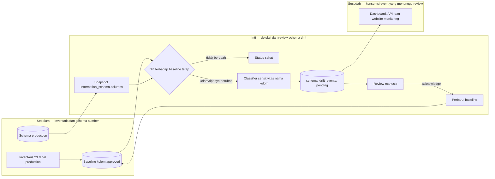

# Report — Milestone 1.4: Monitoring Perubahan Struktur (Schema Drift)

Milestone ini berjenis **berbasis kode/sistem**. Hasilnya adalah baseline kolom yang disetujui, diff engine, serta antrian review perubahan struktur.

## Bagian 1 — Ringkasan Hasil

**Status akhir:** Selesai sesuai rencana.

Milestone 1.4 membangun deteksi perubahan kolom untuk 23 tabel production: kolom baru, kolom dihapus, dan tipe berubah. Baseline awal berisi 165 kolom dan tidak bergeser otomatis. Setiap perbedaan baru masuk ke `monitoring.schema_drift_events` sebagai `pending` sampai seorang reviewer mengakuinya secara eksplisit.

Deteksi memakai snapshot `information_schema.columns` dan diff, bukan event trigger PostgreSQL, karena role koneksi bukan superuser. Uji coba menggunakan tabel staging `_simulation` membuktikan lima skenario: empat jenis perubahan memiliki severity yang benar dan tetap tampak pada run ulang; setelah satu event di-acknowledge, hanya event tersebut yang menjadi baseline baru.

## Bagian 2 — Kriteria Keberhasilan vs Bukti Nyata

| Kriteria (dari dokumen sumber) | Bukti Aktual | Terpenuhi? |
|---|---|---|
| Perubahan skema buatan berhasil terdeteksi dan memicu notifikasi. | `simulate_test.py` menjalankan `ALTER TABLE` nyata untuk tambah kolom biasa, tambah `password_hash`, hapus kolom, dan ubah tipe. Keempatnya tercatat sebagai event pending; keyword sensitif memberi `password_hash` severity high. | Ya |
| Tidak ada perubahan skema yang otomatis diteruskan tanpa jejak/notifikasi. | Run diff kedua tetap menghasilkan empat event pending yang sama—tidak hilang dan tidak terduplikasi. Hanya `acknowledge.py` yang mengubah baseline; sesudah acknowledge satu event, tiga lainnya tetap pending. | Ya |

## Bagian 3 — Cara Kerja dan Arsitektur

### Cara Kerja

`baseline_columns.py` mengambil daftar kolom dari `information_schema` untuk daftar 23 tabel yang sama dengan pemantauan M1.2. `snapshot_and_diff.py` membandingkan keadaan saat ini terhadap baseline approved, memeriksa apakah event pending serupa sudah ada, lalu menulis event idempotent. Kolom baru yang namanya cocok dengan keyword seperti `password`, `email`, `salary`, atau `token` diprioritaskan `high`; heuristik ini hanya mengurutkan review, bukan memberi persetujuan otomatis.

`acknowledge.py` adalah satu-satunya jalur pembaruan baseline. Ia menambah, menghapus, atau mengubah metadata baseline sesuai jenis event lalu menandai event `acknowledged`. Dengan demikian, perubahan tidak pernah normal hanya karena satu snapshot berikutnya telah melewatinya.

### Diagram Arsitektur

### Integrasi dengan Komponen Lain

M1.1 menyediakan cakupan 23 tabel; M1.2 menyediakan schema `monitoring` dan pola pencatatan event. M1.5 menampilkan event pending sebagai pilar schema drift, sementara API dan website berikutnya membacanya sebagai data publik yang sudah disaring dari simulasi.

## Bagian 4 — Perubahan dari Plan

Tidak ada penyimpangan dari plan. Delapan task diselesaikan sesuai keputusan: snapshot-diff waktu nyata, cakupan kolom 23 tabel, baseline tetap dengan acknowledgement, dan keyword classifier.

## Bagian 5 — Keterbatasan dan Item Provisional

- Deteksi tidak mencakup tabel baru atau tabel hilang; hanya kolom pada 23 tabel yang telah dikenal.
- Event trigger seketika tidak tersedia bagi role standar Supabase, sehingga perubahan ditemukan ketika snapshot berikutnya dijalankan.
- Scheduler otomatis masih tertunda; `snapshot_and_diff.py` perlu dioperasikan manual/on-demand sampai scheduler tersedia.
- Data `_simulation.staging_table` sengaja disisakan sebagai bukti uji coba dan harus selalu difilter oleh konsumen production.

## Bagian 6 — Follow-up

- Jalankan diff secara berkala dan review `pending` sebelum menjalankan `acknowledge.py`, terutama untuk severity high.
- Putuskan scheduler otomatis bersama runner monitoring lainnya.
- Tambahkan deteksi tabel baru/hilang bila cakupan pemantauan struktur diperluas.
- Dashboard, API, dan website menggunakan event pending sebagai indikator yang perlu ditindaklanjuti.
