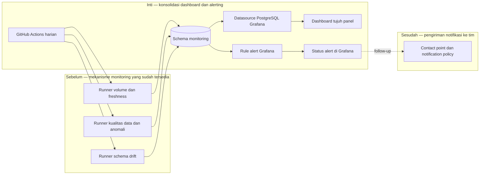

# Report — Milestone 1.5: Dashboard dan Alerting Terpadu (Fase 1)

Milestone ini berjenis **berbasis kode/sistem**. Hasilnya adalah dashboard Grafana, job terjadwal, dan rule alert yang mengonsolidasikan hasil monitoring sebelumnya.

## Bagian 1 — Ringkasan Hasil

**Status akhir:** Selesai sebagian, dengan follow-up.

Milestone 1.5 menyatukan status volume/freshness, kualitas data, anomali nilai, dan schema drift untuk 23 tabel ke dashboard Grafana Cloud dengan tujuh panel. GitHub Actions menjalankan delapan script monitoring harian secara sekuensial, sehingga panel membaca hasil terbaru dari Postgres, bukan data statis. Semua query panel diverifikasi langsung terhadap datasource.

Dua rule Grafana membaca event yang sudah dihitung di `monitoring.alerts` dan `schema_drift_events`; Grafana tidak menduplikasi logic deteksi Python. Rule schema drift telah terbukti melalui siklus `inactive → firing → inactive`. Namun, tidak ada contact point atau notification policy eksternal, sehingga alert baru tampak di Grafana dan belum terkirim ke kanal tim. Itulah alasan status akhir tetap sebagian.

## Bagian 2 — Kriteria Keberhasilan vs Bukti Nyata

| Kriteria (dari dokumen sumber) | Bukti Aktual | Terpenuhi? |
|---|---|---|
| Dashboard dapat diakses tim dan mencerminkan kondisi terkini, bukan basi. | Grafana Cloud aktif dengan tujuh panel query langsung ke Supabase. GitHub Actions pertama berhasil penuh (10m15s) dan mengisi snapshot/hasil DQ baru; seluruh query panel diuji melalui API datasource. | Ya |
| Setiap jenis alert muncul di dashboard dan terkirim ke kanal yang benar saat diuji coba. | Alert M1.2–M1.3 berstatus firing karena temuan nyata, dan rule M1.4 berhasil melalui siklus inactive–firing–inactive dengan event uji. Tidak ada kanal Discord, Slack, atau email yang dikonfigurasi. | Sebagian, lihat Bagian 5 |

## Bagian 3 — Cara Kerja dan Arsitektur

### Cara Kerja

Workflow `monitoring.yml` menjalankan suite volume/freshness, DQ, dan schema drift secara berurutan dengan kredensial GitHub Secret. Script Grafana memprovision datasource Postgres, menyusun panel, lalu membuat dua rule yang hanya menjawab apakah sudah ada alert nyata atau drift pending. Dashboard membaca tabel/view `monitoring` saat panel dibuka.

Validasi dashboard menemukan dua kebocoran data simulasi: view `current_status` menampilkan tiga tabel `_simulation`, dan panel drift membaca event staging. View diperbaiki agar memfilter `_simulation`; panel drift juga memperoleh filter eksplisit. Hasil akhir kembali tepat 23 tabel production dan nol drift production yang pending.

### Diagram Arsitektur

### Integrasi dengan Komponen Lain

M1.2–M1.4 adalah produsen satu-satunya untuk data monitoring dan keputusan alert; M1.5 hanya mengonsolidasikan dan menjadwalkannya. Dashboard, rule, serta API publik M1.6 membaca schema `monitoring` yang sama. Filter `_simulation` menjadi kontrak penting bagi seluruh consumer berikutnya.

## Bagian 4 — Perubahan dari Plan

Dua penyesuaian dilakukan saat validasi: filter `_simulation` ditambahkan pada `monitoring.current_status` dan query panel schema drift. Keduanya diperlukan agar data uji coba tidak disajikan sebagai kondisi production. Kanal notifikasi eksternal sengaja ditunda sebelum implementasi; itu bukan deviasi teknis tersembunyi, tetapi menyebabkan satu kriteria hanya terpenuhi sebagian.

## Bagian 5 — Keterbatasan dan Item Provisional

- Tidak ada kanal notifikasi eksternal. Alert tidak akan push ke tim sampai contact point dan notification policy ditetapkan.
- Tampilan dashboard belum diverifikasi visual oleh manusia; verifikasi saat milestone dilakukan melalui API datasource dan state rule.
- Free tier Grafana membatasi tiga active users per bulan; cukup untuk kondisi sekarang, tetapi perlu ditinjau jika tim tumbuh.

## Bagian 6 — Follow-up

- Tentukan kanal tujuan lalu tambahkan contact point dan notification policy Grafana; rule yang ada dapat dipakai tanpa mengubah logic deteksi.
- Tinjau dashboard secara visual dan pastikan setiap consumer baru selalu mengecualikan schema `_simulation`.
- API publik menggunakan hasil schema `monitoring` ini sebagai kontrak data read-only bagi website publik.
