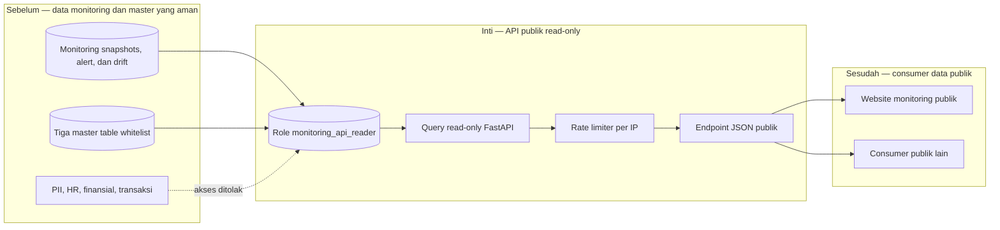

# Report — Milestone 1.6: API Publik Data Monitoring

Milestone ini berjenis **berbasis kode/sistem**. Hasilnya adalah API FastAPI publik, read-only, yang menjadi batas aman antara data monitoring dan website publik.

## Bagian 1 — Ringkasan Hasil

**Status akhir:** Selesai dengan penyesuaian dari plan.

Milestone 1.6 menyediakan API FastAPI publik di Render untuk status 23 tabel, hasil DQ, proporsi dirty data, anomali IQR, schema drift, alert, dan tiga sample data master yang telah di-whitelist. API membaca hasil monitoring yang sudah ada; ia tidak menghitung ulang anomali. Seluruh endpoint dapat digunakan tanpa login, dibatasi rate limit per IP, dan memiliki CORS untuk consumer web.

Keamanan dijaga pada dua lapis: kode hanya menerima tiga nama sample table, dan role `monitoring_api_reader` hanya memiliki `SELECT` pada `monitoring.*` serta `properties`, `fnb_outlets`, dan `rooms`. Verifikasi lokal serta dari deployment publik membuktikan data monitoring konsisten, tabel non-whitelist mengembalikan 404, dan burst request melewati limit menghasilkan HTTP 429.

## Bagian 2 — Kriteria Keberhasilan vs Bukti Nyata

| Kriteria (dari dokumen sumber) | Bukti Aktual | Terpenuhi? |
|---|---|---|
| Endpoint publik tanpa login/API key mengembalikan data monitoring terkini yang konsisten dengan tabel monitoring. | Deployment Render diuji dari luar localhost: status 23 tabel, ringkasan DQ 23 tabel, tiga kegagalan DQ, delapan dirty proportion, enam anomali, nol drift, dan 28 alert konsisten dengan dashboard. | Ya |
| Tidak ada endpoint yang mengekspos kredensial atau data sensitif di luar whitelist. | Role database ditolak untuk `SELECT` tabel non-whitelist dan `INSERT`; endpoint `/api/sample/guests` menghasilkan 404, sedangkan tiga master table aman dapat dibaca. Konfigurasi tidak menyimpan password dalam respons. | Ya |
| Rate limiting per IP terbukti aktif. | Dengan `RATE_LIMIT=3/minute`, request keempat dan kelima dalam window yang sama menerima HTTP 429. Konfigurasi `slowapi` default 60/menit diterapkan pada endpoint data. | Ya |

## Bagian 3 — Cara Kerja dan Arsitektur

### Cara Kerja

FastAPI menerima GET request dan `main.py` memilih query read-only yang sudah diselaraskan dengan query panel Grafana, termasuk filter `_simulation` dan `is_simulated`. `db.py` membuka koneksi dengan `API_DB_URL` milik role scoped; `queries.py` membentuk respons untuk setiap kategori monitoring. Handler sample data memeriksa whitelist sebelum query dibuat. Middleware SlowAPI membatasi endpoint data per alamat IP, dan CORS mengizinkan origin yang ditentukan environment.

Role di provision oleh `setup_reader_role.py` dan grants SQL. Supabase pooler mensyaratkan nama login berformat role dan project reference; script akhirnya menurunkan reference itu dari URL yang ada dan memverifikasi empat larangan/izin akses secara otomatis.

### Diagram Arsitektur

### Integrasi dengan Komponen Lain

Data M1.2–M1.5 masuk melalui `monitoring.*`; API mempertahankan hasil dan filter mereka sebagai kontrak publik. Website monitoring menjadi consumer utama. Restriksi CORS dapat diperketat ke domain web final setelah deployment website tersedia.

## Bagian 4 — Perubahan dari Plan

Tidak ada deviasi teknis dari keputusan FastAPI, data scope, role read-only, atau rate limit. Ada penyimpangan proses: Task 1–6 sempat dikerjakan sebelum M1.6 dan M1.7 ditambahkan ke dokumen source plan. Hal ini dikoreksi pada hari yang sama dengan menambahkan section resmi dan mencatat urutan kejadian secara jujur. Deploy Render memerlukan perbaikan konfigurasi user—akses repo, start command, dan whitespace pada URL database—bukan perubahan desain API.

## Bagian 5 — Keterbatasan dan Item Provisional

- Render free tier dapat sleep setelah idle, sehingga request pertama dapat cold-start lebih lambat.
- CORS masih `*` sebelum domain website final tersedia; ini cukup untuk akses publik tetapi lebih longgar dari kebutuhan akhir.
- Rotasi password role harus diikuti pembaruan `API_DB_URL` pada Render secara manual, dengan perhatian pada whitespace saat copy-paste.

## Bagian 6 — Follow-up

- Setelah website punya domain publik, set `CORS_ALLOW_ORIGINS` ke domain tersebut.
- Rotasi role lewat script bila diperlukan dan segera perbarui environment deployment.
- Website M1.7 mengonsumsi endpoint JSON ini; keterlambatan cold-start perlu dipertimbangkan dalam pengalaman pengguna.
