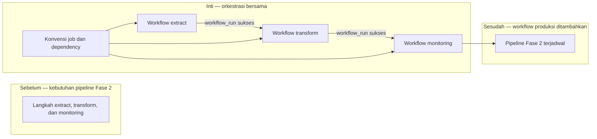

# Report — Milestone 2.0: Fondasi Orchestrator Bersama

Milestone ini berjenis **berbasis kode/sistem**. Hasilnya adalah fondasi orkestrasi bersama memakai GitHub Actions.

## Bagian 1 — Ringkasan Hasil

**Status akhir:** Selesai sesuai rencana.

M2.0 menyiapkan GitHub Actions sebagai orchestrator Fase 2, disertai konvensi penamaan workflow dan dependency lintas workflow. Tiga workflow demo membuktikan rantai extract → transform → monitoring dapat berjalan berurutan dalam satu instance/repo yang sama. Pemilihan GitHub Actions bersifat sadar karena biaya; desainnya tetap mendekati pola dependency produksi dan dicatat untuk ditinjau ulang bila kelak butuh sensor atau graph dependency yang lebih kaya.

## Bagian 2 — Kriteria Keberhasilan vs Bukti Nyata

| Kriteria (dari dokumen sumber) | Bukti Aktual | Terpenuhi? |
|---|---|---|
| Job percobaan sederhana berhasil dijadwalkan dan dijalankan melalui platform. | `orchestrator-demo-extract.yml` memiliki cron dan `workflow_dispatch`; run 31226809039 sukses dalam 7 detik. | Ya |
| Pemilik pekerjaan lain dapat menambahkan job baru ke instance sama tanpa membangun instance terpisah. | `orchestrator-demo-monitoring.yml` ditambahkan sebagai file baru tanpa mengubah dua workflow sebelumnya dan otomatis sukses sebagai run 31226825790 setelah workflow transform. | Ya |

## Bagian 3 — Cara Kerja dan Arsitektur

### Cara Kerja

Workflow pertama dipicu jadwal atau manual. `workflow_run` memicu transform hanya ketika extract sukses; workflow monitoring menggunakan pola yang sama terhadap transform. Konvensi di `docs/05-orchestrator/konvensi-job-dependency.md` menjelaskan cara menambah workflow baru tanpa mengubah workflow pemilik lain.

### Diagram Arsitektur

### Integrasi dengan Komponen Lain

Fondasi ini menjadi mekanisme pemicu extract, transform, dan reverse ETL berikutnya. M2.1 memasok workflow produksi pertama; pemilik domain lain dapat mengikuti konvensi yang sama.

## Bagian 4 — Perubahan dari Plan

Provisioning GCP/BigQuery sempat muncul pada draft awal, lalu dikeluarkan setelah source plan dibaca ulang; itu adalah lingkup M2.1. Tidak ada penyimpangan dari `decisions.md` final.

## Bagian 5 — Keterbatasan dan Item Provisional

- GitHub Actions tidak memiliki sensor kondisi arbitrer, graph dependency visual, atau retry granular setara Airflow/Dagster/Prefect.
- Tiga workflow demo bersifat ilustratif dan perlu diganti/diberi penanda ketika workflow produksi mengambil alih.
- Validasi pemilik lain adalah simulasi karena project dikerjakan solo.

## Bagian 6 — Follow-up

- Tinjau migrasi ke orchestrator self-hosted sebelum pipeline memerlukan sensor `ml_output`.
- M2.1–M2.5 menggunakan konvensi ini untuk workflow produksi dan dependency nyata.
