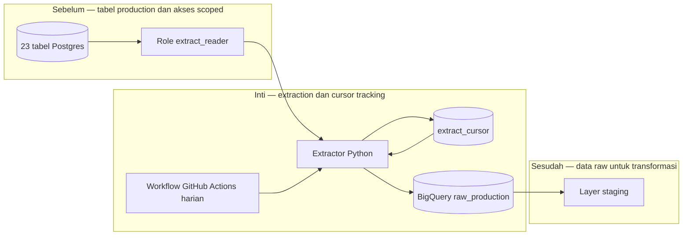

# Report — Milestone 2.1: Extraction Production ke Raw Warehouse

Milestone ini berjenis **berbasis kode/sistem**. Hasilnya adalah ekstraksi 23 tabel Postgres ke BigQuery `raw_production` dengan cursor tracking dan jadwal harian.

## Bagian 1 — Ringkasan Hasil

**Status akhir:** Selesai sebagian, dengan follow-up.

M2.1 memprovision BigQuery `raw_production`, role `extract_reader` yang hanya dapat membaca 23 tabel sumber, service account writer terbatas pada dataset raw, serta extractor Python generik. Semua 23 tabel tersinkron dengan row-count parity 23/23. Workflow harian juga sukses di CI dan membuktikan cursor tracking tidak memproses ulang 19 tabel incremental, sementara empat tabel yang tidak memiliki strategi cursor aman tetap full refresh.

Tiga batasan sadar menghalangi penyelesaian penuh: sumber dibaca dari primary karena read replica berbayar, cursor tidak menangkap update baris lama, dan tabel tidak dapat dipartisi berdasarkan tanggal bisnis di BigQuery Sandbox. Insiden partitioning sempat menghapus data historis akibat expiry 60 hari, tetapi dipulihkan penuh dari Postgres dan parity diverifikasi ulang.

## Bagian 2 — Kriteria Keberhasilan vs Bukti Nyata

| Kriteria (dari dokumen sumber) | Bukti Aktual | Terpenuhi? |
|---|---|---|
| 23 tabel tersinkron ke `raw_production` dengan jumlah baris cocok sumber. | Validasi Postgres versus BigQuery menghasilkan 23/23 cocok, total sekitar 2,53 juta baris. | Ya |
| Sinkronisasi terjadwal incremental tanpa membebani primary, tervalidasi lewat read replica. | Workflow `extract-production.yml` sukses dan cursor terbukti bekerja di CI; namun koneksi tetap ke primary, bukan replica. | Sebagian, lihat Bagian 5 |
| User replikasi tidak dapat mengakses tabel di luar whitelist. | `extract_reader` lolos 23 grant expected; `SELECT monitoring.alerts` dan `INSERT` ditolak. | Ya |

## Bagian 3 — Cara Kerja dan Arsitektur

### Cara Kerja

Extractor membaca tabel dengan role scoped, memilih full refresh atau cursor berbasis primary key/tanggal dari konfigurasi yang diverifikasi lewat `information_schema`, lalu memuat hasil ke BigQuery dengan metadata `_synced_at`. State cursor tersimpan di `monitoring.extract_cursor`. Sebelum produksi, semua row count diperiksa; workflow GitHub Actions menyediakan run harian dan menyimpan kredensial sebagai secret.

### Diagram Arsitektur

### Integrasi dengan Komponen Lain

Raw production adalah input M2.2; M2.0 memberi konvensi orkestrasi. Dataset raw tidak dibersihkan agar transformasi downstream mempertahankan konteks data asli.

## Bagian 4 — Perubahan dari Plan

Partitioning dihentikan setelah expiry Sandbox menghapus hampir seluruh data historis partisi. Recovery dilakukan dengan reset cursor dan full reload; solusi ingestion-time ditolak karena tidak memenuhi tujuan pruning tanggal bisnis. Perbaikan teknis mencakup serialisasi tipe `TIME` dan collision modul konfigurasi.

## Bagian 5 — Keterbatasan dan Item Provisional

- Read replica belum tersedia; ekstraksi memakai primary.
- Cursor hanya menangkap insert baru, bukan update lama.
- Partitioning tanggal bisnis ditunda sampai billing GCP aktif; Sandbox juga melarang DML.
- Key service account perlu rotasi manual bila terpapar.

## Bagian 6 — Follow-up

- Aktifkan billing lalu jalankan `partition_tables.py` untuk menuntaskan partitioning.
- Revisit CDC/read replica ketika data menjadi live atau beban primary meningkat.
- M2.2 membaca `raw_production` sebagai sumber staging.
