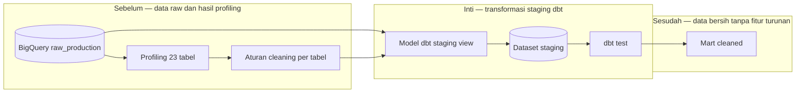

# Report — Milestone 2.2: Layer Staging — Cleaning per Tabel

Milestone ini berjenis **berbasis kode/sistem**. Hasilnya adalah 23 model dbt staging berbentuk view dengan cleaning yang dibuktikan lewat profiling data.

## Bagian 1 — Ringkasan Hasil

**Status akhir:** Selesai sesuai rencana.

M2.2 membangun layer `staging` untuk seluruh 23 tabel raw. Sebelum menentukan cleaning, profiling independen terhadap data nyata menghasilkan `data-profiling-findings.md`; keputusan transformasi kemudian membedakan normalisasi yang aman dari nilai yang harus dipertahankan untuk Data Scientist. Semua model mempertahankan jumlah baris sumber dan tidak menambah fitur atau kolom turunan.

Normalisasi diterapkan hanya pada `employees` dan `guests`: trim nama, 19 variasi department menjadi delapan nilai, parsing `hire_date`, normalisasi format telepon domestik, serta case/whitespace nationality. Missing value yang bermakna, typo nama, duplikasi guest, dan kondisi zero-versus-null tetap dipertahankan/didokumentasikan. `dbt test` menghasilkan 31/31 pass.

## Bagian 2 — Kriteria Keberhasilan vs Bukti Nyata

| Kriteria (dari dokumen sumber) | Bukti Aktual | Terpenuhi? |
|---|---|---|
| Tabel dengan aturan normalisasi menunjukkan nilai sudah dinormalisasi. | `employees.department` berubah 19→8 nilai, `hire_date` menjadi DATE, empat format telepon domestik menjadi satu format, dan nationality dinormalisasi case/whitespace. | Ya |
| Kolom/baris yang harus dipertahankan tetap identik dengan raw. | Row count 23/23 cocok; `role_title` null, phone null/asing, guest duplicate/typo, serta missing value bisnis dipertahankan sesuai pemetaan. | Ya |
| Tidak ada kolom turunan atau fitur kalkulasi di staging. | Semua model berupa cleaning/passthrough view; dokumentasi `warehouse/README.md` menegaskan batas staging dan audit model tidak menemukan feature hasil kalkulasi. | Ya |

## Bagian 3 — Cara Kerja dan Arsitektur

### Cara Kerja

dbt membaca `raw_production` lalu membuat view `stg_<schema>__<tabel>` di `staging`. Mayoritas tabel adalah passthrough. Model `employees` dan `guests` menerapkan transformasi SQL eksplisit; pemetaan department sederhana memakai `LOWER(TRIM())` karena profiling membuktikan semua variasi hanyalah kapitalisasi/whitespace. Test dasar mencakup `not_null`, `unique`, dan `accepted_values` pada department.

### Diagram Arsitektur

### Integrasi dengan Komponen Lain

M2.1 menyediakan raw data; M2.3 mengonsumsi staging sebagai input mart. Temuan Kategori C tetap menjadi konteks bagi consumer, bukan dibetulkan diam-diam di staging.

## Bagian 4 — Perubahan dari Plan

Tidak ada perubahan lingkup. Dua koreksi implementasi tercatat: nama CTE telepon diubah untuk menghindari resolusi STRUCT BigQuery, dan `+schema` tidak dipakai agar dbt tidak membentuk dataset `staging_staging`.

## Bagian 5 — Keterbatasan dan Item Provisional

- Normalisasi nationality hanya case/whitespace; typo/variasi lain tidak dipaksa menjadi negara baku.
- Delapan tabel tanpa PK tunggal tidak memiliki test uniqueness sederhana.
- Staging sebagai view bergantung pada raw dataset dan batas expiry Sandbox.
- Temuan `Corporate Overhead`, zero-versus-null, dan key transaksi nonunik baru didokumentasikan di milestone ini, belum diperbaiki pada dokumen master.

## Bagian 6 — Follow-up

- M2.3 membangun dan menguji `mart_cleaned` dari view ini.
- Pertimbangkan test composite uniqueness dan pembaruan dokumen master untuk temuan Kategori C.
- Pertahankan data yang sengaja kotor sampai consumer yang berwenang memutuskan perlakuannya.
