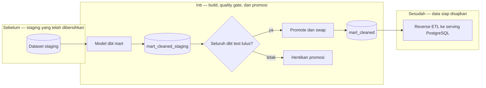

# Report — Milestone 2.3: Layer Intermediate dan Mart Cleaned

Milestone ini berjenis **berbasis kode/sistem**. Hasilnya adalah 23 tabel `mart_cleaned` dengan data-quality gate sebelum promosi.

## Bagian 1 — Ringkasan Hasil

**Status akhir:** Selesai sebagian, dengan follow-up.

M2.3 membuat `mart_cleaned` satu-ke-satu dari staging, tanpa layer intermediate karena dokumen kebutuhan memang tidak membutuhkan join struktural. Semua model dibangun lebih dulu ke `mart_cleaned_staging`, diuji, lalu hanya dipromosikan ke dataset live setelah semua test lulus. Hasil akhir: 23/23 tabel tersedia dan row count cocok dengan staging; 36 dbt test lulus.

Gate dibuktikan dengan baris simulasi `total_amount=-500000`: test gagal dan `promote.py` berhenti sebelum swap, sehingga mart live tetap 217.654 baris tanpa data uji. Namun BigQuery Sandbox memblokir DML, sehingga incremental `MERGE`/`append` tidak dapat dijalankan. Refresh saat ini adalah full refresh; inilah alasan status sebagian.

## Bagian 2 — Kriteria Keberhasilan vs Bukti Nyata

| Kriteria (dari dokumen sumber) | Bukti Aktual | Terpenuhi? |
|---|---|---|
| Semua 23 tabel mart tersedia dan dapat diquery. | 23/23 tabel `mart_cleaned` ada dan parity row count terhadap staging tervalidasi dua kali. | Ya |
| Pengujian kualitas berjalan dan hasil dapat ditelusuri. | 36 dbt test—key, relationship, accepted value, serta custom rule—lulus dan dapat dijalankan ulang. | Ya |
| Data yang melanggar rule tidak diteruskan ke mart. | Uji controlled failure menghentikan promosi; mart live tidak berubah dan tidak memuat baris simulasi. | Ya |
| Refresh perubahan kecil lebih murah/cepat dari full refresh. | Sandbox menolak seluruh DML, sehingga strategi incremental tidak dapat dibuktikan atau digunakan. | Tidak, lihat Bagian 5 |

## Bagian 3 — Cara Kerja dan Arsitektur

### Cara Kerja

Model dbt membaca staging dan menulis kandidat ke `mart_cleaned_staging`. `promote.py` menjalankan build, seluruh test, lalu melakukan `CREATE OR REPLACE` pada tabel live hanya ketika exit test sukses. `is_incremental()` tetap ada sebagai rancangan dormant untuk billing-enabled future, tetapi materialisasi aktif adalah table full refresh.

### Diagram Arsitektur

### Integrasi dengan Komponen Lain

M2.2 menyediakan staging dan M2.4 mengonsumsi `mart_cleaned`. Workflow berikutnya menjadwalkan build/test/promote serta renewal expiry dataset.

## Bagian 4 — Perubahan dari Plan

Rancangan incremental `is_incremental()` tidak diaktifkan setelah run kedua membuktikan Sandbox memblokir DML. Simulasi pelanggaran memakai `UNION ALL` sementara karena INSERT juga dilarang. Macro schema dan client kredensial promosi diperbaiki setelah bug resolusi dbt serta scope service account ditemukan.

## Bagian 5 — Keterbatasan dan Item Provisional

- Billing belum aktif: table/view expiry harus diperpanjang dan refresh incremental tidak tersedia.
- Renewal awalnya manual untuk dataset mart, lalu perlu dijadwalkan bersama transform.
- Delapan tabel tanpa PK tunggal belum tercakup uniqueness test.
- Promosi selektif masih dapat mempromosikan seluruh tabel staging, bukan hanya model yang dipilih.

## Bagian 6 — Follow-up

- Aktifkan billing, hapus expiry Sandbox, dan aktifkan kembali materialisasi incremental.
- Jalankan transform serta renewal terjadwal sebelum expiry berikutnya.
- M2.4 memakai mart live sebagai sumber reverse ETL.
