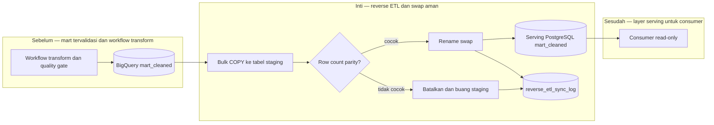

# Report — Milestone 2.4: Reverse ETL Mart Cleaned ke PostgreSQL

Milestone ini berjenis **berbasis kode/sistem**. Hasilnya adalah serving PostgreSQL terpisah yang menerima 23 tabel melalui bulk sync dan swap aman.

## Bagian 1 — Ringkasan Hasil

**Status akhir:** Selesai sesuai rencana.

M2.4 menyediakan project Supabase khusus serving layer, terpisah dari database production, serta `sync.py` untuk membaca BigQuery `mart_cleaned` dan memuatnya ke PostgreSQL. Sync membuat tabel staging, bulk-load melalui `COPY`, memeriksa parity row count sebelum swap, lalu menukar tabel dengan RENAME. Seluruh 23 tabel tersedia dengan jumlah baris yang cocok dengan BigQuery.

Milestone juga menutup dua gap M2.3: workflow transform dan renewal expiry kini dijalankan harian sebelum workflow reverse ETL. Uji concurrency menjalankan delapan swap sambil melakukan 274 query baca; tidak ada query gagal.

## Bagian 2 — Kriteria Keberhasilan vs Bukti Nyata

| Kriteria (dari dokumen sumber) | Bukti Aktual | Terpenuhi? |
|---|---|---|
| Seluruh 23 tabel tersedia di PostgreSQL dengan row count cocok BigQuery. | 23/23 tabel tersinkron; log `monitoring.reverse_etl_sync_log` mencatat status `synced` dan parity tanpa mismatch. | Ya |
| Swap table berjalan tanpa downtime yang mengganggu akses. | `test_no_downtime_swap.py` melakukan delapan swap dengan 274 query konkuren dan 0 error. | Ya |

## Bagian 3 — Cara Kerja dan Arsitektur

### Cara Kerja

Service account BigQuery hanya membaca `mart_cleaned`; role `reverse_etl_writer` hanya dapat membuat/mengubah tabel pada schema serving `mart_cleaned`. Sync memetakan tipe BigQuery ke PostgreSQL, memuat batch melalui `copy_expert`, lalu membatalkan dan membuang staging jika count tidak sama. Hanya staging yang lolos gate dapat menggantikan tabel live; setiap hasil sync dicatat terpusat pada schema monitoring production.

### Diagram Arsitektur

### Integrasi dengan Komponen Lain

M2.3 memasok mart yang telah melewati gate; M2.0 menyediakan chain workflow. Serving layer menjadi batas fisik terpisah bagi consumer berikutnya, sementara log tetap terpusat di monitoring production.

## Bagian 4 — Perubahan dari Plan

Tidak ada deviasi fungsional. Detail implementasi dikoreksi saat environment membuktikan direct connection Supabase IPv6-only tidak terjangkau: URL diganti ke Session Pooler IPv4, bukan Transaction Pooler, agar COPY tetap aman. Collision modul `db.py` juga dihilangkan dengan mengganti nama helper koneksi.

## Bagian 5 — Keterbatasan dan Item Provisional

- Role read-only untuk consumer serving belum menjadi lingkup M2.4.
- Sync produksi masih seluruh 23 tabel; sync selektif belum disediakan.
- Tabel tanpa PK tunggal mewarisi keterbatasan validasi uniqueness dari layer sebelumnya.

## Bagian 6 — Follow-up

- Provision role consumer read-only sebelum serving layer dibuka ke persona baru.
- Pertahankan urutan transform → reverse ETL dan pantau `reverse_etl_sync_log`.
- Consumer Data Scientist berikutnya tetap memakai BigQuery sesuai keputusan aksesnya, bukan writer serving ini.
