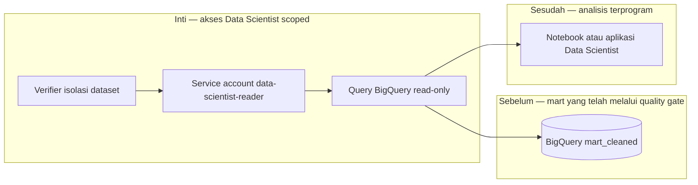

# Report — Milestone 2.5: API Akses Data Scientist

Milestone ini berjenis **berbasis kode/sistem**. Hasilnya adalah kredensial BigQuery read-only dan contoh akses terprogram untuk Data Scientist.

## Bagian 1 — Ringkasan Hasil

**Status akhir:** Selesai sesuai rencana.

M2.5 menyediakan service account `data-scientist-reader` yang hanya dapat membaca `mart_cleaned`, bersama script contoh query dan dokumentasi penggunaan. Verifikasi end-to-end membuktikan kredensial ini dapat melakukan query tunggal, sample, serta agregasi penuh tanpa memakai kredensial admin atau service account pipeline.

Scope akses dibuktikan pada dua sisi: `CREATE TABLE` ditolak, dan helper isolasi mengonfirmasi raw/staging tidak dapat dibaca. `mart_aggregated` belum ada sehingga isolasinya belum dapat diuji langsung, tetapi aman by construction karena ACL BigQuery hanya memberi grant eksplisit kepada `mart_cleaned`.

## Bagian 2 — Kriteria Keberhasilan vs Bukti Nyata

| Kriteria (dari dokumen sumber) | Bukti Aktual | Terpenuhi? |
|---|---|---|
| Tim Data Scientist dapat mengambil data `mart_cleaned` terprogram tanpa kredensial admin/intinya. | `example_query.py` sukses menjalankan query properties, sample bookings, dan agregasi rata-rata per properti hanya dengan `DATA_SCIENTIST_READER_CREDENTIALS`. | Ya |
| Akses read-only dan terisolasi dari raw maupun `mart_aggregated`. | `CREATE TABLE` ditolak; isolasi raw/staging lulus 3/3. Isolasi mart_aggregated dijamin ACL whitelist, walaupun dataset belum ada. | Ya |

## Bagian 3 — Cara Kerja dan Arsitektur

### Cara Kerja

Service account memiliki dataset ACL `READER` pada `mart_cleaned` dan `jobUser` untuk menjalankan query. `example_query.py` memakai file key kredensial tersebut secara langsung. `verify_dataset_isolation.py` menguji query yang seharusnya diizinkan dan yang harus ditolak; helper ini juga dipakai reader reverse ETL agar pola verifikasi tidak diduplikasi.

### Diagram Arsitektur

### Integrasi dengan Komponen Lain

M2.3 menghasilkan dataset yang dibaca. M2.6 menggunakan bukti teknis ini untuk kebijakan kredensial project-wide; tidak ada akses otomatis ke raw, staging, atau future dataset lain.

## Bagian 4 — Perubahan dari Plan

Tidak ada deviasi. Helper isolasi diekstrak dari reader reverse ETL menjadi `scripts/bigquery_common/verify_dataset_isolation.py` dan tetap lulus tanpa regresi.

## Bagian 5 — Keterbatasan dan Item Provisional

- Isolasi `mart_aggregated` belum diuji langsung karena dataset belum dibuat.
- Key file belum memiliki rotasi atau expiry otomatis.
- Kebijakan siapa yang boleh memegang kredensial sengaja menjadi scope M2.6.

## Bagian 6 — Follow-up

- Saat `mart_aggregated` ada, tambahkan deny-test eksplisit untuk dataset itu.
- Terapkan rotasi key dan proses pencabutan sesuai kebijakan M2.6.
- Gunakan helper isolasi untuk setiap kredensial BigQuery scoped baru.
