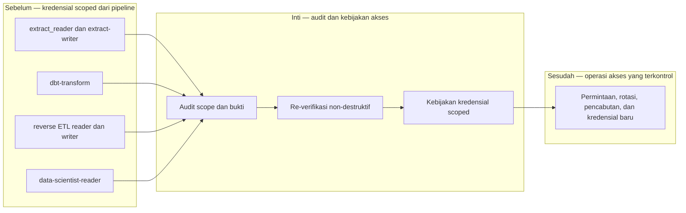

# Report — Milestone 2.6: Isolasi Akses dan Kredensial Read-Only

Milestone ini berjenis **berbasis kode/sistem**. Hasilnya adalah audit serta kebijakan akses project-wide untuk enam kredensial scoped.

## Bagian 1 — Ringkasan Hasil

**Status akhir:** Selesai sesuai rencana.

M2.6 tidak membuat ulang service account Data Scientist karena implementasi dan bukti teknisnya telah selesai di M2.5. Milestone ini mengaudit enam kredensial Fase 2, mengulang verifikasi yang aman tanpa rotasi password, dan menghasilkan kebijakan tunggal `docs/06-akses-kredensial/kebijakan-akses-kredensial-scoped.md`.

Audit menemukan tidak ada drift pada empat kredensial yang dapat diperiksa ulang non-destruktif. Kebijakan mendokumentasikan scope, pemegang yang berwenang, permintaan kredensial baru, rotasi/pencabutan, dan pengecualian penting: `dbt-transform` sengaja mempunyai scope BigQuery project-level karena harus mengelola beberapa dataset.

## Bagian 2 — Kriteria Keberhasilan vs Bukti Nyata

| Kriteria (dari dokumen sumber) | Bukti Aktual | Terpenuhi? |
|---|---|---|
| Kredensial Data Scientist tidak dapat mengakses raw maupun `mart_aggregated`. | Isolasi raw/staging dibuktikan di M2.5 dan diverifikasi ulang tanpa drift. `mart_aggregated` belum ada; isolasi tetap berlaku by construction melalui dataset ACL whitelist. | Ya |
| Kredensial hanya dapat membaca `mart_cleaned`. | Percobaan `CREATE TABLE` M2.5 ditolak `Forbidden`; tidak ada perubahan grant sebelum audit M2.6. | Ya |

## Bagian 3 — Cara Kerja dan Arsitektur

### Cara Kerja

Audit mengumpulkan scope serta bukti dari milestone asal, lalu memilih re-verifikasi yang tidak mengubah state: helper BigQuery untuk dua reader dan query read-only untuk dua role Postgres. Script setup yang merotasi password sengaja tidak dijalankan. Temuan, bukti, dan prosedur operasional dikonsolidasikan dalam satu kebijakan untuk enam kredensial.

### Diagram Arsitektur

### Integrasi dengan Komponen Lain

M2.1–M2.5 adalah sumber kredensial dan bukti teknis; M2.6 menjadi rujukan tunggal untuk pekerjaan berikutnya yang menambah kredensial BigQuery/Postgres.

## Bagian 4 — Perubahan dari Plan

Tidak ada penyimpangan. Scope kebijakan diperluas secara sadar menjadi project-wide sesuai frasa “seluruh sistem”, dan verifikasi dibatasi non-destruktif agar GitHub Secret yang aktif tidak putus oleh rotasi password.

## Bagian 5 — Keterbatasan dan Item Provisional

- Rotasi kredensial otomatis belum tersedia.
- `extract-writer` tidak memiliki verifier isolasi re-runnable; `dbt-transform` memang project-level sehingga tidak setara kredensial dataset-scoped.
- Isolasi mart_aggregated perlu diuji langsung setelah dataset benar-benar ada.

## Bagian 6 — Follow-up

- Tambahkan setiap kredensial baru ke inventaris kebijakan.
- Terapkan rotasi otomatis serta deny-test mart_aggregated saat dataset dibuat.
- Gunakan pendekatan least-privilege dan re-verifikasi non-destruktif sebagai standar operasional.
