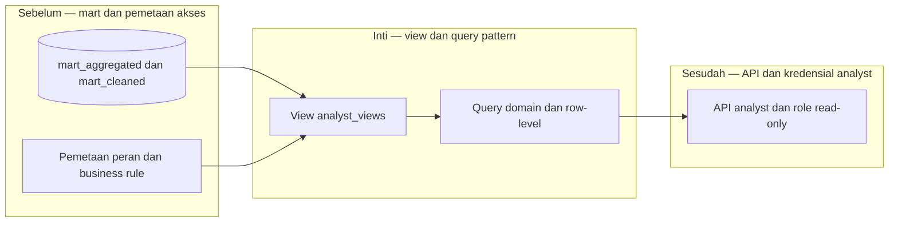

# Report — Milestone 3.2: View dan Query Pattern per Domain

Milestone ini berjenis **berbasis kode/sistem**. Hasilnya adalah view `analyst_views` yang menanamkan filter dan business rule per domain.

## Bagian 1 — Ringkasan Hasil

**Status akhir:** Selesai sesuai rencana.

M3.2 membangun kelompok view aggregate dan row-level di schema terpisah `analyst_views`, di atas mart agregat serta mart cleaned serving PostgreSQL. View mengekspos nama dimensi, bukan surrogate ID, dan menanamkan filter kritis seperti pengecualian Overall/Corporate Overhead, payroll eksklusif, dan SLA pending-count. Hasil manual dan query view diverifikasi cocok pada metrik representatif.

## Bagian 2 — Kriteria Keberhasilan vs Bukti Nyata

| Kriteria (dari dokumen sumber) | Bukti Aktual | Terpenuhi? |
|---|---|---|
| Query view tiap domain cocok dengan perhitungan manual/sampel. | View domain dan row-level diuji terhadap tabel sumber serta metrik representatif; rule kritis tetap muncul pada output. | Ya |
| Query tanpa filter eksplisit tetap benar karena filter tertanam di view. | Uji view tanpa filter pemakai mempertahankan exclusion finance, payroll, dan rule scope yang ditentukan M3.1. | Ya |

## Bagian 3 — Cara Kerja dan Arsitektur

### Cara Kerja

DDL membuat view whitelisted per fact table di `analyst_views`. Setiap view melakukan join dimension yang diperlukan, memilih kolom aman, dan menanamkan predicate bisnis di SQL, bukan menyerahkannya kepada caller. Row-level tetap memakai tabel cleaned ketika agregat tidak dapat menjawab investigasi.

### Diagram Arsitektur

### Integrasi dengan Komponen Lain

View menjadi kontrak M3.3 untuk index, M3.4 untuk whitelist API, dan M3.5 untuk grant SELECT tanpa akses langsung ke mart mentah.

## Bagian 4 — Perubahan dari Plan

Tidak ada perubahan keputusan inti; authoring memakai admin karena role analyst belum ada.

## Bagian 5 — Keterbatasan dan Item Provisional

- Pace booking snapshot belum dibuatkan view karena status implementasi belum final.
- View tidak sendiri menegakkan identitas pemakai; kredensial M3.5 diperlukan.

## Bagian 6 — Follow-up

- M3.3 mengoptimalkan query view yang representatif.
- M3.4 mengekspos hanya view/tabel whitelisted.
- M3.5 memberi grant per peran pada view ini.
