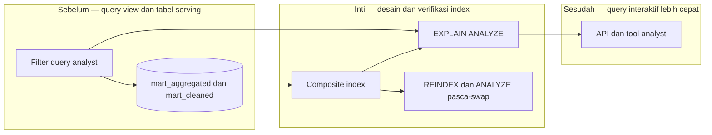

# Report — Milestone 3.3: Index dan Optimasi Performa untuk Pola Akses Analyst

Milestone ini berjenis **berbasis kode/sistem**. Hasilnya adalah 50 index serving PostgreSQL dan reindex/analyze pasca-swap.

## Bagian 1 — Ringkasan Hasil

**Status akhir:** Selesai dengan penyesuaian dari plan.

M3.3 mengoptimalkan query analyst pada `mart_aggregated` dan `mart_cleaned` berdasarkan filter dari pemetaan akses. Sebanyak 41 index dibuat pada mart agregat dan sembilan pada mart cleaned; `REINDEX/ANALYZE` kini berjalan otomatis setelah reverse ETL. Semua index dibuktikan dipilih planner dan tercatat memiliki `idx_scan ≥ 1`.

Perbaikan terbesar terjadi pada `staff_shifts` (1702,8ms→2,5ms), `fnb_transactions` (~1004ms→~5ms setelah cache warm), dan revenue LOS (276,6ms→0,48ms). Temuan implementasi mengoreksi asumsi awal: selektivitas filter, bukan ukuran tabel saja, menentukan apakah index bernilai.

## Bagian 2 — Kriteria Keberhasilan vs Bukti Nyata

| Kriteria (dari dokumen sumber) | Bukti Aktual | Terpenuhi? |
|---|---|---|
| Query representatif tiap domain cukup cepat untuk analisis interaktif. | `EXPLAIN ANALYZE` dibandingkan sebelum/sesudah pada enam domain dan dua schema; baseline lengkap tercatat di `index-baseline-analyst.md`. | Ya |
| Index yang dipasang benar-benar digunakan query plan. | Seluruh 50 query verifikasi memakai Index/Bitmap Index Scan dan seluruh index memiliki `pg_stat_user_indexes.idx_scan ≥ 1`. | Ya |

## Bagian 3 — Cara Kerja dan Arsitektur

### Cara Kerja

Definisi index mengikuti filter `property_id`, tanggal, outlet, employee, atau business line yang dipakai view/API. Setelah reverse ETL menukar tabel, script index menyiapkan ulang struktur dan statistik. Pengukuran mencakup query plan serta runtime; cache-dingin dicatat terpisah agar tidak disalahartikan sebagai kegagalan index.

### Diagram Arsitektur

### Integrasi dengan Komponen Lain

M3.1 menyediakan pola filter, M3.2 menyediakan query/view, dan M3.4 memakai baseline ini untuk endpoint. Reindex dipicu setelah workflow reverse ETL.

## Bagian 4 — Perubahan dari Plan

Asumsi bahwa tabel kecil pasti tidak membutuhkan index dikoreksi setelah tabel 180 baris memakai Index Scan dengan filter selektif. Corporate/Financial diuji penuh; tabel kecil domain sebelumnya belum diuji ulang.

## Bagian 5 — Keterbatasan dan Item Provisional

- Tabel kecil yang dikecualikan pada domain awal belum direvisit dengan pemahaman selektivitas baru.
- Baseline runtime perlu diukur ulang saat data atau distribusi berubah.
- Cache dingin dapat membuat run pertama pasca-swap lebih lambat.

## Bagian 6 — Follow-up

- Revisit index saat skema berubah melalui pengajuan perubahan.
- Uji tabel kecil yang sebelumnya dikecualikan bila menjadi bottleneck.
- Gunakan kolom index sebagai parameter endpoint agar planner tetap dapat menggunakannya.
