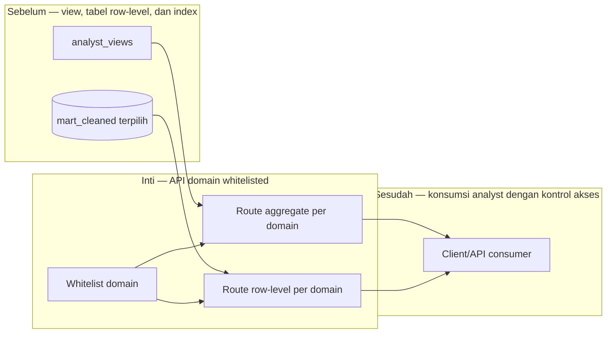

# Report — Milestone 3.4: Multi-Endpoint API untuk Data Analyst

Milestone ini berjenis **berbasis kode/sistem**. Hasilnya adalah API internal dengan 12 route whitelisted per domain.

## Bagian 1 — Ringkasan Hasil

**Status akhir:** Selesai sesuai rencana.

M3.4 membangun dua endpoint untuk masing-masing enam domain: satu jalur aggregate berbasis `analyst_views` dan satu jalur row-level berbasis tabel cleaned yang telah disetujui. Tidak ada endpoint generik lintas domain. Property/GM memakai union lima domain dengan filter properti pada request.

Route diverifikasi via HTTP terhadap server FastAPI/uvicorn nyata. Kasus pembatalan booking Bali, transaksi F&B, ticket maintenance, event, shift, serta financial/payroll terbukti dapat dijawab dari endpoint row-level. Rule Overall/Corporate Overhead, payroll eksklusif, pending count SLA, dan larangan metrik tertentu tetap terbawa sampai API.

## Bagian 2 — Kriteria Keberhasilan vs Bukti Nyata

| Kriteria (dari dokumen sumber) | Bukti Aktual | Terpenuhi? |
|---|---|---|
| Enam peran dan Property/GM mendapat data sesuai domain tanpa endpoint di luar scope. | Dua belas route dipisah prefix domain; Property/GM diuji pada lima domain dengan `property_id=P02`, tanpa route Corporate/Financial. | Ya |
| Endpoint row-level menjawab investigasi ad-hoc representatif. | Skenario cancellation P01 Maret 2024 serta skenario row-level setiap domain berhasil melalui HTTP. | Ya |

## Bagian 3 — Cara Kerja dan Arsitektur

### Cara Kerja

`main.py` mendaftarkan prefix domain dan modul whitelist hanya mengizinkan view/tabel yang dipetakan M3.1. Endpoint aggregate membaca `analyst_views`; endpoint row-level menerima parameter batas yang relevan. API tidak menghitung ulang business rule—ia memakai view yang sudah menanamkannya.

### Diagram Arsitektur

### Integrasi dengan Komponen Lain

M3.2 menjadi kontrak data; M3.3 mempercepat pola query. M3.5 harus mengganti koneksi admin dan menegakkan domain serta properti berdasarkan identitas caller.

## Bagian 4 — Perubahan dari Plan

Tidak ada perubahan desain. `uvicorn --reload` terbukti tidak konsisten sehingga verifikasi setiap checkpoint memakai restart server bersih.

## Bagian 5 — Keterbatasan dan Item Provisional

- API belum memiliki auth/isolasi per peran dan belum dideploy.
- `property_id` belum diwajibkan secara teknis; tanpa filter masih mungkin mengembalikan lintas properti.
- Pace booking snapshot belum mempunyai route.

## Bagian 6 — Follow-up

- M3.5 memakai kredensial per role dan harus meng-inject property filter untuk Property/GM.
- Consumer baru menambah whitelist, bukan endpoint generik.
- Evaluasi deployment internal bila API dipakai di luar localhost.
