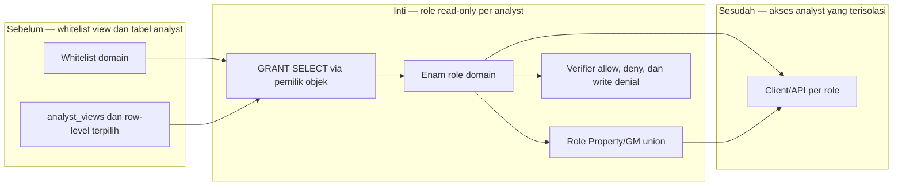

# Report — Milestone 3.5: Isolasi Akses dan Kredensial Read-Only Analyst

Milestone ini berjenis **berbasis kode/sistem**. Hasilnya adalah tujuh role PostgreSQL read-only yang menegakkan scope analyst.

## Bagian 1 — Ringkasan Hasil

**Status akhir:** Selesai dengan penyesuaian dari plan.

M3.5 membuat enam role domain dan satu role union Property/GM di serving PostgreSQL. Role menerima SELECT hanya pada whitelist view/tabel yang diperlukan; tidak satu pun diberi grant pada `mart_aggregated` mentah. Uji connect-as-role membuktikan HR tidak dapat membaca payroll atau view finansial, Property/GM tidak dapat mengakses Corporate/Financial, dan Corporate/Financial tidak dapat melewati filter view dengan membaca tabel dasar.

Setiap role diuji mencoba INSERT pada data yang paling dekat dengan scope-nya; semuanya ditolak. Audit akhir juga memastikan role bukan superuser/creator dan ACL tidak mengandung izin selain SELECT.

## Bagian 2 — Kriteria Keberhasilan vs Bukti Nyata

| Kriteria (dari dokumen sumber) | Bukti Aktual | Terpenuhi? |
|---|---|---|
| Role analyst tidak dapat mengakses data di luar scope. | Verifier terhadap tujuh koneksi role membuktikan payroll dan empat target finance ditolak untuk HR; Property/GM ditolak Corporate/Financial; tabel dasar finance ditolak untuk role terluas. | Ya |
| Semua kredensial read-only pada mart. | Percobaan INSERT tiap role ditolak; `pg_roles` dan ACL mengonfirmasi tidak ada grant tulis. | Ya |

## Bagian 3 — Cara Kerja dan Arsitektur

### Cara Kerja

Konfigurasi per domain mendefinisikan whitelist objek. Setup membuat/merotasi role, merutekan GRANT melalui pemilik objek yang benar, lalu verifier menguji allow/deny dan write denial dengan koneksi role nyata. Property/GM memakai inheritance dari lima role domain sehingga tidak memerlukan grant objek langsung.

### Diagram Arsitektur

### Integrasi dengan Komponen Lain

Whitelist M3.4 menjadi sumber grant. API berikutnya dapat memakai URL koneksi per role untuk menggantikan admin. Kebijakan project-wide M2.6 diperbarui dengan tujuh kredensial ini.

## Bagian 4 — Perubahan dari Plan

GRANT admin tidak berlaku untuk objek milik writer lain, sehingga setup dirutekan ke koneksi pemilik per schema. Supavisor juga memerlukan warm-up retry sebelum verifikasi. Keduanya penyesuaian operasional, bukan perubahan model least-privilege.

## Bagian 5 — Keterbatasan dan Item Provisional

- Password belum berotasi otomatis dan pencabutan akses masih manual.
- Audit lintas-pemilik perlu memakai `pg_class.relacl`, bukan hanya `information_schema.role_table_grants`.
- Whitelist perlu diperbarui jika view atau tabel bertambah.

## Bagian 6 — Follow-up

- Integrasikan koneksi role ke API analyst.
- Re-run setup dan verifier setelah perubahan view/whitelist.
- Dokumentasikan prosedur pencabutan dan rotasi otomatis.
