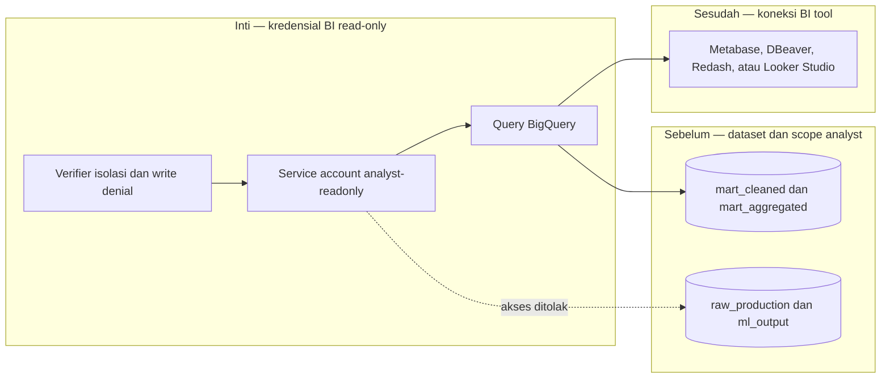

# Report — Milestone 3.6: Akses BigQuery Langsung via BI Tool

Milestone ini berjenis **berbasis kode/sistem**. Hasilnya adalah service account BigQuery `analyst-readonly` dan panduan integrasi BI tool.

## Bagian 1 — Ringkasan Hasil

**Status akhir:** Selesai sebagian, dengan follow-up.

M3.6 menyediakan kredensial read-only yang dapat membaca `mart_cleaned` dan `mart_aggregated`, beserta contoh query dan panduan koneksi untuk tool yang menerima service-account key maupun jalur OAuth/impersonation. Query terprogram membuktikan akses row-level dan agregat bekerja; isolasi raw/ml_output serta penolakan write juga terbukti nyata.

Namun koneksi dari UI BI tool sungguhan belum diuji. Docker Desktop tidak aktif untuk Metabase dan jalur Looker Studio memerlukan setup impersonation tambahan. Karena kriteria meminta pembuktian dari BI tool, status akhir tetap sebagian.

## Bagian 2 — Kriteria Keberhasilan vs Bukti Nyata

| Kriteria (dari dokumen sumber) | Bukti Aktual | Terpenuhi? |
|---|---|---|
| Analyst menjalankan query eksploratif langsung dari BI tool. | Kredensial dan query Python sukses untuk row-level serta agregat, tetapi koneksi UI Metabase/Looker Studio belum dijalankan. | Sebagian, lihat Bagian 5 |
| Kredensial tidak dapat mengakses raw atau ml_output. | Verifier menjalankan dua allow dan dua deny query terhadap BigQuery, seluruhnya 4/4 sesuai harapan. | Ya |
| Kredensial hanya dapat membaca. | `CREATE TABLE` menggunakan kredensial analyst-readonly ditolak 403 Forbidden. | Ya |

## Bagian 3 — Cara Kerja dan Arsitektur

### Cara Kerja

Service account memiliki ACL reader pada dataset yang disetujui dan `jobUser` untuk menjalankan query. Script contoh menjalankan query properties, bookings, dan fact revenue menggunakan hanya key tersebut. Panduan membedakan alat yang dapat mengunggah key dari tool OAuth yang memerlukan impersonation; verifier memastikan scope deny dan write denial sebelum key dipakai consumer.

### Diagram Arsitektur

### Integrasi dengan Komponen Lain

Kredensial melengkapi akses PostgreSQL M3.5 untuk kebutuhan BigQuery/BI. Kebijakan scoped credentials diperbarui dengan inventaris dan pemegang yang berwenang.

## Bagian 4 — Perubahan dari Plan

Tidak ada perubahan keputusan inti. Bug lama `write_env_var()` yang menggabungkan dua entry tanpa newline ditemukan saat menambah kredensial ini dan diperbaiki; seluruh key kemudian dapat diparse kembali dengan benar.

## Bagian 5 — Keterbatasan dan Item Provisional

- UI BI tool belum terhubung, sehingga KK1 belum penuh.
- OAuth/Looker Studio membutuhkan service-account impersonation yang belum dikonfigurasi.
- Kredensial key file tetap memerlukan rotasi manual.

## Bagian 6 — Follow-up

- Jalankan Metabase atau BI tool GUI dan bukti satu query eksploratif nyata untuk menutup KK1.
- Konfigurasikan `serviceAccountTokenCreator` bila memakai jalur OAuth.
- Gunakan helper env yang sudah diperbaiki untuk kredensial baru.
