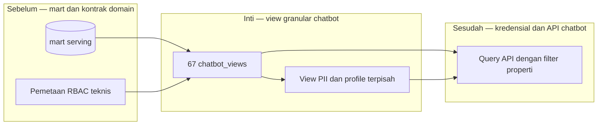

# Report — Milestone 4.2: View Akses Granular per Domain

Milestone ini berjenis **berbasis kode/sistem**. Hasilnya adalah 67 view `chatbot_views` yang memisahkan domain dan kolom chatbot.

## Bagian 1 — Ringkasan Hasil

**Status akhir:** Selesai sesuai rencana.

M4.2 membuat view per domain pada serving PostgreSQL. View hanya mengembalikan kolom yang relevan, memisahkan kontak PII dari profil guest, dan selalu membawa `property_id` agar API dapat menerapkan own/all-property. Dua view guest dioptimalkan dari correlated lateral join menjadi agregasi `DISTINCT ON`, menurunkan runtime menjadi 0,44 detik.

## Bagian 2 — Kriteria Keberhasilan vs Bukti Nyata

| Kriteria (dari dokumen sumber) | Bukti Aktual | Terpenuhi? |
|---|---|---|
| Setiap domain memiliki view dengan kolom relevan saja. | 67 view aktif, dikelompokkan pada sepuluh domain, tanpa join lintas domain yang tidak dikontrakkan. | Ya |
| PII tidak dapat dibaca dari profile view dan sebaliknya. | Assertion metadata membuktikan kolom kontak tidak ada pada profile view serta kolom profil tidak ada pada contact view. | Ya |
| Filter own/all-property dapat bekerja pada beberapa properti. | Enam view agregat/lookup diuji pada P01 dan P02; keduanya memberi hasil berbeda dan nonkosong. | Ya |

## Bagian 3 — Cara Kerja dan Arsitektur

### Cara Kerja

SQL view membaca mart serving dan mengekspos data domain-spesifik. View tidak memfilter properti sendiri; ia membawa identitas properti yang kemudian dipakai API. Lookup yang tidak memiliki property native memperoleh property melalui join ke outlet/room.

### Diagram Arsitektur

### Integrasi dengan Komponen Lain

M4.3 hanya memberi grant ke view ini; M4.4 memilih view dan menerapkan scope properti.

## Bagian 4 — Perubahan dari Plan

`event_bookings` dikeluarkan dari union guest karena tidak memiliki `guest_id`; tiga lookup diperbaiki agar memuat property melalui join.

## Bagian 5 — Keterbatasan dan Item Provisional

- Tidak ada index chatbot khusus; view besar perlu dipantau setelah API aktif.
- Lookup financial summary masih memerlukan filter konteks di API.

## Bagian 6 — Follow-up

- M4.3 membatasi role pada view ini.
- M4.4 wajib menyuntikkan filter own-property dan filter staff individunya.
