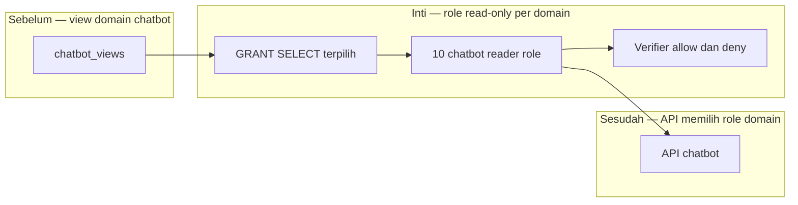

# Report — Milestone 4.3: Kredensial Read-Only Per Kelompok Akses

Milestone ini berjenis **berbasis kode/sistem**. Hasilnya adalah sepuluh role PostgreSQL chatbot, satu per `data_domain`.

## Bagian 1 — Ringkasan Hasil

**Status akhir:** Selesai sesuai rencana.

M4.3 membuat kredensial read-only yang hanya memiliki `USAGE` dan `SELECT` pada `chatbot_views` sesuai domainnya. Role tidak memiliki akses schema `mart_aggregated` atau `mart_cleaned`, sehingga tidak dapat menembus view ke tabel mentah. Sepuluh role diverifikasi dengan koneksi sungguhan dan write denial.

## Bagian 2 — Kriteria Keberhasilan vs Bukti Nyata

| Kriteria (dari dokumen sumber) | Bukti Aktual | Terpenuhi? |
|---|---|---|
| Kredensial tidak dapat mengakses data di luar pemetaan, raw, atau production source. | Semua role ditolak pada mart dasar, `role_permissions`, dan domain yang tidak diizinkan; kredensial hanya hidup di serving PostgreSQL. | Ya |
| Kredensial hanya dapat membaca. | INSERT diuji pada setiap role dan seluruhnya ditolak `InsufficientPrivilege`. | Ya |

## Bagian 3 — Cara Kerja dan Arsitektur

### Cara Kerja

Konfigurasi domain membuat role dan grant eksklusif ke daftar view. Verifier menguji view yang diizinkan, bypass ke dua schema mart, akses lintas domain, dan penulisan.

### Diagram Arsitektur

### Integrasi dengan Komponen Lain

M4.4 memakai role ini per request; API tetap mengurus komposisi multi-domain dan filter properti.

## Bagian 4 — Perubahan dari Plan

Tidak ada penyimpangan.

## Bagian 5 — Keterbatasan dan Item Provisional

- Password belum berotasi otomatis.
- Belum ada consumer nyata dan komposisi multi-domain ada di API.

## Bagian 6 — Follow-up

- M4.4 memilih koneksi role berdasarkan domain yang diizinkan.
- Re-run setup setelah whitelist view berubah.
