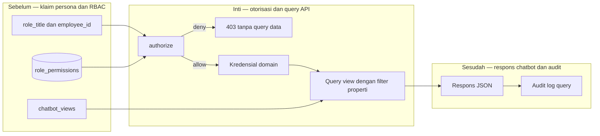

# Report — Milestone 4.4: API Query Interface untuk AI Chatbot

Milestone ini berjenis **berbasis kode/sistem**. Hasilnya adalah FastAPI internal yang mengotorisasi query chatbot per role, domain, dan properti.

## Bagian 1 — Ringkasan Hasil

**Status akhir:** Selesai sesuai rencana.

M4.4 menghubungkan `role_permissions`, whitelist view, dan sepuluh kredensial domain menjadi API query internal. Otorisasi berjalan sebelum lookup whitelist maupun koneksi database. Endpoint hanya mengeksekusi view yang disetujui lewat kredensial domain; reader auth terpisah hanya membaca `role_permissions` dan tidak pernah mengirimkannya ke respons.

Uji HTTP mencakup persona Staff, Manager, dan Korporat serta seluruh penolakan lintas-domain. `own_property` tidak mempercayai property dari caller, tetapi me-resolve property dari `employee_id`. Perbaikan view Facility menambahkan `property_id` agar enforcement ini tidak dapat dilewati.

## Bagian 2 — Kriteria Keberhasilan vs Bukti Nyata

| Kriteria (dari dokumen sumber) | Bukti Aktual | Terpenuhi? |
|---|---|---|
| Persona Staff, Manager, dan Korporat memperoleh data sesuai role_permissions. | Persona representatif diuji HTTP dan dibandingkan dengan query production sebagai ground truth. | Ya |
| Domain di luar scope ditolak sebelum diteruskan ke database. | Cross-domain dan role tidak dikenal menerima 403 dari `authorize()` sebelum whitelist/koneksi. | Ya |
| API tidak dapat menjangkau role_permissions, mart mentah di luar peta, atau raw. | Role permissions bukan view whitelisted; query data memakai kredensial domain M4.3 yang tidak dapat membaca mart mentah. | Ya |

## Bagian 3 — Cara Kerja dan Arsitektur

### Cara Kerja

Handler membaca klaim persona, meminta reader auth untuk scope domain, lalu `authorize()` menentukan allow/deny. Untuk allow, API memilih whitelist dan koneksi role domain, me-resolve property bila scope `own_property`, lalu menjalankan query berparameter/paginasi. Deny berhenti tanpa akses ke kredensial data.

### Diagram Arsitektur

### Integrasi dengan Komponen Lain

M4.2 memberi view, M4.3 memberi kredensial, dan M4.5 mencatat outcome setiap handler. Sistem chatbot Lapis 1 tetap bertanggung jawab memastikan klaim identitas autentik.

## Bagian 4 — Perubahan dari Plan

Tidak ada deviasi. `own_property_column` digeneralisasi per whitelist karena view guest memakai `last_active_property_id`.

## Bagian 5 — Keterbatasan dan Item Provisional

- API belum diintegrasikan ke chatbot nyata dan bentuk respons belum final.
- Belum ada rate limit/circuit breaker.
- Lapis 2 tidak memvalidasi kecocokan `role_title` dengan `employee_id`; itu kontrak Lapis 1.

## Bagian 6 — Follow-up

- M4.5 menambahkan jejak audit untuk allow dan deny.
- M4.6 menguji matriks seluruh persona/domain.
- Integrasi chatbot harus mengikat identity dan role sebelum memanggil API.

## Addendum (2026-08-17) — Gap RBAC row-level ditemukan & diperbaiki pasca-milestone

Tim AI Chatbot (Lapis 1) melaporkan bahwa 7 dari 9 view bergrain per-individu staf (`v_hr_employee_monthly`, `v_hr_employee_performance_semester`, `v_hr_watchlist_monthly`, `v_housekeeping_staff_daily`, `v_maintenance_technician_daily`, `v_lookup_housekeeping_log`, `v_lookup_maintenance_tickets`) tidak mendeklarasikan filter `employee_id`/kolom individu di whitelist `chatbot_api` — meski Lapis 1 sudah mengirim parameter tersebut. Diverifikasi nyata: `main.py` hanya menerapkan filter yang eksplisit dideklarasikan di `entry["filters"]`, jadi dampaknya Staff dengan akses `own_property` menerima data seluruh staf di propertinya, bukan cuma dirinya sendiri, saat memanggil 7 view itu. Ini di luar cakupan tiga Kriteria Keberhasilan sumber (yang menguji isolasi properti/domain, bukan isolasi baris per-individu di dalam satu properti) sehingga tidak tertangkap oleh Fase 4-6 milestone ini maupun M4.6.

Diperbaiki: `whitelist_hr.py`/`whitelist_facility.py` (7 entry diberi filter `employee_id` ke kolom individu yang benar — lihat `logs.md` 2026-08-17). Tidak ada perubahan pada `main.py`, `authz.py`, maupun view SQL — mekanisme filternya sudah ada dan terbukti benar di 2 view yang sudah dideklarasikan sebelumnya (`v_lookup_staff_shifts`/`v_lookup_employee_performance`), gap-nya murni deklarasi whitelist yang belum lengkap.
