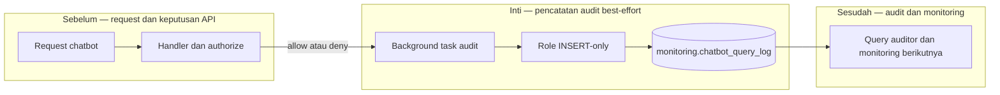

# Report — Milestone 4.5: Audit Log Query Chatbot

Milestone ini berjenis **berbasis kode/sistem**. Hasilnya adalah audit trail setiap outcome API chatbot pada `monitoring.chatbot_query_log`.

## Bagian 1 — Ringkasan Hasil

**Status akhir:** Selesai sesuai rencana.

M4.5 menambahkan writer role INSERT-only dan tabel audit di schema monitoring production. Setiap request API—sukses, domain ditolak, view tidak whitelisted, atau parameter own-property tidak lengkap—mencatat persona, domain, view, scope, property ter-resolve, status, alasan deny, dan row count.

Implementasi menemukan bahwa FastAPI membuang `BackgroundTasks` ketika handler melempar exception. Jalur deny diganti ke `JSONResponse` yang membawa background task, lalu lima skenario HTTP diverifikasi seluruhnya tercatat.

## Bagian 2 — Kriteria Keberhasilan vs Bukti Nyata

| Kriteria (dari dokumen sumber) | Bukti Aktual | Terpenuhi? |
|---|---|---|
| Semua panggilan berhasil maupun ditolak tercatat dengan detail cukup. | Lima skenario 200/403/404/400 menghasilkan baris audit dengan field konteks dan hasil yang benar. | Ya |
| Log dapat diquery terpisah dari chatbot. | Tabel PostgreSQL di schema monitoring diverifikasi melalui query admin terpisah dari proses API. | Ya |

## Bagian 3 — Cara Kerja dan Arsitektur

### Cara Kerja

Setelah handler menentukan hasil request, task latar menulis metadata minimal ke `chatbot_query_log` menggunakan role khusus INSERT-only. Writer tidak dapat membaca log atau data chatbot. Jalur response termasuk deny membawa task yang sama, sehingga audit tidak hanya mencatat success.

### Diagram Arsitektur

### Integrasi dengan Komponen Lain

M4.4 menghasilkan semua outcome request; M4.6 memakai log sebagai bukti tambahan pengujian RBAC. Monitoring fase berikutnya dapat membaca log melalui reader yang terpisah.

## Bagian 4 — Perubahan dari Plan

Tidak ada deviasi keputusan. URL Supavisor, privilege sequence untuk `bigserial`, dan BackgroundTasks pada exception dikoreksi sebagai temuan implementasi.

## Bagian 5 — Keterbatasan dan Item Provisional

- Delivery bersifat best-effort: crash antara respons dan task dapat kehilangan satu event.
- Password writer belum berotasi otomatis dan dashboard audit belum ada.
- Belum ada caller chatbot nyata.

## Bagian 6 — Follow-up

- M4.6 menggunakan audit log dalam verifikasi persona.
- Monitoring performa berikutnya dapat membuat reader serta dashboard log.
- Jika diperlukan latency, tambahkan kolom secara additive.
