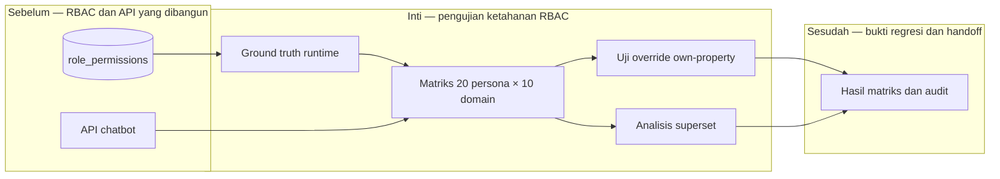

# Report — Milestone 4.6: Uji Ketahanan RBAC Lintas Persona

Milestone ini berjenis **berbasis kode/sistem**. Hasilnya adalah suite regresi RBAC terhadap API chatbot untuk seluruh persona dan domain.

## Bagian 1 — Ringkasan Hasil

**Status akhir:** Selesai sesuai rencana.

M4.6 memverifikasi implementasi RBAC Lapis 2 secara exhaustive: 20 persona × 10 domain menghasilkan 200 keputusan HTTP yang dibandingkan dengan ground truth `role_permissions` saat runtime. Seluruh 200 sel sesuai: tidak ada leakage access dan tidak ada akses sah yang hilang. Uji tambahan memeriksa override own-property pada 15 persona dan containment superset pada 40 pasangan role.

Tidak ditemukan bug RBAC. Satu temuan arsitektural didokumentasikan: `role_title` dan `employee_id` adalah klaim independen di API. Mengikat keduanya adalah kewajiban Lapis 1, bukan kontrol Lapis 2.

## Bagian 2 — Kriteria Keberhasilan vs Bukti Nyata

| Kriteria (dari dokumen sumber) | Bukti Aktual | Terpenuhi? |
|---|---|---|
| Seluruh 20 persona memiliki cakupan persis sesuai role_permissions. | Matriks 200 sel API dibandingkan ground truth 77 permission menghasilkan 200/200 cocok; 15 override property juga 15/15 benar. | Ya |
| Superset Director→Manager→Staff dan CEO diverifikasi. | Analisis hasil HTTP nyata menguji 40 pasangan containment dan seluruhnya valid. | Ya |

## Bagian 3 — Cara Kerja dan Arsitektur

### Cara Kerja

Tooling menarik ground truth role/domain dari database, memanggil API untuk setiap sel matriks, lalu membandingkan status aktual dengan ekspektasi. Uji kedua menguji property override, dan analisis akhir menghitung relation containment dari hasil API—bukan dari teori permission saja. Bukti mentah disimpan pada hasil Layer A dan C.

### Diagram Arsitektur

### Integrasi dengan Komponen Lain

Suite memakai API M4.4 dan log M4.5. Ia dapat dijalankan ulang ketika permission berubah dan menjadi bukti penutupan Lapis 2.

## Bagian 4 — Perubahan dari Plan

Tidak ada deviasi. Kesalahan aritmatika draft jumlah pasangan superset diperbaiki dari 34 menjadi 40 setelah output tooling menunjukkan jumlah yang benar.

## Bagian 5 — Keterbatasan dan Item Provisional

- Matriks memakai satu view representatif per domain, bukan seluruh 67 view.
- Override property adalah sampel 15, bukan seluruh kombinasi.
- Tooling regresi masih manual, tidak terjadwal.

## Bagian 6 — Follow-up

- Lapis 1 harus mengikat identitas employee dan role sebelum API dipanggil.
- Jalankan ulang tiga script regresi ketika role/domain berubah.
- Milestone berikutnya dapat memakai audit log untuk monitoring, bukan pengujian akses inti.
