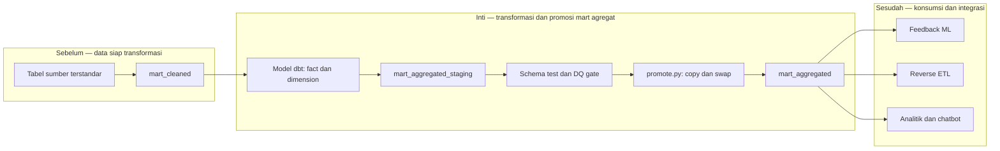

# Report — Milestone 5.3: Implementasi Transformasi Mart Aggregated

Milestone ini berbasis **kode/sistem**. Mart agregat dibangun dengan dbt, diuji sebagai satu paket data, lalu dipromosikan dari staging ke dataset konsumsi melalui gate yang dapat dijalankan ulang.

## 1. Ringkasan Hasil

**Status akhir: Completed.** Sebanyak 76 tabel live—27 dimension dan 49 fact—dibangun di `mart_aggregated`. Transformasi memakai model dbt, sementara `scripts/mart_aggregated/promote.py` menjalankan build, test, dan swap promosi agar tabel konsumsi tidak menerima hasil yang gagal diuji.

Enam validasi metrik lintas-domain sesuai sumber: occupancy `0.4762`, pendapatan F&B `Rp98.370.508.260`, tiket fasilitas `13.514`, pendapatan spa/event `Rp76.728.937.061`, kehadiran HR `531.751`, dan GOP `Rp330.502.531.389`. Suite test dbt serta singular test anti-double-counting GOP lulus; ketika filter proteksi sengaja dihilangkan, test gagal pada 180 baris dan kembali lulus setelah dipulihkan.

## 2. Kriteria Keberhasilan vs Bukti Nyata

| Kriteria | Bukti nyata |
| --- | --- |
| Mart agregat tersedia dengan grain terdokumentasi | 76 tabel live dibangun dari 49 fact dan 27 dimension; dokumentasi skema dan metadata diperbarui. |
| Metrik domain benar terhadap sumber | Enam metrik representatif dari occupancy, F&B, fasilitas, spa/event, HR, dan finansial cocok dengan query pembanding. |
| Kualitas data dijaga otomatis | Seluruh suite schema test dan singular test lulus; fault injection GOP membuktikan gate mendeteksi duplikasi. |
| Mart tidak membawa PII tamu granular | Pemeriksaan INFORMATION_SCHEMA tidak menemukan email, telepon, atau guest ID; nama karyawan adalah pengecualian yang didokumentasikan. |

## 3. Cara Kerja dan Arsitektur

`mart_cleaned` menyuplai data yang telah diseragamkan. Model dbt menghasilkan tabel dalam `mart_aggregated_staging`, kemudian gate promosi memastikan seluruh model terpilih lolos test sebelum tabel disalin/swap ke `mart_aggregated`. Dataset final menjadi sumber tersaring untuk feedback ML dan reverse ETL berikutnya.

**Integrasi.** `promote.py` menjadi batas transaksi operasional: build dan test yang gagal tidak dipromosikan. Dokumentasi `DataSchema`, `Metadata`, dan ERD menyertai artefak agar pengguna tidak menebak grain dari nama tabel.

## 4. Perubahan dari Plan

Beberapa rancangan grain disesuaikan dengan data nyata: revenue harian dipecah menjadi empat fact, pricing GOP menjadi bulanan, performa HR menjadi tiga fact semester, dan service charge menjadi bulanan. Korelasi disimpan sebagai dua nilai mentah alih-alih satu nilai korelasi yang menyesatkan; utilitas rendah disederhanakan menjadi hitungan rolling 30 hari. Koreksi sumber juga dilakukan untuk ingredient, snapshot room/inventory/employee, dan `undistributed_expense`.

## 5. Keterbatasan dan Item Provisional

- Rincian undistributed expense tidak tersedia di sumber.
- Snapshot pace booking bernilai nol pada data sintetis statis sehingga belum menunjukkan perilaku operasional yang kaya.
- Ambang SLA masih terbuka; ambang watchlist HR baru dikalibrasi dalam M5.6.

## 6. Follow-up

- M5.4 menambahkan fact forecast ML terisolasi dari 76 tabel inti.
- M5.5 memindahkan mart ke PostgreSQL serving.
- Perubahan struktur setelah ini harus melewati mekanisme M5.6 dan dicatat pada backlog.
