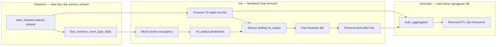

# Report — Milestone 5.4: Integrasi Feedback Loop ML

Milestone ini berbasis **kode/sistem**, tetapi seluruh kontrak ML-nya **provisional**. Implementasinya membuktikan mekanisme trigger, sensor, isolasi kegagalan, dan transformasi agregat; bukan spesifikasi final untuk pipeline yang nantinya dimiliki ML Engineer.

## 1. Ringkasan Hasil

**Status akhir: Completed (proof of concept provisional).** Satu loop end-to-end berjalan di GitHub Actions: refresh `mart_cleaned` memicu mock scoring dan transformasi mart secara paralel; transformasi menunggu `ml_output`, lalu mempromosikan fact forecast bila data siap. Fact baru `fact_ml_occupancy_forecast_property_room_type` memakai grain property × room type × target date × model version sehingga tetap konsisten dengan mart agregat.

Run terkontrol membuktikan tiga hasil inti: siklus otomatis berhasil, 756 baris forecast live tidak memiliki `NULL` pada `model_version` maupun `feature_snapshot_at`, dan ketika sensor sengaja dibuat timeout, 76 tabel non-ML tetap dipromosikan dengan job berstatus sukses.

## 2. Kriteria Keberhasilan vs Bukti Nyata

| Kriteria | Bukti nyata |
| --- | --- |
| Siklus refresh → scoring → sensor → mart berjalan tanpa intervensi lanjutan | Satu trigger `transform-mart-cleaned` memicu workflow scoring dan transform mart; run downstream selesai sukses. |
| Hasil prediksi selalu memiliki metadata model dan snapshot fitur | 12 dbt test lulus dan query live pada 756 baris menemukan nol `NULL` pada kedua kolom wajib. |
| Kegagalan/kelambatan ML tidak menggagalkan refresh utama | Fault injection dengan model yang tidak ada membuat sensor timeout; promosi ML dilewati, 76 tabel inti tetap dipromosikan, dan workflow sukses. |
| Akses scoring dibatasi | Kredensial `ml-scoring-writer` memiliki write pada `ml_output` dan read pada data fitur `mart_aggregated`; uji allow/deny lulus. |

## 3. Cara Kerja dan Arsitektur

Mock scorer mengambil fitur agregat, menghitung forecast occupancy sederhana, lalu menulis riwayat prediksi ke `ml_output.predictions`. Workflow mart mempromosikan bagian non-ML terlebih dahulu, memakai polling manual sebagai sensor, dan hanya menjalankan promosi fact ML sebagai best effort setelah data baru ditemukan.

**Integrasi.** `promote.py` diperbaiki agar `--select` dan `--exclude` benar-benar membatasi tabel yang dipromosikan. Pemisahan scope ini mencegah kegagalan satu model ML menahan 76 tabel yang independen.

## 4. Perubahan dari Plan

Desain awal dikoreksi saat diuji: selector dbt menggunakan `--exclude` sebagai flag terpisah, bukan sintaks inline; promosi yang sebelumnya menyalin seluruh staging diperbaiki menjadi scope-aware; dan kredensial scoring ditambah read pada `mart_aggregated` setelah kegagalan akses fitur terungkap. Job juga tidak membuat dataset sendiri karena ACL writer tidak memberi izin membuat dataset.

## 5. Keterbatasan dan Item Provisional

- Skema `ml_output`, `target_date`, format `entity_id`, mock scorer, dan use case occupancy forecast belum merupakan kontrak ML final.
- Sensor adalah polling workaround; belum ada sensor native atau orchestrator penuh.
- Fact ML belum diberi partition/cluster untuk skala besar, ERD lama belum mencerminkan tabel tambahan, dan rotasi kredensial belum otomatis.
- Timeout realistis sekitar 60 menit belum dijalankan sampai habis; uji timeout dipersingkat untuk fault injection.

## 6. Follow-up

- ML Engineer perlu mengganti mock scorer dan meninjau kontrak `ml_output` melalui proses perubahan cakupan.
- Orchestrator native tetap menjadi keputusan terbuka.
- Reverse ETL M5.5 perlu menentukan apakah fact ML provisional ikut disajikan; akhirnya tabel tersebut memang ditunda dari sinkronisasi serving.
