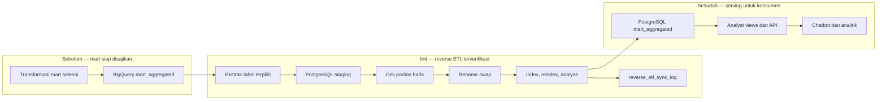

# Report — Milestone 5.5: Reverse ETL Mart Aggregated

Milestone ini berbasis **kode/sistem**. Mart agregat di BigQuery disinkronkan ke PostgreSQL serving dengan pemeriksaan paritas, swap tabel, dan pemulihan indeks agar konsumen tidak membaca data setengah jadi.

## 1. Ringkasan Hasil

**Status akhir: Completed.** Sebanyak 76 dari 77 tabel di `mart_aggregated` disinkronkan ke skema PostgreSQL `mart_aggregated`; satu fact ML provisional sengaja ditunda sampai kontrak ML stabil. Seluruh 76 tabel memiliki paritas jumlah baris dan log sinkronisasi di `monitoring.reverse_etl_sync_log`.

Swap diuji dengan 250 query bersamaan tanpa error. Setelah ditemukan bahwa tabel staging baru menyebabkan indeks sebelumnya hilang, proses diperbaiki dengan `CREATE INDEX IF NOT EXISTS`, `REINDEX`, dan `ANALYZE`: contoh query berubah dari sequential scan sekitar `33.088 ms` menjadi index scan sekitar `2.386 ms`.

## 2. Kriteria Keberhasilan vs Bukti Nyata

| Kriteria | Bukti nyata |
| --- | --- |
| Mart BigQuery tersedia pada serving PostgreSQL | 76 tabel tersalin ke `mart_aggregated` PostgreSQL; fact ML provisional adalah pengecualian yang disengaja. |
| Hasil sinkronisasi lengkap dan dapat ditelusuri | Paritas jumlah baris terverifikasi untuk 76 tabel dan masing-masing memiliki sync log. |
| Pembaruan tidak memutus pembaca | Uji 250 query konkuren selama swap menghasilkan nol error. |
| Performa pasca-swap tidak mengabaikan indeks | Reindex/analyze dipulihkan dan diuji ulang setelah re-sync menghapus indeks. |

## 3. Cara Kerja dan Arsitektur

Proses mengambil tabel dari BigQuery, memuatnya ke tabel staging PostgreSQL, membandingkan jumlah baris, lalu melakukan rename swap hanya setelah data valid. Langkah akhir mengembalikan indeks dan statistik query sebelum status sinkronisasi dicatat.

**Integrasi.** Workflow `reverse-etl-mart-aggregated.yml` dipicu setelah transformasi mart. Kredensial reader/writer dipisahkan, dan kolom `dataset_name` ditambahkan secara aditif ke log monitoring agar jejak sinkronisasi lintas dataset tetap jelas.

## 4. Perubahan dari Plan

Terdapat koreksi penting pada operasi pasca-swap: asumsi bahwa indeks bertahan setelah staging swap terbukti salah. Implementasi kemudian secara eksplisit membuat/memulihkan indeks dan menjalankan `ANALYZE`. Selain itu, tabel ML tidak dipaksakan ikut sinkron karena status kontraknya masih provisional.

## 5. Keterbatasan dan Item Provisional

- `fact_ml_occupancy_forecast_property_room_type` belum disajikan di PostgreSQL.
- Konfigurasi indeks contoh masih provisional dan tidak seluruh pola query produksi diuji.
- Jalur workflow `--all` dan rotasi kredensial belum otomatis.

## 6. Follow-up

- Sinkronkan fact ML setelah kontraknya disahkan melalui proses perubahan cakupan.
- Otomatiskan rotasi kredensial dan perluas uji performa berdasarkan query konsumen nyata.
- Pastikan perubahan tabel serving mempertimbangkan dependency view, seperti yang muncul pada M5.7.
