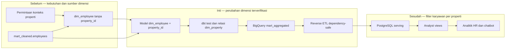

# Report — Milestone 5.7: Perubahan Cakupan `dim_employee.property_id`

Milestone ini berbasis **kode/sistem**. Perubahan kebutuhan nyata dari backlog diselesaikan dengan menambahkan konteks properti ke dimensi karyawan, lalu memverifikasinya sampai layer serving.

## 1. Ringkasan Hasil

**Status akhir: Completed.** Kolom `property_id` ditambahkan pada `mart_aggregated.dim_employee`, bersumber dari `mart_cleaned.employees`. dbt run dan tujuh test terkait lulus, termasuk relasi ke `dim_property`. BigQuery berisi 755 baris dengan `property_id` non-null seluruhnya; distribusinya P01 165, P02 270, P03 115, P04 100, P05 85, dan P06 20.

Reverse ETL satu tabel menghasilkan paritas 755 baris di PostgreSQL dan tiket backlog ditutup. Perubahan ini adalah respons terhadap kebutuhan aktual yang tidak ada pada desain awal, bukan perluasan spontan di luar tata kelola.

## 2. Kriteria Keberhasilan vs Bukti Nyata

| Kriteria | Bukti nyata |
| --- | --- |
| Dimensi karyawan membawa konteks properti | `property_id` tersedia dari sumber `mart_cleaned.employees` di 755 baris BigQuery. |
| Integritas model tetap terjaga | dbt run dan 7/7 test lulus, termasuk relationship ke `dim_property`. |
| Perubahan tersedia di serving | Reverse ETL `dim_employee` selesai dengan paritas 755 baris PostgreSQL. |
| Perubahan ditutup melalui governance | Permintaan backlog dari kebutuhan M3.2 dicatat, diselesaikan, dan ditutup. |

## 3. Cara Kerja dan Arsitektur

Model dimension mengambil `property_id` dari data karyawan yang sudah dibersihkan, menjalankan test relasi, lalu dipromosikan ke BigQuery. Sinkronisasi spesifik tabel mengirim hasilnya ke PostgreSQL sambil menghindari kegagalan swap saat view lama masih bergantung pada object table sebelumnya.

**Integrasi.** Perbaikan sync menangani error `DependentObjectsStillExist`: apabila analyst view masih mengikat OID tabel lama, tabel lama dipertahankan sebagai peringatan agar sinkronisasi tidak crash. Ini membuat perubahan data berhasil tanpa memutus konsumsi yang ada.

## 4. Perubahan dari Plan

Penambahan ini tidak termasuk desain awal M5.2; ia masuk melalui backlog setelah kebutuhan M3.2 teridentifikasi. Saat sync awal gagal karena dependency view, strategi swap disesuaikan menjadi dependency-safe. Konsekuensinya, tabel lama dapat menumpuk sampai view dikelola ulang secara otomatis.

## 5. Keterbatasan dan Item Provisional

- Tiga analyst view HR belum memilih `property_id` sehingga belum mengekspos filter baru.
- Reapply otomatis untuk seluruh 48 analyst view belum tersedia.
- View lain belum diuji ulang melalui sync `--all`; tabel lama perlu dibersihkan secara terkelola setelah dependency dipindahkan.

## 6. Follow-up

- Perbarui tiga view HR agar memakai `property_id`.
- Tambahkan langkah reapply/validasi view ke otomasi reverse ETL sebelum menjalankan sinkronisasi semua tabel.
- Kelola penghapusan tabel lama hanya setelah seluruh dependency telah berpindah dengan aman.
