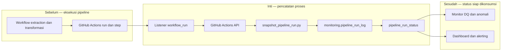

# Report — Milestone 6.2: Monitoring Log Proses Pipeline

Milestone ini berbasis **kode/sistem**. Ia mengubah status eksekusi GitHub Actions menjadi histori PostgreSQL yang dapat ditanya melalui satu view, tanpa mengubah enam workflow pipeline yang diamati.

## 1. Ringkasan Hasil

**Status akhir: Completed.** `monitoring.pipeline_run_log` menyimpan histori append-only dan `monitoring.pipeline_run_status` menyajikan status terbaru untuk sembilan titik. Satu listener `monitoring-warehouse-pipeline-log.yml` mengamati workflow terkait melalui GitHub Actions API dan menyimpan status, waktu mulai/selesai, durasi, serta `ran_today`.

Trigger nyata membuktikan listener berjalan otomatis: run extraction baru tercatat dengan durasi 121 detik yang cocok dengan GitHub Actions. Trigger berulang juga menangkap cascade empat tahap dan menghasilkan dua baris historis untuk setiap sembilan titik, sementara view tetap memilih run terbaru.

## 2. Kriteria Keberhasilan vs Bukti Nyata

| Kriteria | Bukti nyata |
| --- | --- |
| Status, waktu, dan durasi dapat dibaca tanpa log mentah | Satu query ke `pipeline_run_status` menjawab kondisi sembilan titik sekaligus. |
| Riwayat tersedia untuk investigasi tren | `pipeline_run_log` append-only; trigger berulang menghasilkan dua rekam historis per titik. |
| Listener benar-benar otomatis | Workflow listener terpicu oleh `workflow_run` setelah extraction dan merekam run baru. |
| Idempotensi log terjaga | Unique index memakai `COALESCE(step_name, '')`, sehingga nilai `NULL` tidak membuat duplikasi lolos. |

## 3. Cara Kerja dan Arsitektur

Listener observasional menerima event penyelesaian workflow, mengambil data run serta step lewat GitHub Actions API, lalu menulis snapshot idempoten ke PostgreSQL. View status memilih eksekusi terbaru per titik untuk kebutuhan dashboard dan alert berikutnya.

**Integrasi.** Mapping sembilan titik divalidasi terhadap YAML workflow. Titik DQ tetap ditandai `granularity='coarse'`: listener dapat melihat hasil step, tetapi belum mengetahui test spesifik yang gagal.

## 4. Perubahan dari Plan

Tidak ada deviasi keputusan. Satu koreksi DDL diperlukan saat implementasi: `UNIQUE` biasa tidak idempoten bagi nilai nullable pada PostgreSQL, sehingga diganti unique index dengan normalisasi `step_name` kosong.

## 5. Keterbatasan dan Item Provisional

- Detail per-test DQ dan percobaan sensor belum disimpan; status M6.2 bersifat coarse.
- Belum ada retensi/pruning histori monitoring.
- Verifikasi menemukan kegagalan orphan table pada reverse ETL `mart_cleaned` dan `mart_aggregated`; mekanisme mencatatnya, tetapi perbaikannya di luar scope M6.2.

## 6. Follow-up

- M6.3 menambahkan detail hasil dbt test dan deteksi anomali.
- M6.7 memakai view status sebagai sumber panel pipeline, dengan filter sinyal simulasi yang sesuai.
- Pemilik reverse ETL perlu menangani akar orphan-table agar sinyal operasional tidak terus berulang.
