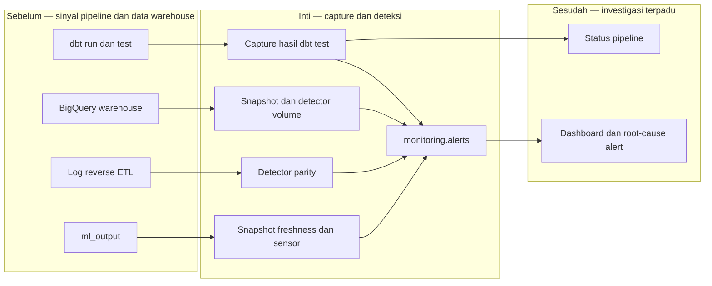

# Report — Milestone 6.3: Monitoring Kesalahan dan Anomali Pipeline Warehouse

Milestone ini berbasis **kode/sistem**. Ia menambahkan observabilitas detail untuk DQ gate, volume warehouse, paritas BigQuery–PostgreSQL, dan freshness/kelambatan `ml_output` tanpa mengubah logika promosi data yang sudah ada.

## 1. Ringkasan Hasil

**Status akhir: Completed.** Hasil dbt test kini tersimpan pada `monitoring.dbt_test_result`; snapshot volume, freshness ML, dan parity dikonsolidasikan ke schema monitoring serta `monitoring.alerts`. Workflow monitoring menjalankan detector terjadwal, sedangkan dua workflow transformasi hanya memperoleh langkah capture `if: always()`.

Empat fault injection membuktikan jalur utama: satu test DQ gagal tertangkap tepat sebagai 1 dari 37 hasil; dua outlier volume 10× menghasilkan dua alert critical per tabel/dataset; mismatch parity sintetis mengidentifikasi tabel dan row count; dan lag `ml_output` 150 jam serta durasi sensor anomali masing-masing menghasilkan alert spesifik.

## 2. Kriteria Keberhasilan vs Bukti Nyata

| Kriteria | Bukti nyata |
| --- | --- |
| Kegagalan test DQ terlihat tanpa log CI mentah | Fault injection menghasilkan 37 hasil, dengan tepat satu failure yang menunjuk test dan jumlah gagal yang benar. |
| Anomali volume dibedakan menurut tahap asal | Outlier pada dua tabel di dua dataset memicu dua alert critical yang membawa schema dan table name. |
| Mismatch BigQuery–PostgreSQL dapat diidentifikasi | Baris simulasi menghasilkan satu alert parity dengan tabel dan dua row count yang tepat; data normal tetap nol mismatch. |
| Keterlambatan ML dibedakan dari sensor gagal umum | Freshness lag 150 jam dan sensor duration anomaly masing-masing memiliki detector serta detail alert tersendiri. |

## 3. Cara Kerja dan Arsitektur

Data uji DQ ditangkap bahkan ketika promosi gagal. Detector terjadwal menambahkan snapshot volume, freshness, dan parity ke sumber monitoring, lalu menulis alert yang dapat dikonsumsi dashboard tanpa membaca log mentah.

**Integrasi.** `promote.py` tidak diubah. Instrumentasi berada sesudah gate dengan `if: always()`, sehingga data failure tetap tersedia sementara swap yang gagal tetap dibatalkan seperti sebelumnya.

## 4. Perubahan dari Plan

`INFORMATION_SCHEMA.TABLE_STORAGE` tidak dapat diakses di BigQuery Sandbox, sehingga snapshot volume memakai pseudo-table `__TABLES__` yang diverifikasi akurat. Detector parity men-query tabel log langsung agar dapat menguji simulasi, dan baseline durasi sensor tidak lagi difilter per hari-minggu karena metrik tersebut tidak memiliki pola mingguan yang bermakna. Detector parity juga ditambahkan ke workflow terjadwal agar KK3 berjalan otomatis.

## 5. Keterbatasan dan Item Provisional

- Jumlah test aktual `mart_aggregated` yang direvalidasi adalah 190, berbeda dari angka lama di laporan M5.3; penyebab drift belum ditelusuri.
- Timeout sensor 60 menit belum diuji sampai habis.
- Rotasi kredensial `warehouse-monitor-reader` belum otomatis.
- Orphan-table reverse ETL masih merupakan akar masalah terpisah.

## 6. Follow-up

- M6.4 memakai snapshot freshness sebagai fondasi observabilitas ML.
- M6.6 dapat memakai parity existing untuk fokus pada kesehatan swap dan storage.
- M6.7 mengonsumsi `monitoring.alerts` dan hasil DQ untuk dashboard serta root-cause grouping.
