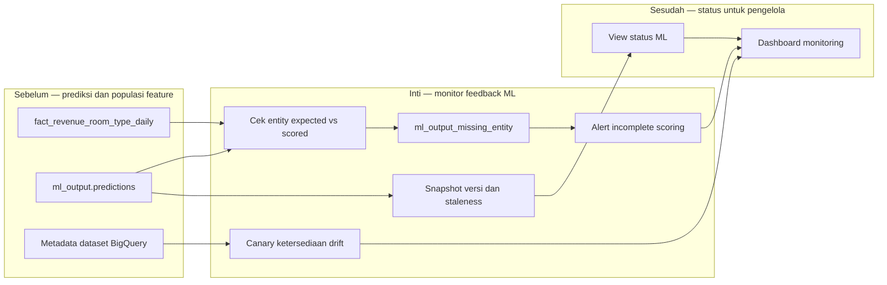

# Report — Milestone 6.4: Monitoring Data Drift Feedback Loop ML

Milestone ini berbasis **kode/sistem**, namun mengikuti status feedback loop ML yang masih provisional. Ia menyediakan observabilitas versi model dan kelengkapan scoring, serta canary untuk kesiapan data drift tanpa mengarang threshold atau skema yang belum dimiliki tim ML.

## 1. Ringkasan Hasil

**Status akhir: Completed.** Snapshot versi model dan view `monitoring.ml_model_staleness_status` menampilkan kapan `model_version` pertama aktif. Kelengkapan scoring membandingkan populasi property × room type dari fact agregat dengan prediksi yang tersedia dan mencatat entity yang hilang per baris. Canary juga memeriksa keberadaan dataset drift tanpa mengasumsikan kolomnya.

Pada baseline live, 18 entity yang diharapkan seluruhnya terskor. Fault injection mengecualikan P03 pada snapshot fitur baru dan menghasilkan 3 entity hilang dengan alert `ml_output_incomplete_scoring`. Canary tervalidasi pada keadaan tanpa dataset dan dataset throwaway; model staleness sengaja informational-only karena versi mock masih hardcoded.

## 2. Kriteria Keberhasilan vs Bukti Nyata

| Kriteria | Bukti nyata |
| --- | --- |
| Waktu aktivitas setiap model version dapat dilihat | View live menampilkan `occupancy_forecast_mock_v1`, waktu pertama aktif, jumlah baris, dan flag versi terbaru. |
| Entity yang gagal terskor teridentifikasi otomatis | Baseline 18/18 lengkap; fault injection menghasilkan `expected=18`, `scored=15`, dan tiga entity P03 yang tercatat. |
| Kesiapan data drift dapat dipantau | Canary mendeteksi benar keadaan `found=false` dan `found=true` pada dataset uji. |
| Monitoring tidak memakai threshold tanpa dasar | Staleness tidak menjadi alert sampai cadence retrain nyata dan kebijakan ML tersedia. |

## 3. Cara Kerja dan Arsitektur

Monitor membaca prediksi serta fact feature agregat. Satu jalur menyimpan aktivitas model untuk status informasi, satu jalur membandingkan populasi expected/scored dan mengirim alert bila ada kekosongan, sedangkan canary metadata memeriksa apakah sumber drift telah dipublikasikan.

**Integrasi.** Tiga langkah baru berjalan dalam workflow DQ/anomali yang sudah ada. `warehouse-monitor-reader` memperoleh metadata viewer agar canary dapat melihat dataset di luar empat ACL data yang sebelumnya terbatas.

## 4. Perubahan dari Plan

Saat implementasi, prediksi terbukti hanya memiliki `entity_id` komposit, bukan `property_id` dan `room_type_id` terpisah; pemeriksaan kelengkapan diperbaiki memakai `SPLIT(entity_id, ':')`. Fault injection juga membutuhkan feature snapshot yang belum pernah dipakai karena mock scorer append-only. CLI audit untuk snapshot spesifik dipertahankan karena berguna untuk pemeriksaan mendatang.

## 5. Keterbatasan dan Item Provisional

- Belum ada data drift nyata, sehingga KK3 adalah kapasitas deteksi ketersediaan, bukan tren drift yang tervisualisasi.
- Cadence retrain dan threshold staleness belum diputuskan bersama ML Engineer.
- Canary hanya mengenali pola nama `drift` atau `ml_monitoring`; nama yang berbeda tidak akan terdeteksi.
- Populasi expected mengasumsikan scoring satu batch per hari seperti mock scorer saat ini.

## 6. Follow-up

- Saat ML Engineer menerbitkan data drift, gunakan nama dataset yang terdeteksi canary sebagai awal visualisasi tren.
- Revisit threshold staleness ketika model version benar-benar berubah antar-retrain.
- M6.7 mengonsumsi status staleness dan ketersediaan drift sebagai informasi langsung, bukan hanya dari tabel alert.
