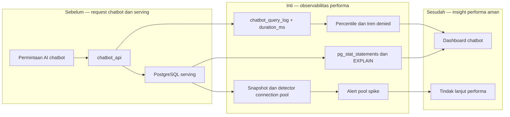

# Report — Milestone 6.5: Monitoring Performa Query AI Chatbot

Milestone ini berbasis **kode/sistem**. Ia menutup gap latency pada audit chatbot, memantau bentuk query dan connection pool, sambil mempertahankan logic RBAC serta whitelist yang ada tetap steril.

## 1. Ringkasan Hasil

**Status akhir: Completed.** Instrumentasi `duration_ms` ditambahkan ke audit request `chatbot_api`, sehingga p50/p95/p99 dapat dihitung dari data request nyata, bukan diperkirakan dari `pg_stat_statements`. Snapshot query performance, `EXPLAIN ANALYZE`, dan koneksi serving ditulis ke schema monitoring melalui kredensial reader yang terpisah.

Data live menghasilkan p50 `909,77 ms`, p95 `1.521,5 ms`, p99 `1.575,9 ms` dari tiga request berinstrumen; tren denied terbaca lintas dua hari. Uji 20 request paralel membuat koneksi naik dari 0 ke 30 dan secara benar memicu alert critical connection-pool spike. `guests_contact_view` juga teridentifikasi sebagai outlier nyata sekitar 2,35–2,49 detik.

## 2. Kriteria Keberhasilan vs Bukti Nyata

| Kriteria | Bukti nyata |
| --- | --- |
| Latensi end-to-end dan query lambat terlihat tanpa investigasi manual | `duration_ms` menghasilkan percentile nyata; snapshot `pg_stat_statements` menemukan outlier `guests_contact_view`. |
| Penolakan/kegagalan terlihat sebagai tren | Rekam dua hari menunjukkan 127/239 denied dan 2/3 denied, bukan sekadar angka satu hari. |
| Lonjakan connection pool terdeteksi | Burst 20 request nyata meningkatkan koneksi hingga 30 dan memicu alert critical; simulasi rerunnable juga lulus. |
| Akses monitoring tetap minimum | `chatbot_perf_reader` dan `chatbot_audit_reader` lulus pemeriksaan isolasi masing-masing 8/8 dan 6/6. |

## 3. Cara Kerja dan Arsitektur

Audit API mencatat durasi setiap request. Monitor terpisah membaca audit log produksi untuk percentile, membaca `pg_stat_statements` dan aktivitas koneksi dari serving, lalu menyimpan snapshot/alert tanpa mengubah keputusan otorisasi chatbot.

**Integrasi.** Tidak ada workflow GitHub Actions baru karena API masih manual-only dan belum memiliki traffic kontinu. Role monitoring berada pada boundary audit/serving terpisah, sehingga pembacaan performa tidak menambah akses pada RBAC aplikasi.

## 4. Perubahan dari Plan

M6.5 tidak hanya menggunakan sinyal yang tersedia: ia menambahkan `duration_ms` karena `pg_stat_statements` tidak menyimpan percentile per request. Implementasi juga memperbaiki nama role agar sesuai konvensi Postgres, mengakses extension dengan schema eksplisit, menggunakan parameter SQL yang aman, dan mengecualikan koneksi monitor dari hitungan pool.

## 5. Keterbatasan dan Item Provisional

- `chatbot_api` tidak memiliki connection pooling sendiri; di atas sekitar 15 request konkuren per domain, sebagian request dapat gagal `500` karena batas Supavisor session-mode.
- Sample percentile awal kecil (`n=3`) dan 245 baris audit lama bernilai `duration_ms=NULL` tanpa kemungkinan backfill.
- Outlier `guests_contact_view` belum dioptimalkan.
- Scope hanya `chatbot_views`, bukan semua tabel/view serving.

## 6. Follow-up

- Tambahkan pooling aplikasi sebelum chatbot menerima traffic produksi yang nyata.
- Investigasi dan optimalkan `guests_contact_view`.
- M6.7 menampilkan snapshot performa sebagai informasi agregat; data audit granular tidak diekspos publik.
