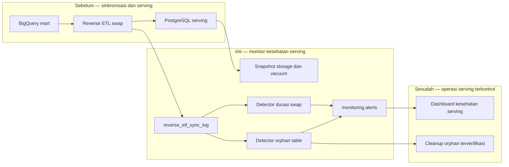

# Report — Milestone 6.6: Monitoring Reverse ETL dan Serving Layer PostgreSQL

Milestone ini berbasis **kode/sistem**. Ia memantau pertumbuhan storage dan kesehatan swap PostgreSQL, sekaligus menambahkan bukti operasional pada log reverse ETL dan membersihkan orphan table yang telah diverifikasi aman.

## 1. Ringkasan Hasil

**Status akhir: Completed.** Snapshot harian storage mencatat ukuran tabel, live/dead tuple, dan waktu vacuum/autovacuum untuk `mart_cleaned` serta `mart_aggregated`. Dua detector membedakan orphan table dari swap lambat, sehingga masalah lifecycle tabel tidak tercampur dengan query lambat biasa.

Data awal mencatat 173 tabel dengan total 531,6 MB; setelah cleanup 73 orphan table, kondisi menjadi 100 tabel dan 409,7 MB. Uji lock `ACCESS EXCLUSIVE` nyata menahan RENAME sekitar 20 detik dan menghasilkan `swap_duration_ms=10.518,7` dibanding baseline sekitar 914 ms; detector memicu alert critical. Cleanup menghapus 112,1 MB sambil mempertahankan row count tabel live dan fungsi view.

## 2. Kriteria Keberhasilan vs Bukti Nyata

| Kriteria | Bukti nyata |
| --- | --- |
| Tren storage dan vacuum dapat dilihat tanpa login manual | Snapshot live menyimpan size, tuple, dan vacuum metadata untuk semua tabel serving. |
| Swap lambat atau gagal dibedakan dari masalah query | `serving_swap_orphan_table` menemukan 73 orphan nyata, sedangkan `serving_swap_slow` menangkap delay RENAME terkontrol. |
| Monitoring tidak memperoleh akses data baris | `serving_storage_reader` hanya memiliki `pg_monitor` dan `USAGE`, tanpa `SELECT` tabel. |
| Cleanup tidak merusak serving | View diterapkan ulang sebelum drop; verifikasi menunjukkan tabel live dan view tetap benar. |

## 3. Cara Kerja dan Arsitektur

Log reverse ETL kini menyimpan status tabel lama dan durasi swap. Monitor harian mengambil metadata storage serta log tersebut, mengeluarkan alert per kelas masalah, dan menyediakan cleanup eksplisit yang harus didahului reapply view.

**Integrasi.** Workflow `monitoring-serving-layer-health.yml` menjalankan snapshot dan detector. Kedua implementasi sync menerima instrumentasi `old_table_status` dan `swap_duration_ms`; jalur graceful degradation untuk dependency view pada `mart_cleaned` disejajarkan dengan jalur yang sudah ada.

## 4. Perubahan dari Plan

Tabel yang sudah memiliki orphan tidak dapat dipakai sebagai happy-path swap, sehingga uji menggunakan tabel bebas orphan serta skenario dependency conflict terpisah. Percobaan lock pertama memerlukan kredensial owner, bukan admin. Detector orphan juga diperbaiki untuk menggunakan snapshot terbaru agar cleanup pada hari yang sama terlihat benar.

## 5. Keterbatasan dan Item Provisional

- Langkah RENAME masih dapat gagal bila nama `__old` sudah dipakai orphan lama; ini gap terpisah yang belum diperbaiki.
- Uji penuh delapan siklus untuk mart agregat belum dapat dijalankan kembali karena gap RENAME tersebut.
- Pencegahan orphan otomatis melalui reapply view masih open; cleanup hanya satu kali dan orphan baru dapat menumpuk kembali.
- Detector swap terjadwal hanya membangun baseline dari tabel yang disinkronkan pada hari itu.

## 6. Follow-up

- Putuskan dan implementasikan proteksi RENAME collision secara terpisah.
- Otomatiskan reapply view sebelum lifecycle cleanup.
- M6.7 mengonsumsi alert swap serta snapshot storage untuk dashboard terpadu.
