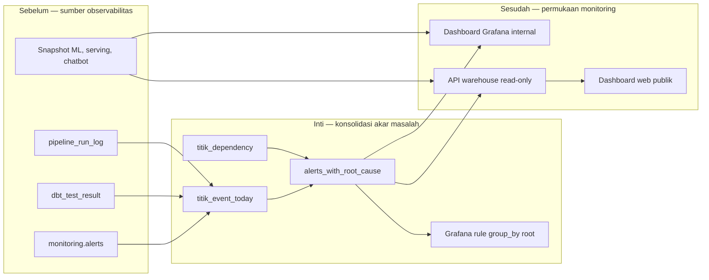

# Report — Milestone 6.7: Dashboard dan Alerting Terpadu

Milestone ini berbasis **kode/sistem** dan menutup keluarga monitoring 6.x. Bagian internal Grafana dan API publik selesai; kode dashboard web publik sudah siap, tetapi deployment Vercel masih menunggu aksi pengguna sehingga bagian tersebut belum dapat dinyatakan live.

## 1. Ringkasan Hasil

**Status akhir: Completed untuk Grafana internal dan API publik; pending deployment untuk web publik.** Dashboard Grafana `Nirwana - Warehouse & Serving Monitoring (Fase 2)` memiliki sembilan panel untuk status pipeline, DQ, volume, ML, reverse ETL, storage, dan performa chatbot. Root-cause grouping mengelompokkan event menurut graph dependency sehingga satu masalah akar tidak berubah menjadi banjir alert downstream.

Delapan endpoint read-only `/api/warehouse/*` sudah live di Render. Empat halaman web untuk permukaan publik selesai dan terverifikasi lokal, serta sudah dipush; namun belum tersedia secara publik karena deployment Vercel dilakukan manual oleh pengguna.

## 2. Kriteria Keberhasilan vs Bukti Nyata

| Kriteria | Bukti nyata |
| --- | --- |
| Kondisi pipeline terkini dapat diakses tim | Dashboard Grafana live dengan sembilan panel, diverifikasi melalui API Grafana dan query panel. |
| Satu akar masalah menghasilkan satu alert terkelompok | Skenario sintetis memetakan titik 2 beserta downstream 3, 6, 7, dan 9 ke satu `root_titik_id`; query rule menghasilkan tepat satu baris alert. |
| Mekanisme juga bekerja pada data operasional | Alert swap lambat dan orphan serving terkelompok melalui graph dependency dan terlihat di halaman warehouse. |
| Data publik tetap agregat dan read-only | Delapan endpoint API live; performa chatbot disajikan agregat tanpa mengekspos audit log yang mengandung `employee_id`. |

## 3. Cara Kerja dan Arsitektur

View event menggabungkan kegagalan pipeline, alert, dan kegagalan DQ lalu menghubungkannya dengan graph `titik_dependency`. Recursive CTE menentukan akar per event; Grafana dan API memakai hasil yang sama, sementara notification policy mengelompokkan berdasarkan `root_titik_id`.

**Integrasi.** Detektor `pipeline_dependency_gap` menambah sinyal untuk dependency titik 1→2 yang belum digate. Sumber informasi seperti storage, staleness ML, dan performa chatbot dibaca langsung—tidak dipaksa menjadi alert bila memang bersifat informational.

## 4. Perubahan dari Plan

Cakupan diperluas atas keputusan pengguna dari Grafana internal ke API dan web publik. Selama verifikasi, filter simulasi dipindahkan ke konsumen agar root-cause view tetap dapat diuji, query dashboard diproteksi dari residu simulasi, dan status pipeline dibaca langsung dari log dengan filter event simulasi. Tidak ada kode milestone closed yang diubah; mitigasi dilakukan pada layer konsumsi ini.

## 5. Keterbatasan dan Item Provisional

- Dashboard web publik belum live karena deployment Vercel belum dilakukan pengguna.
- Kanal notifikasi eksternal tetap belum diputuskan.
- Korelasi berbasis hari kalender dapat salah menggabungkan dua event nyata yang tidak terkait bila keduanya berbagi edge dependency pada hari yang sama.
- Race condition volume anomaly dan gap RENAME reverse ETL tetap menjadi follow-up pada milestone asal.
- Orphan baru dapat kembali muncul selama reapply view belum otomatis.

## 6. Follow-up

- Setelah web live, verifikasi URL publik dan ubah status bagian web menjadi completed.
- Jika `alert_type` baru ditambahkan, perluas mapping `titik_event_today` agar ia ikut root-cause grouping.
- Putuskan kanal notifikasi eksternal dan selesaikan automation reapply view serta RENAME collision sebelum beban operasional bertambah.
